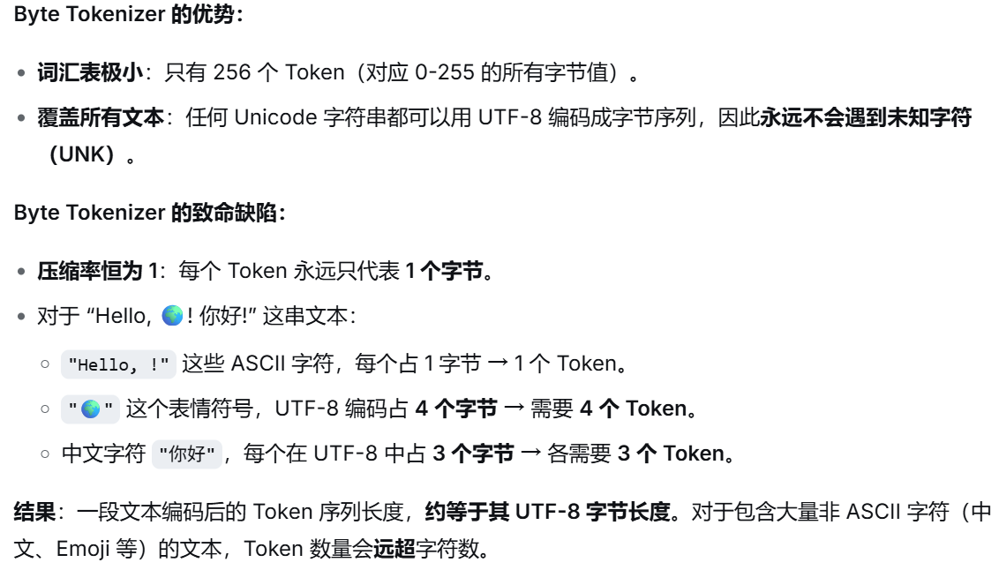

# 1. why_this_course_exists()

## Problem: 
researchers are becoming **disconnected** from the underlying technology.
- 2016: researchers implemented and trained their own models.
- 2018: researchers downloaded models (e.g., BERT) and fine-tuned them.
- Today: researchers prompt API models (e.g., GPT/Claude/Gemini).

Moving up levels of abstraction boosts productivity, but
- These abstractions are leaky (in contrast to programming languages or operating systems).
- There is still fundamental research to be done that requires tearing up the stack.

**Full understanding** of this technology is necessary for **fundamental research**.
Philosophy of this course: **understanding via building**.
But there's one small problem...

Frontier models are really expensive:

There are no public details on how frontier models are built.
From the GPT-4 technical report  
[[OpenAI+ 2023]](https://arxiv.org/pdf/2303.08774.pdf)

So,in this lecture,we 'll learn:
There are three types of knowledge:
- **Mechanics**: how things work (what a Transformer is, how model parallelism works)
- **Mindset**: squeezing the most out of the hardware, taking scaling seriously
- **Intuitions**: which data and modeling decisions yield good accuracy

We can teach mechanics and mindset (these do transfer).
We can only partially teach intuitions (do not necessarily transfer across scales).

## Intuitions? 🤷

Some design decisions are simply not (yet) justifiable and just come from experimentation.
Example: Noam Shazeer paper that introduced SwiGLU  
[[Shazeer 2020]](https://arxiv.org/pdf/2002.05202.pdf)


## The bitter lesson
Wrong interpretation: scale is all that matters, algorithms don't matter.
Right interpretation: algorithms that scale are what matter.

 $accuracy = efficiency * resources$

In fact, efficiency is way more important at larger scales (can't afford to be wasteful).
Framing: what is the best model one can build given a certain compute and data budget?

In other words, **maximize efficiency**!
# 2. current_lm_landscape()

## Pre-neural (before 2010s)

- Language model to measure the entropy of English 
[[Shannon 1950]](https://www.princeton.edu/~wbialek/rome/refs/shannon_51.pdf)

- N-gram language models (used in machine translation and speech recognition systems) 
[[Brants+ 2007]](https://aclanthology.org/D07-1090.pdf)

## Neural ingredients (2010s)

- Long-Short Term Memory (LSTM) 
[[Hochreiter+ 1997]](https://www.bioinf.jku.at/publications/older/2604.pdf)

- First neural language model 
[[Bengio+ 2003]](https://www.jmlr.org/papers/volume3/bengio03a/bengio03a.pdf)

- Sequence-to-sequence modeling (for machine translation) 
[[Sutskever+ 2014]](https://arxiv.org/pdf/1409.3215.pdf)

- Adam optimizer 
[[Kingma+ 2014]](https://arxiv.org/pdf/1412.6980.pdf)

- Attention mechanism (for machine translation) 
[[Bahdanau+ 2014]](https://arxiv.org/pdf/1409.0473.pdf)

- Transformer architecture (for machine translation) 
[[Vaswani+ 2017]](https://arxiv.org/pdf/1706.03762.pdf)

- Mixture of experts 
[[Shazeer+ 2017]](https://arxiv.org/pdf/1701.06538.pdf)

- Model parallelism 
[[Huang+ 2018]](https://arxiv.org/pdf/1811.06965.pdf)
[[Rajbhandari+ 2019]](https://arxiv.org/abs/1910.02054)
[[Shoeybi+ 2019]](https://arxiv.org/pdf/1909.08053.pdf)

## Early foundation models (late 2010s)

- ELMo: pretraining with LSTMs, fine-tuning improves downstream tasks 
[[Peters+ 2018]](https://arxiv.org/abs/1802.05365)

- BERT: pretraining with Transformer, fine-tuning improves downstream tasks 
[[Devlin+ 2018]](https://arxiv.org/abs/1810.04805)

- Google's T5 (11B): cast everything as text-to-text 
[[Raffel+ 2019]](https://arxiv.org/pdf/1910.10683.pdf)

## Embracing scaling

- OpenAI's GPT-2 (1.5B): fluent text, first signs of zero-shot 
[[Radford+ 2019]](https://cdn.openai.com/better-language-models/language_models_are_unsupervised_multitask_learners.pdf)

- Scaling laws: provide hope / predictability for scaling 
[[Kaplan+ 2020]](https://arxiv.org/pdf/2001.08361.pdf)

- OpenAI's GPT-3 (175B): in-context learning 
[[Brown+ 2020]](https://arxiv.org/pdf/2005.14165.pdf)

- Google's PaLM (540B): massive scale, undertrained 
[[Chowdhery+ 2022]](https://arxiv.org/pdf/2204.02311.pdf)

- DeepMind's Chinchilla (70B): compute-optimal scaling laws 
[[Hoffmann+ 2022]](https://arxiv.org/pdf/2203.15556.pdf)

## Open models

Early attempts (attempts to replicate GPT-3):
- EleutherAI's open datasets (The Pile) and models (GPT-J) 
[[Gao+ 2020]](https://arxiv.org/pdf/2101.00027.pdf)
[[Wang+ 2021]](https://arankomatsuzaki.wordpress.com/2021/06/04/gpt-j/)

- Meta's OPT (175B): GPT-3 replication, lots of hardware issues 
[[Zhang+ 2022]](https://arxiv.org/pdf/2205.01068.pdf)

- Hugging Face / BigScience's BLOOM (176B): focused on data sourcing 
[[Workshop+ 2022]](https://arxiv.org/abs/2211.05100)
Credible open-weight models (weights + paper):

- Meta's Llama models 
[[Touvron+ 2023]](https://arxiv.org/pdf/2302.13971.pdf)
[[Touvron+ 2023]](https://arxiv.org/pdf/2307.09288.pdf)
[[Grattafiori+ 2024]](https://arxiv.org/abs/2407.21783)

- Mistral's models 
[[Jiang+ 2023]](https://arxiv.org/pdf/2310.06825.pdf)
[[Jiang+ 2024]](https://arxiv.org/pdf/2401.04088.pdf)

- DeepSeek's models 
[[DeepSeek-AI+ 2024]](https://arxiv.org/pdf/2401.02954.pdf)
[[DeepSeek-AI+ 2024]](https://arxiv.org/abs/2405.04434)
[[DeepSeek-AI+ 2024]](https://arxiv.org/pdf/2412.19437.pdf)
[[DeepSeek-AI+ 2025]](https://arxiv.org/pdf/2501.12948.pdf)
[[DeepSeek-AI+ 2025]](https://arxiv.org/abs/2512.02556)

- Alibaba's Qwen models 
[[Qwen+ 2024]](https://arxiv.org/abs/2412.15115)
[[Yang+ 2025]](https://arxiv.org/abs/2505.09388)

- Moonshot's Kimi models 
[[Kimi Team 2025]](https://arxiv.org/pdf/2501.12599.pdf)
[[Kimi Team 2026]](https://arxiv.org/abs/2602.02276)

- Z.ai's GLM models 
[[GLM-4.5 Team 2025]](https://arxiv.org/abs/2508.06471)
[[GLM-5-Team 2026]](https://arxiv.org/abs/2602.15763)

- Minimax's models 
[[[MiniMax M2.5]]](https://www.minimax.io/news/minimax-m25)

- Xiaomi's MIMO models 
[[[Xiaomi MIMO v2]]](https://mimo.xiaomi.com/mimo-v2-pro)

These models are approaching closed models (GPT, Claude, Gemini, etc.).
Open-source models (weights + paper + code + data):

- AI2's Olmo models 
[[Groeneveld+ 2024]](https://arxiv.org/pdf/2402.00838.pdf)
[[Team OLMo 2024]](https://arxiv.org/abs/2501.00656)
[[Team Olmo 2025]](https://arxiv.org/abs/2512.13961)

- NVIDIA's Nemotron models 
[[Parmar+ 2024]](https://arxiv.org/pdf/2402.16819.pdf)
[[NVIDIA+ 2025]](https://arxiv.org/abs/2512.20856)

- Marin's models (open development) 
[[[Marin 8B retro]]](https://marin.readthedocs.io/en/latest/reports/marin-8b-retro/)
[[[Marin 32B retro]]](https://marin.readthedocs.io/en/latest/reports/marin-32b-retro/)

Openness is important for trust and innovation  
[[Kapoor+ 2024]](https://arxiv.org/abs/2403.07918)

Ideas from open models enable us to teach CS336.

What is a language model?

- 2018 (BERT): something you fine-tune
- 2020 (GPT-3): something you prompt
- 2022 (ChatGPT): something you talk to 

[[example conversation]](https://huggingface.co/datasets/HuggingFaceTB/smoltalk/viewer/all/train?row=72&conversation-viewer=72)

- 2026 (agents): something that acts autonomously 
[[example trace]](https://huggingface.co/datasets/nebius/SWE-rebench-openhands-trajectories/viewer/default/train?conversation-viewer=1)

The fundamentals are the same (attention, kernels, optimization).
The specs are different (longer context, inference efficiency matters even more).

# 3. course_syllabus()

All information online:  
[[course website]](https://stanford-cs336.github.io/spring2026/)

***basics() # Assignment 1: tokenization, model architecture, training***
***systems() # Assignment 2: kernels, parallelism, inference***
***scaling_laws() # Assignment 3: scaling laws***
***data() # Assignment 4: evaluation, curation, transformation, filtering, deduplication, mixing***
***alignment() # Assignment 5: RLHF, RL algorithms, RL systems***

Remember it's all about **efficiency**:
- Resources: data + hardware (compute, memory, communication bandwidth)
- How do you train the best model given a fixed set of resources?

Today, we are compute-constrained, so design decisions will reflect squeezing the most out of given hardware.

- Systems: clearly about efficiency
- Tokenization: working with raw bytes is elegant, but compute-inefficient with today's model architectures
- Model architecture: many changes motivated by reducing memory or FLOPs (e.g., sharing KV caches, sliding window attention)
- Data filtering: avoid wasting precious compute updating on bad / irrelevant data
- Scaling laws: use less compute on smaller models to do hyperparameter tuning

## 3.1 basics() 
Goal: be able to train a basic language model
Components: tokenization, model architecture, training

### **3.1.1 Tokenization**
What are the atoms that the model operates on?
Formally: a tokenizer converts between raw inputs (bytes) and sequences of integers (tokens)


Popular tokenizer: **Byte-Pair Encoding** (BPE)  
[[Sennrich+ 2015]](https://arxiv.org/abs/1508.07909)

Intuition: break input into frequently-occuring chunks
Efficiency lens
- Reduce context length (1000 bytes → ~250 tokens)
- Adaptive computation (more modeling capacity on interesting parts of input)

The dream: tokenizer-free model architectures, which operate directly on bytes  
[[Xue+ 2021]](https://arxiv.org/abs/2105.13626)
[[Yu+ 2023]](https://arxiv.org/pdf/2305.07185.pdf)
[[Pagnoni+ 2024]](https://arxiv.org/abs/2412.09871)
[[Deiseroth+ 2024]](https://arxiv.org/abs/2406.19223)
[[Hwang+ 2025]](https://arxiv.org/abs/2507.07955)

These are promising, but have not yet been scaled up to the frontier.

### **3.1.2 Model architecture**
Starting point: original Transformer  
[[Vaswani+ 2017]](https://arxiv.org/pdf/1706.03762.pdf)


**Refinements:**
- **Activation functions:** ReLU, SwiGLU [[Shazeer 2020]](https://arxiv.org/pdf/2002.05202.pdf)
- **Positional encodings:** sinusoidal, RoPE [[Su+ 2021]](https://arxiv.org/pdf/2104.09864.pdf)
- **Normalization**: LayerNorm, RMSNorm, QK norm, pre-norm versus post-norm 

[[Ba+ 2016]](https://arxiv.org/pdf/1607.06450.pdf)
[[Zhang+ 2019]](https://arxiv.org/abs/1910.07467)
[[Dehghani+ 2023]](https://arxiv.org/abs/2302.05442)
[[Xiong+ 2020]](https://arxiv.org/pdf/2002.04745.pdf)

- **Attention**: full, sparse/local attention, group-query attention (GQA), multi-head latent attention (MLA) 

[[Child+ 2019]](https://arxiv.org/pdf/1904.10509.pdf)
[[Ainslie+ 2023]](https://arxiv.org/pdf/2305.13245.pdf)
[[DeepSeek-AI+ 2024]](https://arxiv.org/abs/2405.04434)

- **Recurrence/state-space models/linear attention**: Mamba, Gated DeltaNet 

[[Katharopoulos+ 2020]](https://arxiv.org/abs/2006.16236)
[[Dao+ 2024]](https://arxiv.org/abs/2405.21060)
[[Yang+ 2024]](https://arxiv.org/abs/2412.06464)
[[Lahoti+ 2026]](https://arxiv.org/abs/2603.15569)

- **MLP**: dense, mixture of experts 

[[Shazeer+ 2017]](https://arxiv.org/pdf/1701.06538.pdf)
[[Fedus+ 2021]](https://arxiv.org/abs/2101.03961)

- **Shape** (hidden dimension, depth, number of heads, number of experts)

### **3.1.3 Training**
How do you set the parameters of the model?

- **Loss function** (e.g., multi-token prediction) 

[[Gloeckle+ 2024]](https://arxiv.org/abs/2404.19737)
[[DeepSeek-AI+ 2024]](https://arxiv.org/pdf/2412.19437.pdf)

- **Optimizer** (e.g., AdamW, SOAP, Muon) 

[[Kingma+ 2014]](https://arxiv.org/pdf/1412.6980.pdf)
[[Loshchilov+ 2017]](https://arxiv.org/pdf/1711.05101.pdf)
[[Vyas+ 2024]](https://arxiv.org/abs/2409.11321)
[[Keller 2024]](https://kellerjordan.github.io/posts/muon/)

- **Initialization scale** (e.g., Xavier init, muP) 

[[Glorot+ 2010]](https://proceedings.mlr.press/v9/glorot10a/glorot10a.pdf)
[[Yang+ 2022]](https://arxiv.org/abs/2203.03466)

- **Learning rate schedule** (e.g., cosine, WSD) 

[[Loshchilov+ 2016]](https://arxiv.org/pdf/1608.03983.pdf)
[[Hu+ 2024]](https://arxiv.org/pdf/2404.06395.pdf)

- **Regularization** (e.g., dropout, weight decay)
- **Batch size** (e.g., critical batch size) 
[[McCandlish+ 2018]](https://arxiv.org/pdf/1812.06162.pdf)

- **MoE specific**: load balancing (e.g., aux-free) 
[[Wang+ 2024]](https://arxiv.org/abs/2408.15664)
[[DeepSeek-AI+ 2024]](https://arxiv.org/pdf/2412.19437.pdf)

### **3.1.4  Assignment 1 (basics)**

[[GitHub]](https://github.com/stanford-cs336/assignment1-basics)
[[PDF]](https://github.com/stanford-cs336/assignment1-basics/blob/main/cs336_spring2026_assignment1_basics.pdf)

- Implement BPE tokenizer
- Implement Transformer, cross-entropy loss, AdamW optimizer, training loop
- Do resource accounting
- Train on TinyStories and OpenWebText
- Leaderboard: minimize OpenWebText perplexity given 45 minutes on a B200 

[[last year's leaderboard]](https://github.com/stanford-cs336/spring2025-assignment1-basics-leaderboard)

High-level principle: everything is about balancing the following:
- Expressivity (can represent complex dependencies in the data)
- Stability (keep parameter and gradient norms in goldilocks zone)
- Efficiency (runs fast on hardware, both training and inference)

## 3.2 systems() 
Goal: squeeze the most out of the hardware (GPU or TPU)
Components: kernels, parallelism, inference
### **3.2.1 basics**
- Resource accounting: memory and compute characteristics of a model
`total_flops = 6 * 70e9 * 1e12 # Training 70B parameters on 1T tokens = 4.2e23 FLOPs`


- Model parameters must be moved from memory (HBM) to the compute (SMs)
- Example: B200 can perform 2.25 PFLOP/sec (bf16) with 8TB/sec memory bandwidth
- Roofline analysis: understand whether we're compute-bound or memory-bound
- Benchmarking and profiling (nsight): see what happens in practice

[DGX B200](https://docs.nvidia.com/dgx/dgxb200-user-guide/introduction-to-dgxb200.html):


### **3.2.2 Kernels**
- Kernel is a function that runs on GPU
- When using PyTorch, each primitive operation launches a standard kernel
- Can write custom kernels to make GPUs go brrr
- Principle: organize computation to minimize data movement
- Naive: read HBM; compute A; write HBM; read HBM; compute B; write HBM
- Fused: read HBM; compute A and B; write HBM
- Strategies: operator fusion (matmul + activation), tiling (FlashAttention)
- Warp divergence, memory coalescing, bank conflicts, occupancy, bulk-async memory transfers
- Write kernels in CUDA/**Triton**/CUTLASS/ThunderKittens

### **3.2.3 Parallelism**
- What if we have 1024 GPUs?
- Data movement between GPUs is even slower, but same 'minimize data movement' principle holds
- Use classic collective operations (e.g., gather, reduce, all-reduce)
- Shard memory (parameters, activations, gradients, optimizer states) across GPUs
- How to split computation: {data,tensor,pipeline,sequence,expert} parallelism

### **3.2.4 Inference**
Goal: generate tokens given a prompt (needed to actually use models!)

Inference is also needed for reinforcement learning, test-time compute, evaluation
Two phases: prefill and decode


- Prefill (similar to training): tokens are given, can process all at once (compute-bound)
- Decode: need to generate one token at a time (memory-bound)

Methods to speed up decoding:

- Use cheaper model (via model pruning, quantization, distillation)
- Speculative decoding: use a cheaper "draft" model to generate multiple tokens, then use the full model to score in parallel (exact decoding!)
- Systems optimizations: fused kernels, continuous batching

### **3.2.5 Assignment 2 (systems)**
[[GitHub]](https://github.com/stanford-cs336/assignment2-systems)
[[PDF from Spring 2025]](https://github.com/stanford-cs336/assignment2-systems/blob/spring2025/cs336_spring2025_assignment2_systems.pdf)

- Implement a fused RMSNorm kernel in Triton
- Implement distributed data parallel training
- Implement optimizer state sharding
- Benchmark and profile the implementations

Recommended book: [How to Scale Your Model](https://jax-ml.github.io/scaling-book/)
- Nicely lays out how to approach systems for LLMs conceptually
- From Google, so it foregrounds TPUs, but high-level concepts are similar

## 3.3 scaling_laws() 
Setting: if you had 1e25 FLOPs of compute, what hyperparameters would you use to train a good model?

Too expensive to do hyperparameter tuning at full scale!
Key conceptual shift: instead of a single scale, think of a **scaling recipe** (FLOPs → hyperparameters)

For a scaling recipe:

- Run experiments to compute the loss at various smaller scales (e.g., up to 1e24 FLOPs)
- Fit a scaling law to predict the loss of the scaling recipe at the target scale (e.g., 1e25 FLOPs)

Now you can:
1. Optimize the scaling recipe targeting a larger scale using smaller scale experiments
2. Predict the loss at the target scale before actually running the experiment!

Scaling laws don't happen automatically, they require careful construction of a scaling recipe.
Parameterize the model in a way to get **hyperparameter transfer**  
[[Yang+ 2022]](https://arxiv.org/abs/2203.03466)

Predictability is at least as important as optimality!

Question: given a FLOPs budget (C = 6 N D), use a bigger model (N) or train on more tokens (D)?

Classic compute-optimal scaling laws:  
[[Kaplan+ 2020]](https://arxiv.org/pdf/2001.08361.pdf)
[[Hoffmann+ 2022]](https://arxiv.org/pdf/2203.15556.pdf)

- ISOFLOP curves: for multiple small FLOPs budgets, find optimal N
- Then fit a scaling law to extrapolate to large FLOPs budgets


TL;DR: D = 20 N is roughly optimal (e.g., 70B parameter model should be trained on ~1.4T tokens)
Caveat: this doesn't take into account inference costs (want a smaller model)

Live example from Marin  
[[post]](https://x.com/percyliang/status/2034367256277533100)


Should be done training this week, should see how well we match the preregistered loss!

### **3.3.1 Assignment 3 (scaling laws)**
[[GitHub]](https://github.com/stanford-cs336/assignment3-scaling)
[[PDF from Spring 2025]](https://github.com/stanford-cs336/assignment3-scaling/blob/master/cs336_spring2025_assignment3_scaling.pdf)

- We define a training API (hyperparameters → loss) based on previous runs
- Submit "training jobs" (under a FLOPs budget) and gather data points
- Fit scaling laws to the data points
- Submit extrapolated hyperparameters and loss predictions
- Leaderboard: minimize loss given FLOPs budget
## 3.4 data()
Question: What capabilities do we want the model to have?
Multilingual? Good at conversation? Agentic coding capabilities?

### **3.4.1 Evaluation**
What is the purpose of evaluation?

1. Internal: guide model development (smoothness across scales, relative performance matters)
2. External: measure absolute quality of a real use case (ecological validity matters)

Examples of evaluations:

1. Perplexity: ideally run on private documents not on Internet (avoid contamination)
2. Advanced use cases: GPQA, HLE, SWE-Bench, Terminal-Bench

LMs are general purpose, require a diverse set of evaluations!

### **3.4.2 Data curation**
- Data does not just fall from the sky.
- Sources: webpages crawled from the Internet, books, arXiv papers, GitHub code, etc.

- Appeal to fair use to train on copyright data? 
[[Henderson+ 2023]](https://arxiv.org/pdf/2303.15715.pdf)

- Might have to license data (e.g., Google with Reddit data) 
[[article]](https://www.reuters.com/technology/reddit-ai-content-licensing-deal-with-google-sources-say-2024-02-22/)

- Raw data is HTML, PDF, directories (not text), requires processing

### **3.4.3 Data processing**
- Transformation: convert HTML/PDF to text (extract main content)
- Filtering: keep high quality data, remove harmful content (via classifiers)
- Deduplication: save compute, avoid memorization; use Bloom filters or MinHash
- Data mixing: how much to upweight/downweight each source? 
[[Liu+ 2024]](https://arxiv.org/abs/2407.01492)
[[Chen+ 2026]](https://arxiv.org/abs/2602.12237)

- Rewriting / synthetic data: use LM to augment real data, more similar to downstream tasks 
[[Maini+ 2024]](https://arxiv.org/abs/2401.16380)

Types of data:
- Pretraining data: large and diverse
- Mid-training data: high quality, including long-context
- Post-training data: supervised fine-tuning (conversations, agentic traces with tool calling)

### **3.4.4 Assignment 4 (data)**
[[GitHub]](https://github.com/stanford-cs336/assignment4-data)

[[PDF from Spring 2025]](https://github.com/stanford-cs336/assignment4-data/blob/spring2025/cs336_spring2025_assignment4_data.pdf)

- Convert Common Crawl HTML to text
- Train classifiers to filter for quality and harmful content
- Deduplication using MinHash
- Leaderboard: minimize perplexity given token budget

## 3.5 alignment()
So far, we have trained a model on full supervision (predict the next token).
Now that the model should be reasonable, we can improve it further from **weak supervision**.

Why weak supervision? When it is easier to critique than to generate.

Basic template:
1. Generate responses from the model.
2. Score responses with a {human, verifier, LM judge}.
3. Update the model to prefer better responses.

Algorithms:
- Proximal Policy Optimization (PPO) from reinforcement learning 
[[Schulman+ 2017]](https://arxiv.org/pdf/1707.06347.pdf)
[[Ouyang+ 2022]](https://arxiv.org/pdf/2203.02155.pdf)

- Direct Policy Optimization (DPO): for preference data, simpler 
[[Rafailov+ 2023]](https://arxiv.org/pdf/2305.18290.pdf)

- Group Relative Preference Optimization (GRPO): remove value function 
[[Shao+ 2024]](https://arxiv.org/pdf/2402.03300.pdf)

Challenges:
- RL algorithms are unstable and hard to tune
- At scale, this requires a lot of new infrastructure (inference with async rollouts)
- Constantly trading off systems efficiency and on-policyness

### **3.5.1 Assignment 5 (alignment)**
[[GitHub]](https://github.com/stanford-cs336/assignment5-alignment)
[[PDF from Spring 2025]](https://github.com/stanford-cs336/assignment5-alignment/blob/spring2025/cs336_spring2025_assignment5_alignment.pdf)

- Implement Direct Preference Optimization (DPO)
- Implement Group Relative Preference Optimization (GRPO)


# 4. tokenization

## 4.1.1 introduction
This unit was inspired by Andrej Karpathy's video on tokenization; check it out!  
[[video]](https://www.youtube.com/watch?v=zduSFxRajkE)

Raw text is generally represented as Unicode strings.
string = "Hello, 🌍! 你好!"

A language model places a probability distribution over sequences of tokens (usually represented by integer indices).
indices = [15496, 11, 995, 0]

So we need a procedure that _encodes_ strings into tokens.
We also need a procedure that _decodes_ tokens back into strings.
***A  Tokenizer is a class that implements the encode and decode methods.***

## 4.1.2 tokenization_examples
To get a feel for how tokenizers work, play with this  
[[interactive site]](https://tiktokenizer.vercel.app/?encoder=gpt2)

 Observations

- A word and its preceding space are part of the same token (e.g., " world").
- A word at the beginning and in the middle are represented differently (e.g., "hello hello").
- Numbers are tokenized into every few digits.

Here's the GPT-5 tokenizer from OpenAI (tiktoken) in action.

`tokenizer = get_gpt5_tokenizer()`
`string = "Hello, 🌍! 你好!"`

Check that encode() and decode() roundtrip:

`indices = tokenizer.encode(string)`
`reconstructed_string = tokenizer.decode(indices)`
`assert string == reconstructed_string`

Compression ratio: number of bytes per token
`compression_ratio = get_compression_ratio(string, indices)`

``` python
def get_compression_ratio(string: str, indices: list[int]) -> float:

"""Given `string` that has been tokenized into `indices`, return the number of UTF-8 bytes per token.."""
		num_bytes = len(bytes(string, encoding="utf-8"))
		num_tokens = len(indices)
		return num_bytes / num_tokens
```

The larger the compression ratio, the shorter the sequence (good since attention is quadratic in sequence length).
One could increase compression ratio by increasing **vocabulary size** (number of possible token values increases), leading to sparsity.

> **volcabulary size**是指分词器（Tokenizer）在将文本切分成最小单元（Token）时，**所有可能出现的Token的总数量**。
> - 如果词汇表很小（比如只有26个英文字母+空格），那么任何英文文本都会被切分成单个字母，Token数量会非常多。
> - 如果词汇表很大（比如包含10万个常用单词、词根和标点），那么常见的词就可以作为一个整体被切分，Token数量会少很多。
> - **增大词汇表 → 提高压缩率**:如果词汇表很大，比如“人工智能”这个词被整个收录为一个Token，那么它只占1个Token。但如果词汇表很小，它可能被切成“人工”、“智能”两个Token，甚至更多。所以，**词汇表越大，常见的词、短语越可能被整体编码，从而缩短整个序列的长度**，这就是提高了“压缩率”。
> - **压缩率提高 → 导致稀疏性**:当词汇表变得非常大（比如从3万扩大到10万），每个Token的“身份”变成了一个超高维的One-hot（独热）向量。在这个向量里，只有当前Token对应的那一维是1，其余几万维都是0。**因为词汇表太大了，任何一个Token都只能激活其中极少数维度，这就导致了模型输入层的稀疏性**。此外，这种巨大词汇表也会让模型顶部的输出层（Softmax层）计算量暴涨，且大部分概率都集中在一小部分Token上，其他大量Token的概率接近0，这也是一种稀疏分布。

`vocabulary_size = tokenizer.n_vocab`

Let's take a look at the actual vocabulary:  

[[vocab]](https://github.com/stanford-cs336/lectures/blob/main/var/gpt5_tokenizer_vocab.txt)
`output_tokenizer(tokenizer, "var/gpt5_tokenizer_vocab.txt")`

#### **4.1.1.1 character_tokenizer**
A Unicode string is a sequence of Unicode characters.
Each character can be converted into a code point (integer) via `ord`.

`assert ord("a") == 97`
`assert ord("🌍") == 127757`

It can be converted back via `chr`.

`assert chr(97) == "a"`
`assert chr(127757) == "🌍"`

Now let's build a `Tokenizer` and make sure it round-trips:

`tokenizer = CharacterTokenizer()`
`string = "Hello, 🌍! 你好!"`
`indices = tokenizer.encode(string) # call ord`
`reconstructed_string = tokenizer.decode(indices) # call chr`
`assert string == reconstructed_string`

There are approximately 150K Unicode characters.  
[[Wikipedia]](https://en.wikipedia.org/wiki/List_of_Unicode_characters)

`vocabulary_size = max(indices) + 1 # This is a lower bound`

Problem 1: this is a very large vocabulary.
Problem 2: many characters are quite rare (e.g., 🌍), which is inefficient use of the vocabulary.

`compression_ratio = get_compression_ratio(string, indices)`
This tokenizer is the worst of both worlds (large vocabulary, low compression ratio).

> **增大词汇表能提高压缩率**，前提是**词汇表里收录了常见的“词”或“子词”**，这样可以把多个字符“打包”成一个Token。
> 但字符级分词器完全不同：
> - 它的词汇表里**没有“词”**，只有**单个字符**（包括 `a`、`b`、`你`、`🌍` 等）。
> - 无论词汇表是150K还是150万，对于“Hello”这个单词，它**必须**切分成 `H` `e` `l` `l` `o` **5个Token**，因为它的基本单位就是字符。
> - 它没法像子词分词器（如BPE）那样，把“Hello”整个作为一个Token（如果词汇表里收录了它）。
> - 结论：vocabulary size 虽然巨大，但**没有增加任何“打包”能力**，每个Token的“信息密度”极低。所以，**巨大的词汇表只是浪费了模型输出层的计算资源，却没有换来任何序列长度的缩短**。

> 此外，许多字符非常罕见（如🌍），这是对词汇表的低效利用
> - 为了编码这个表情符号，词汇表里必须为它**预留一个ID**。
> - - 但它在训练语料中可能只出现几次，这意味着这个ID对应的嵌入向量（Embedding）几乎得不到充分的训练，浪费了模型参数。
> - 相比之下，子词分词器遇到罕见字符时，会将其拆分成更基础的字节（如UTF-8字节），然后用已有的字节Token组合表示，**无需为罕见字符专门增加词汇表**，更加灵活高效。

#### **4.1.1.2 byte_tokenizer**


#### **4.1.1.3 word_tokenizer**
Another approach (closer to what was done classically in NLP) is to split strings into words.

`string = "I'll say supercalifragilisticexpialidocious!"`
`chunks = regex.findall(r"\w+|.", string)`

This regular expression keeps all alphanumeric characters together (words).
To turn this into a `Tokenizer`, we need to map these chunks into integers.
Then, we can build a mapping from each chunk into an integer.
What's good: each token is meaningful (since humans invented words).

`vocabulary_size = "Number of distinct chunks in the training data"`
`compression_ratio = get_compression_ratio(string, chunks)`
`Compression ratio is good, but vocabulary size can be huge.`

Moreover:

- Many words are rare and the model won't learn much about them.
- This doesn't obviously provide a fixed vocabulary size.
- New words we haven't seen during training get a special UNK token, which is ugly and can mess up perplexity calculations.

#### **4.1.1.4 bpe_tokenizer**

 **Byte Pair Encoding (BPE)**

The BPE algorithm was introduced by Philip Gage in 1994 for data compression.  
[[article]](http://www.pennelynn.com/Documents/CUJ/HTML/94HTML/19940045.HTM)
It was adapted to NLP for neural machine translation. (Previously, papers had been using word-based tokenization.)

BPE was then used by GPT-2. 

Basic idea: _train_ the tokenizer on raw text to construct a vocabulary tailored to the data.
Intuition: common sequences of bytes are represented by a single token, rare sequences are represented by many tokens.

Sketch: start with each byte as a token, and successively merge the most common pair of adjacent tokens.

 **Training the tokenizer**
 
``` python
string = "the cat in the hat"
params = train_bpe(string, num_merges=3)
```

**Using the tokenizer**
Now, given a new text, we can encode it.
``` python
tokenizer = BPETokenizer(params)
string = "the quick brown fox"
indices = tokenizer.encode(string)
reconstructed_string = tokenizer.decode(indices)
assert string == reconstructed_string
```

In Assignment 1, you will go beyond this in the following ways:
- encode() currently loops over all merges. Only loop over merges that matter.
- Detect and preserve special tokens (e.g., <|endoftext|>).
- Use pre-tokenization (e.g., the GPT-2 tokenizer regex).
- Try to make the implementation as fast as possible.

``` python
def train_bpe(string: str, num_merges: int) -> BPETokenizerParams:
	#Start with the list of bytes of `string`.
	indices = list(map(int, string.encode("utf-8")))
	merges: dict[tuple[int, int], int] = {} # index1, index2 => merged index
	vocab: dict[int, bytes] = {x: bytes([x]) for x in range(256)} # index -> bytes
	for i in range(num_merges):
		# Count the number of occurrences of each pair of tokens
		counts = count_adjacent_pairs(indices)
		# Find the most common pair
		pair = max(counts, key=counts.get)
		# Merge that pair
		new_index = 256 + i
		merges[pair] = new_index
		vocab[new_index] = vocab[pair[0]] + vocab[pair[1]]
		indices = merge(indices, pair, new_index)

	compression_ratio = get_compression_ratio(string, indices)
	
	return BPETokenizerParams(vocab=vocab, merges=merges)
	
	
def count_adjacent_pairs(indices: list[int]) -> dict[tuple[int, int], int]:

"""Return a dictionary mapping each adjacent pair of tokens in `indices` to the number of times it occurs."""
	counts = defaultdict(int)
	for index1, index2 in zip(indices, indices[1:]):
		counts[(index1, index2)] += 1
	return counts

if __name__ == "__main__":

main()
```