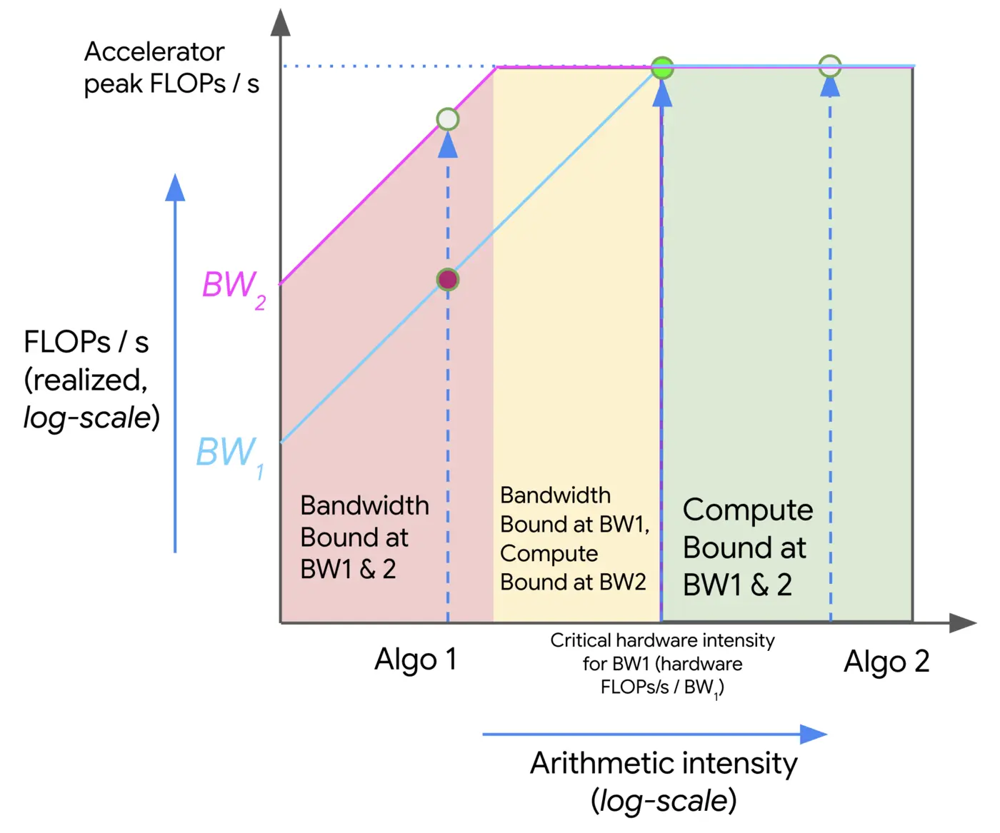
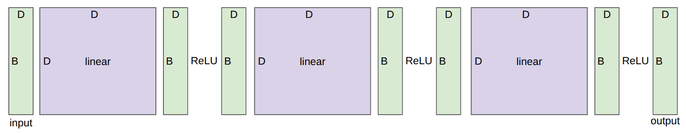

# 1. knowledge overview
What knowledge to take away from this lecture:

- Mechanics: straightforward (PyTorch semantics)
- Mindset: resource accounting (remember to do it)
- Intuitions: get a sense of how resources are spent, no ML magic today

# 2. Memory accounting
## 2.1 tensors_basics()
张量（Tensors）是用于存储一切数据的基本构建单元：
- 数据（data）
- 参数（parameters）
- 梯度（gradients）
- 优化器状态（optimizer state）
- 激活值（activations）
    
每个张量都有一个**阶数（rank）**，即其维度的数量。
`x = torch.zeros(4) # rank 1 tensor (vector)`
`x = torch.zeros(4, 8) # rank 2 tensor (matrix)`
`x = torch.zeros(4, 8, 2) # rank 3 tensor` 

在 Transformer 模型中，我们会看到阶数为4的张量：
`B = 32 # Batch size`
`S = 16 # Sequence length`
`H = 16 # Number of heads`
`D = 64 # Hidden dimension per head`
`x = torch.zeros(B, S, H, D)`
## 2.2 tensors_memory()

张量的元素通常是浮点数。
### **2.2.1 fp32**


`fp32` 数据类型（也称为 `float32` 或单精度）是默认选项。
传统上，在科学计算中，`fp32` 是基准；在某些情况下，你可能会使用双精度（`fp64`）。
在深度学习中，你可以“马虎”很多。

让我们检查这些张量的内存使用情况。
内存由 (i) 值的数量 和 (ii) 每个值的数据类型 决定。
`x = torch.zeros(4, 8)`
`assert x.dtype == torch.float32 # 默认类型`
`assert x.numel() == 4 * 8`
`assert x.element_size() == 4 # 浮点数为4字节`
`assert get_memory_usage(x) == 4 * 8 * 4 # 128字节`

GPT-3 前馈层中的一个矩阵：
`assert get_memory_usage(torch.empty(12288 * 4, 12288)) == 2304 * 1024 * 1024 # 2.3 GB`
### **2.2.2 fp16**

`fp16` 数据类型（也称为 `float16` 或半精度）可以减少内存使用。

`x = torch.zeros(4, 8, dtype=torch.float16)`
`assert x.element_size() == 2`

然而，它的动态范围（尤其是对于小数字）表现不佳。

`x = torch.tensor([1e-8], dtype=torch.float16)`
`assert x == 0 # 下溢（Underflow）！`

如果在训练时发生这种情况，可能会导致训练不稳定。
### **2.2.3 bf16**


Google Brain 在 2018 年开发了 `bfloat16`（脑浮点数）来解决这个问题。
`bf16` 使用与 `fp16` 相同的内存，但拥有与 `fp32` 相同的动态范围！
唯一的缺点是精度（分辨率）较低，但这在深度学习中影响不大。

`x = torch.tensor([1e-8], dtype=torch.bfloat16)`
`assert x != 0 # 不会发生下溢！`

### **2.2.4 Mixed precision**
对训练的影响：
- 使用 `fp32` 训练是可行的，但需要大量内存。
- 使用 `fp16` 甚至 `bf16` 训练存在风险，可能导致训练不稳定。
解决方案：**混合精度训练** [[Micikevicius+ 2017]](https://arxiv.org/pdf/1710.03740.pdf)
- 对**参数、激活值和梯度**使用 `bf16`。
- 对**优化器状态**使用 `fp32`。

PyTorch 有一个自动混合精度（AMP）库。
它会尝试在安全的情况下（例如矩阵乘法 `matmuls`，而非 `exp` 操作）将计算转换为 `bf16`。

`with torch.amp.autocast("cuda", dtype=torch.bfloat16):`
`x = torch.zeros(4, 8)`

### **2.2.5 fp8**
2022 年，受机器学习工作负载的推动，`fp8` 被标准化。

- H100 GPU 支持两种 `fp8` 变体：**E4M3**（范围 [-448, 448]）和 **E5M2**（范围 [-57344, 57344]）。
- 参考：[[Micikevicius+ 2022]](https://arxiv.org/pdf/2209.05433.pdf)
### **2.2.6 fp4**
2025 年，NVIDIA 开发了 `nvfp4`。

- 每个值仅占 **4 位**！
- 数值：`-6, -4, -3, -2, -1.5, -1.0, -0.5, 0.0, 0.5, 1.0, 1.5, 2, 3, 4, 6`
- 每个块使用单独的缩放因子，因此实际上可以获得更大的动态范围（只是不能与邻近值自由变化）。
- Nemotron 3 Super 模型正是在 `NVFP4` 精度下训练的。[[Nemotron 3 Super: Open, Efficient Mixture-of-Experts Hybrid Mamba-Transformer Model for Agentic Reasoning]](https://research.nvidia.com/labs/nemotron/files/NVIDIA-Nemotron-3-Super-Technical-Report.pdf)
- 其中部分操作是在用户控制之外的 NVIDIA 库中完成的。
## 2.3 tensors_on_gpus()

默认情况下，张量存储在 CPU 内存中。

`x = torch.zeros(32, 32)`
`assert x.device == torch.device("cpu")`

但是，GPU 呢？


`device = cuda_if_available() #如果可用则返回 "cuda"，否则返回 "cpu"`

为了利用 GPU 的大规模并行计算能力，我们需要将张量移动到 GPU 内存中。

`x = x.to(device)`

或者直接在 GPU 上创建张量：

`with torch.device(device):`
`x = torch.zeros(32, 32)`
`assert x.device == device`

# 3. Compute accounting
## 3.1 tensor_einops()
### **3.1.1 einops_motivation**

Einops 是一个用于操作张量的库，其特点是维度被命名。  
它的灵感来自爱因斯坦求和约定（Einstein, 1916）。[[Einops tutorial]](https://einops.rocks/1-einops-basics/)

### **3.1.2 einops_einsum**
Einsum 是一种广义矩阵乘法，具有良好的“记账”能力（即能清晰地追踪维度）。

`x = torch.ones(3, 4)  # seq1 hidden` 
`y = torch.ones(4, 3)  # hidden seq2` 

**旧方法（Pytorch原生）**
`z = x @ y # seq1 seq2`

**新方式（einops）**
`z = einsum(x, y, "seq1 hidden, hidden seq2 -> seq1 seq2")`  

让我们尝试一个更复杂的例子...
`x = torch.ones(2, 3, 4)  # batch seq1 hidden` 
`y = torch.ones(2, 3, 4)  # batch seq2 hidden` 

**旧方法（Pytorch原生）**
`z = x @ y.transpose(-2, -1) # batch seq1 seq2`

**新方式（einops）**
`z = einsum(x, y, "batch seq1 hidden, batch seq2 hidden -> batch seq1 seq2")`

**在输出中没有指定的维度会被求和（约减掉）。**
 或者可以使用 `...` 来表示对任意数量维度的广播
 `z = einsum(x, y, "... seq1 hidden, ... seq2 hidden -> ... seq1 seq2")`

### **3.1.3 einops_reduce**
你可以通过某种操作（例如求和、求平均、求最大、求最小）来约减（reduce）单个张量。
我们有一个三维张量：
`x = torch.ones(2, 3, 4)  # batch seq hidden` 
我们的目标是：**对最后一个维度（`hidden` 维度，大小为4）进行求和**，得到一个形状为 `(2, 3)` 的张量。

**旧方法（Pytorch原生）**
`y = x.sum(dim=-1)`

- `dim=-1` 指的是**最后一个维度**，也就是 `hidden` 维度。    
- 这行代码的意思是：把大小为4的那个维度全部加起来，得到一个数字，取代原来这4个位置。
- 结果张量的形状从 `(2, 3, 4)` 变成 `(2, 3)`。

**这个过程，就叫“约减（reduce）”**，因为我们在某个维度上做了归并（求和、平均等），减少了张量的总元素数量。

**新方式（einops）**
`y = reduce(x, "... hidden -> ...", "sum")`
对于张量中所有前面的维度（`...`），取其中的 `hidden` 这个维度，用 `sum`（求和）操作把它约减掉，最终只保留那些前面的维度（`...`）。

### **3.1.4 einops_rearrange**
有时候，一个维度实际上代表了两个维度（例如，被压平在了一起） ...而你想要对其中一个维度进行操作。
**对一个二维张量，模拟“多头”线性变换。[[Attention]]

- **输入**：`x` 的形状是 `(3, 8)`，即 3 个样本（`seq`），每个样本的特征维度是 8（`total_hidden`）。
- **权重**：`w` 的形状是 `(4, 4)`，是一个线性变换矩阵。
- **我们想做的**：把 8 维特征拆成 **2 个头（`heads`）**，每个头有 4 维（`hidden1`），然后用权重 `w` 把这 4 维变成新的 4 维（`hidden2`），最后再合并回 8 维。

step1: `rearrange` —— 拆分维度

`x = rearrange(x, "... (heads hidden1) -> ... heads hidden1", heads=2)`
- **拆解语法**：`"... (heads hidden1)"` 中的括号 `( )` 表示“把原来的一个维度拆成两个”。
- **具体操作**：原来的 `total_hidden=8` 被拆成了 `heads=2` 和 `hidden1=4`。
- **结果**：`x` 的形状从 `(3, 8)` 变成了 `(3, 2, 4)`。

step2: `einsum` —— 组内变换
`x = einsum(x, w, "... hidden1, hidden1 hidden2 -> ... hidden2")`
- **现在的 `x`**：形状是 `(3, 2, 4)`，即 `(seq, heads, hidden1)`。
- **权重 `w`**：形状是 `(4, 4)`，即 `(hidden1, hidden2)`。
- **`einsum` 的操作**：对于每个 `seq` 和每个 `heads`，都拿它那组的 4 维向量，去和 `w` 做矩阵乘法，得到新的 4 维向量。
- **结果**：`x` 的形状从 `(3, 2, 4)` 变成 `(3, 2, 4)`。注意，这里维度大小没变（因为输入4维，输出也是4维），但**数据内容**发生了变化。

step3: `rearrange` —— 合并维度
`x = rearrange(x, "... heads hidden2 -> ... (heads hidden2)")`
- **操作**：这是第一步的逆过程。把 `heads` 和 `hidden2` 这两个维度重新“压平”合并成一个维度。
- **结果**：`x` 的形状从 `(3, 2, 4)` 变回 `(3, 8)`。

## 3.2 tensor_operations_flops()
在了解了所有操作之后，让我们来考察一下它们的计算成本。  
**浮点运算（FLOP）** 是一种基本运算，如加法（x + y）或乘法（x * y）。  
有两个非常容易混淆的缩写词（发音相同！）：

- **FLOPs**：浮点运算次数（衡量完成的计算量）
- **FLOP/s**：每秒浮点运算次数（也写作 FLOPS），用于衡量硬件的速度。

**一些直观数据**

- 训练 GPT-3（2020年）花费了 3.14e23 FLOPs。
- 训练 GPT-4（2023年）据推测花费了 2e25 FLOPs。
- H100 GPU 的峰值性能为：开启稀疏性时 1979 万亿次 FLOP/s，不开启时为其一半（约 990 万亿次 FLOP/s）。

```python
h100_flop_per_sec = 1979e12 / 2
```

8 块 H100 运行 2 周：
```python
total_flops = 8 * 2 * (60 * 60 * 24 * 7) * h100_flop_per_sec  
# 8块卡 * 2周 * (秒数) * 每块卡的每秒FLOP数
```

**线性模型示例**

```python
if torch.cuda.is_available():
    B = 16384  # 点的数量（批量大小）
    D = 32768  # 每个点的维度
    K = 8192   # 输出数量
else:
    B = 1024
    D = 256
    K = 64

x = torch.ones(B, D, device=cuda_if_available())
w = torch.randn(D, K, device=cuda_if_available())
y = x @ w  # 矩阵乘法
```
**这个矩阵乘法（matmul）需要多少次 FLOPs？**
对于每个 (i, j, k) 三元组，我们有一次乘法（x[i][j] * w[j][k]）和一次加法。

```python
actual_num_flops = 2 * B * D * K  
```

我们也可以计时这个操作，看它需要多长时间。

```python
actual_time = benchmark(lambda: x @ w)  
```

**这个操作的实际 FLOP/s（每秒浮点运算次数）：**

```python
actual_flop_per_sec = actual_num_flops / actual_time  
```

每块 GPU 都有其规格表，提供了峰值性能。
例如：[[H100 spec]](https://resources.nvidia.com/en-us-gpu-resources/h100-datasheet-24306)

**注意，FLOP/s 高度依赖于数据类型！**
```python
promised_flop_per_sec = get_promised_flop_per_sec(x.dtype)  
```

**模型 FLOPs 利用率（Model FLOPs Utilization, MFU）**  
定义：MFU = (实际 FLOP/s) / (承诺/峰值 FLOP/s) [忽略通信/开销]

```python
mfu = actual_flop_per_sec / promised_flop_per_sec if promised_flop_per_sec else None  
```

通常，MFU ≥ 0.5 就算相当不错了！

**但为什么 MFU 不能更接近 1 呢？**  
要回答这个问题，我们需要更仔细地研究计算在 GPU 上是如何执行的...
## 3.3 arithmetic_intensity()

**如何执行一次计算：**
1. 将输入从内存发送到加速器（如GPU）
2. 执行计算
3. 将输出从加速器发送回内存

**这需要多长时间？**
取决于两件事：
- **加速器速度（FLOP/s）**：每秒能执行多少次浮点运算
- **内存带宽（bytes/s）**：每秒能传输多少字节的数据
```python
assert h100_flop_per_sec == 1979e12 / 2  # 不开启稀疏性时为峰值的一半
assert h100_bytes_per_sec == 3.35e12     # H100的内存带宽
```

**不同操作的算术强度（Arithmetic Intensity）示例：**
`arithmetic_intensity_relu()                 # ReLU激活函数`
`arithmetic_intensity_gelu()                 # GELU激活函数`
`arithmetic_intensity_dot_product()          # 向量点积`
`arithmetic_intensity_matrix_vector_product() # 矩阵-向量乘法`
`arithmetic_intensity_matmul()               # 矩阵-矩阵乘法`
### **3.3.1 arithmetic_intensity_relu()**

```python
n = 1024 * 1024
x = torch.ones(n, dtype=torch.bfloat16, device=cuda_if_available())
y = torch.relu(x)

bytes = (2 * n) + (2 * n)  # 读取 x，写入 y（bfloat16 每个数占2字节）
flops = n  # n 次比较操作

communication_time = bytes / h100_bytes_per_sec    # 数据传输时间
computation_time = flops / h100_flop_per_sec        # 计算时间
```

假设通信和计算可以完美地重叠（同时进行）。
```python
total_time = max(communication_time, computation_time)  # 总时间取两者中的最大值
```

**瓶颈是什么？**

- **内存受限（Memory-bound）**：通信时间 > 计算时间
- **计算受限（Compute-bound）**：计算时间 > 通信时间
    
在这种情况下，**ReLU 是内存受限的**。
**另一种看待方式：**
加速器强度：加速器每传输1字节能完成多少计算？
加速器强度”是硬件的分界线。它表示：**GPU 每从显存搬 1 byte 数据，至少要做多少 FLOPs，才能把计算单元也忙满。**

```python
h100_accelerator_intensity = h100_flop_per_sec / h100_bytes_per_sec
```

算术强度：对于这个任务，每传输1字节实际完成了多少计算？
```python
arithmetic_intensity = flops / bytes  # 约等于 1/4
```

**瓶颈是什么？**

- **内存受限**：算术强度 < 加速器强度
- **计算受限**：算术强度 > 加速器强度
```python
assert arithmetic_intensity < h100_accelerator_intensity
```
一般来说，我们会发现自己常常处于**内存受限**的状态。
### **3.3.2 arithmetic_intensity_gelu()**

```python
n = 1024 * 1024
x = torch.ones(n, dtype=torch.bfloat16, device=cuda_if_available())
y = F.gelu(x) # GELU(x) = 0.5 x (1 + tanh(sqrt(2/pi) (x + 0.044715 x^3)))

bytes = (2 * n) + (2 * n) # Read x, write y (bf16 is 2 bytes/float)
flops = 20 * n # tanh can be approximated in various ways (e.g., polynomials)

arithmetic_intensity = flops / bytes
h100_accelerator_intensity = h100_flop_per_sec / h100_bytes_per_sec
assert arithmetic_intensity < h100_accelerator_intensity
```

注意，**GeLU 在每传输1字节的数据上做了更多的计算**，因此它比 ReLU 具有更高的算术强度。

但**它仍然是内存受限的**
换句话说，**ReLU 并不比 GeLU 更快**（在以孤立方式单独执行时）。
### **3.3.3 arithmetic_intensity_dot_product()**

```python
n = 1024 * 1024
x = torch.ones(n, dtype=torch.bfloat16, device=cuda_if_available())
w = torch.ones(n, dtype=torch.bfloat16, device=cuda_if_available())

y = x @ w
bytes = (2 * n) + (2 * n) + 2 # Read x, read w, write y
flops = 2 * n - 1 # n multiplications, n-1 additions

arithmetic_intensity = flops / bytes # ~1/2
h100_accelerator_intensity = h100_flop_per_sec / h100_bytes_per_sec
assert arithmetic_intensity < h100_accelerator_intensity
```

Memory-bound!
### **3.3.4 arithmetic_intensity_matrix_vector_product()**

```python
n = 1024
x = torch.ones(n, dtype=torch.bfloat16, device=cuda_if_available())
w = torch.ones(n, n, dtype=torch.bfloat16, device=cuda_if_available())

y = x @ w
bytes = (2 * n) + (2 * n * n) + (2 * n) # Read x, read w, write y
flops = n * (2 * n - 1) # n dot-products

arithmetic_intensity = flops / bytes # ~1
h100_accelerator_intensity = h100_flop_per_sec / h100_bytes_per_sec
assert arithmetic_intensity < h100_accelerator_intensity
```

Memory-bound!
### **3.3.5 arithmetic_intensity_matmul()**
```python
n = 1024
x = torch.ones(n, n, dtype=torch.bfloat16, device=cuda_if_available())
w = torch.ones(n, n, dtype=torch.bfloat16, device=cuda_if_available())

y = x @ w
bytes = (2 * n * n) + (2 * n * n) + (2 * n * n) # Read x, read w, write y
flops = n * n * (2 * n - 1) # n^2 dot products

arithmetic_intensity = flops / bytes # ~n/3
h100_accelerator_intensity = h100_flop_per_sec / h100_bytes_per_sec
assert arithmetic_intensity > h100_accelerator_intensity
```

compute-bound!
只要我们有足够大的矩阵，我们就是**计算受限**的（即能够用满加速器的计算能力）。
训练 Transformer 模型时，涉及的是大规模的矩阵乘法。
**矩阵-向量乘法** 是在**推理（inference）** 阶段发生的，这就是为什么推理是**内存受限**的。
注意：算术/加速器强度也取决于**精度**（`bf16` 与 `fp32` 相比会有差异）。

### **3.3.6 roofline_plots()**
我们可以用**屋顶线图（roofline plots）**来可视化算术强度与性能之间的关系。

- x轴上的每个切片代表一个特定的计算操作（具有某个算术强度值）
- 每个分段线性函数对应一种特定的硬件
- **拐点（Kink）就是加速器强度（即从内存受限过渡到计算受限的分界点）

我们现在可以把它与 **MFU（模型FLOPs利用率）** 联系起来：
**MFU = min(1, 算术强度 / 加速器强度)**
# 4. Memory and compute accounting for training
## 4.1 deep_network()

考虑一个深度网络，它有 `L` 层，且输入、激活值和输出都是 `D` 维的。
```python
def deep_network():
	# 定义网络
	D = 8  # 输入、激活值和输出的维度
	L = 3  # 层数
	model = DeepNetwork(dim=D, num_layers=L).to(cuda_if_available())
	
	num_parameters = get_num_parameters(model)  
	assert num_parameters == (D * D) * L  # 每层 D*D 个参数，共 L 层
	
	# 在一批数据上运行模型
	B = 4  # 批量大小
	x = torch.randn(B, D, device=cuda_if_available())  
	y = model(x)  

	
class Block(nn.Module):
    """简单的模块，应用线性变换后再接 ReLU 非线性激活。"""
    def __init__(self, dim: int):
        super().__init__()
        self.weight = nn.Parameter(torch.randn(dim, dim) / math.sqrt(dim))
    def forward(self, x: torch.Tensor) -> torch.Tensor:
        x = x @ self.weight  # 线性变换
        x = F.relu(x)        # 激活函数
        return x
        

class DeepNetwork(nn.Module):
    """将 `dim` 维向量映射到 `dim` 维向量。"""
    def __init__(self, dim: int, num_layers: int):
        super().__init__()
        self.layers = nn.ModuleList([Block(dim) for i in range(num_layers)])
    def forward(self, x: torch.Tensor) -> torch.Tensor:
        # 按顺序应用所有层
        for layer in self.layers:
            x = layer(x)  
        return x
```
## 4.2 gradients_basics()

到目前为止，我们已经构建了张量，并将它们传入各种操作（前向传播）。
现在，我们要开始计算梯度（反向传播）。
作为一个简单的例子，让我们考虑这个简单的线性模型：
**y = 0.5 * (x * w - 5)²**

**前向传播：计算损失**
```python
x = torch.tensor([1., 2, 3])
w = torch.tensor([1., 1, 1], requires_grad=True)  # 需要计算梯度
pred_y = x @ w
loss = 0.5 * (pred_y - 5).pow(2)
```

**反向传播：计算梯度**
```python
loss.backward()
assert torch.equal(w.grad, torch.tensor([1, 2, 3]))
```
## 4.3 gradients_flops()
让我们来计算一下计算梯度所需的FLOPs。

```python
B = 1024 # Number of points
D = 256 # Dimension

#Define a simplified model (2-layer linear network):
x = torch.ones(B, D, device=cuda_if_available())
w1 = torch.randn(D, D, device=cuda_if_available(), requires_grad=True)
w2 = torch.randn(D, D, device=cuda_if_available(), requires_grad=True)

# Forward pass
h1 = einsum(x, w1, "batch in, in out -> batch out") # x
h2 = einsum(h1, w2, "batch in, in out -> batch out") # h1
loss = (h2.mean() - 0)**2 # Regress everything to 0 (arbitrary)

# Backward pass
h1.retain_grad() # For debugging
h2.retain_grad() # For debugging
loss.backward()
```

`loss.backward()` 是 PyTorch 自动求导机制的“总开关”，它只做一件核心的事：**计算所有 `requires_grad=True` 的张量的梯度**。但它本身不返回任何值，而是把计算结果“存”在每个张量的 `.grad` 属性里。

当你调用 `loss.backward()` 后，PyTorch 会从 `loss` 这个标量开始，沿着计算图反向传播，最终为所有参与计算的、且 `requires_grad=True` 的张量计算出梯度。
调用之后，你可以直接访问：
- `w1.grad`：这是损失函数关于 `w1` 的梯度矩阵，形状与 `w1` 相同 `(D, D)`。
- `w2.grad`：这是损失函数关于 `w2` 的梯度矩阵，形状与 `w2` 相同 `(D, D)`。

**这就是它“得到”的所有东西：一个存在于 `.grad` 属性中的梯度值。** `loss.backward()` 本身不返回任何东西（即返回 `None`）。

为了计算出 `w1.grad` 和 `w2.grad`，`loss.backward()` 在内部实际上“得到”了更多的中间结果，只是没有全部保留下来。
这个过程可以想象成一条反向流水线：
1. **起点**：从 `loss` 开始，它的梯度初始为 `1.0`。
2. **第二层**：反向传播到 `h2`，计算得到 `h2.grad`。这个梯度是临时的，用于下一步。代码中需要用 `h2.retain_grad()` 才能强制保留它，否则它会被释放。
3. **第三层**：利用 `h2.grad` 和 `w2`，同时计算出：
    - `w2.grad` (这是我们最终需要的)
    - `h1.grad` (这是要传给下一层的中间结果)
4. **继续反向**：利用 `h1.grad` 和 `w1`，计算出 `w1.grad` (另一个最终需要的)。

所以，`loss.backward()` 在内部“得到”了整个反向传播链上的所有中间梯度，但**只有那些 `requires_grad=True` 的张量的梯度才会被保存下来**。其他中间结果（比如 `h1.grad`）默认会被丢弃以节省内存，除非你用 `retain_grad()` 明确要求保留。

**聚焦于其中一层**
让我们关注第二层（`h2 = h1 @ w2`）。
- **前向传播**：回想一下前向传播的FLOPs：
    `num_forward_flops = 2 * B * D * D   # 2 * 批次大小 * 输入维度 * 输出维度`
- **反向传播**：运行反向传播需要多少次FLOPs？
    我们需要计算：（loss对输入h1/loss对参数w2）
    1. `h1.grad = d loss / d h1` （损失对`h1`的梯度）
    2. `w2.grad = d loss / d w2` （损失对`w2`的梯度）
        
```python
# 计算 h1 的梯度
h1_grad = einsum(h2.grad, w2, "batch out, in out -> batch in")
assert torch.allclose(h1.grad, h1_grad)

# 计算 w2 的梯度
w2_grad = einsum(h2.grad, h1, "batch out, batch in -> in out")
assert torch.allclose(w2.grad, w2_grad)
```

这两次运算的FLOPs：
`num_backward_flops = (2 * B * D * D) + (2 * B * D * D)  # 两次矩阵乘法的FLOPs`

**注意，反向传播的计算量是前向传播的2倍。**

**考虑所有层**
刚才我们只计算了第二层，还需要对网络中所有参数都进行同样的计算。
**把它们汇总起来：**
- **前向传播**：`2 * (数据点数量) * (参数量)` FLOPs
- **反向传播**：`4 * (数据点数量) * (参数量)` FLOPs    
- **总计**：`6 * (数据点数量) * (参数量)` FLOPs

这个计算适用于**多层感知机（MLP）**。
...但事实证明，对于**短上下文长度**的Transformer模型，这个近似值也同样适用。
## 4.4 optimizer()
回顾一下我们的深度网络。
```python
B = 2  # 批量大小
D = 4  # 输入、激活值和输出的维度
L = 3  # 层数
model = DeepNetwork(dim=D, num_layers=L).to(cuda_if_available())  
```

让我们定义 AdaGrad 优化器
- **动量（Momentum）** = SGD + 梯度的指数移动平均
- **AdaGrad** = SGD + 按梯度平方进行缩放（累积）
- **RMSProp** = AdaGrad + 梯度平方的指数移动平均
- **Adam** = RMSProp + 动量

AdaGrad  [[Duchi+ 2011]](https://www.jmlr.org/papers/volume12/duchi11a/duchi11a.pdf)
```python
optimizer = AdaGrad(model.parameters(), lr=0.01)  
state = model.state_dict()  
```

**计算梯度**
```python
x = torch.randn(B, D, device=cuda_if_available())
y = torch.tensor([4., 5.], device=cuda_if_available())
pred_y = model(x).mean()  
loss = F.mse_loss(input=pred_y, target=y)
loss.backward()
```

**执行一步优化**
```python
optimizer.step()
optimizer_state = {i: dict(p_state) for i, (p, p_state) in enumerate(optimizer.state.items())}  
```

**释放内存**
```python
optimizer.zero_grad(set_to_none=True)
```
