# 1. 本讲问题与核心结论

- 现代 LLM 的“默认配方”是什么？
- 哪些架构选择已经形成共识，哪些仍在快速演化？
- 超参数应如何设定，背后的系统与训练稳定性权衡是什么？

- 核心结论：主流模型大多是 **LLaMA-like Transformer**；差异主要集中在归一化、位置编码、FFN 激活、注意力实现与稳定性技巧
# 2. 从原始 Transformer 到现代 LLM
## 2.1原始 Transformer 的关键选择
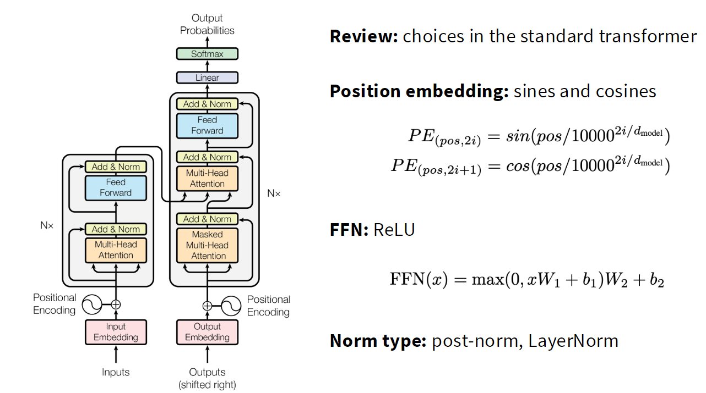

- 正弦/余弦位置编码
- ReLU FFN
- Post-Norm + LayerNorm
- 带 bias 的线性层

## 2.2 本课程实现的现代变体
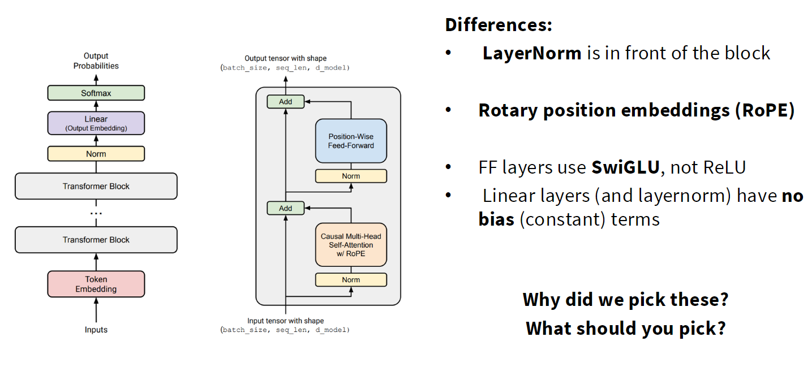
- Pre-Norm
- RoPE（Rotary Position Embedding）
- SwiGLU FFN
- 线性层和归一化层通常不使用 bias

## 2.3 学习架构选择的方法

- 不要将每个新模型视为完全不同的架构
- 从大量公开模型和论文中归纳共同点、例外与证据强度
- 区分“经验上常用”与“有充分消融验证”
# 3. 归一化与残差连接
## 3.1Pre-Norm 与 Post-Norm 

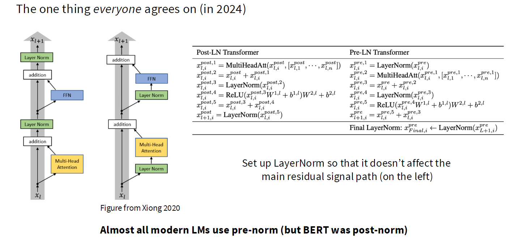
- 两种结构的公式与数据流图
- Post-Norm 的训练不稳定问题
- **Pre-Norm 的核心直觉：避免归一化扰动主残差路径**
- 潜在原因：梯度衰减、梯度尖峰、对 warmup 的依赖
## 3.2 非残差 Post-Norm / Double Norm
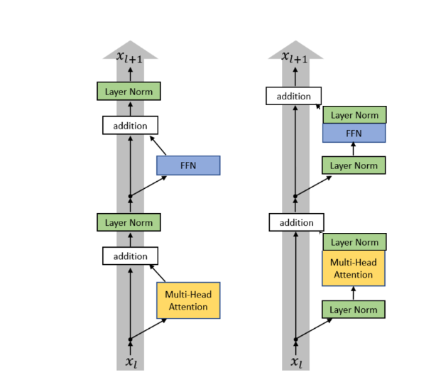
- 为什么有人在保留 Pre-Norm 的同时，再在残差流外加入归一化->保持模型的稳定性
- 一般来说，如果训练时遇到了稳定性问题，可以在注意力里加一个LayerNorm
- 代表模型：Grok、Gemma 2、OLMo 2
## 3.3 LayerNorm 与 RMSNorm

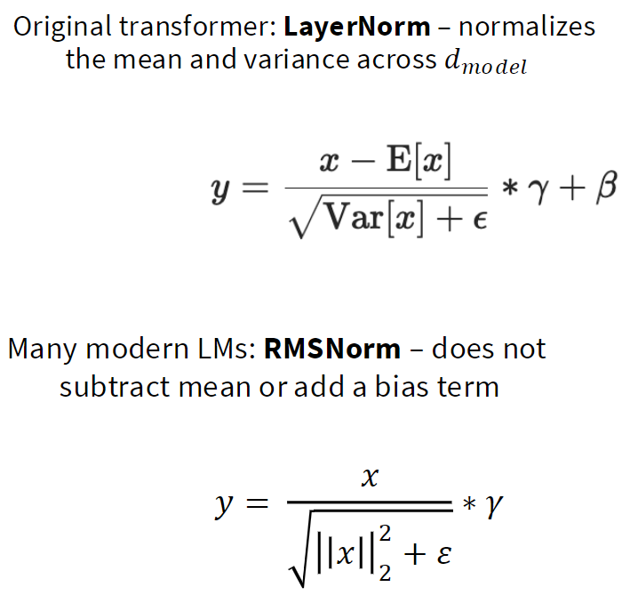
- LayerNorm：减均值并按方差归一化
- RMSNorm：只按 RMS 缩放，通常没有 

> 上一讲讲到了arithmetic intensity 的概念，我们希望通过矩阵乘法（还有其他计算密集型操作）让GPU保持高负载，我们不想白白浪费GPU资源去频繁搬运少量内存，这对GPU来说是一种极度低效的利用。
> 所以我们希望剔除那些规模小且频繁移动内存的操作，但它们对模型的表达能力提升不大，所以这里的想法是，如果均值的减法和加法操作对我们的作用不大，那就直接去掉它

- RMSNorm 的优势：
    - 参数更少
    - 数据搬运更少
    - 运行时间可能更优
- 重要认识：FLOPs 不等于真实运行时间；内存访问同样关键
## 3.4 去除 Bias

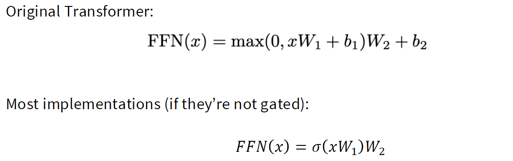
- 现代 Transformer 普遍移除线性层 bias
- 原因：节省参数/访存，并可能改善优化稳定性

## 3.5 小结

- 默认做法：Pre-Norm + RMSNorm，线性层与归一化层通常去掉 bias。
- 例外模型：早期 BERT 使用 Post-Norm；OPT-350M 仍使用 Post-Norm；Grok、Gemma 2 等还引入残差流之外的额外归一化。
- 证据强度：Pre-Norm 在深层网络训练稳定性上已有较强经验和研究支持；RMSNorm 与 LayerNorm 的最终质量差异则更依赖具体训练设置。
- 工程影响：RMSNorm 与无 bias 设计减少参数和内存访问；对大模型而言，减少访存常比减少少量 FLOPs 更重要。
# 4. FFN 与激活函数
## 4.1 常见激活函数

- ReLU
- GELU
- Swish
- GLU 系列：ReGLU、GeGLU、SwiGLU

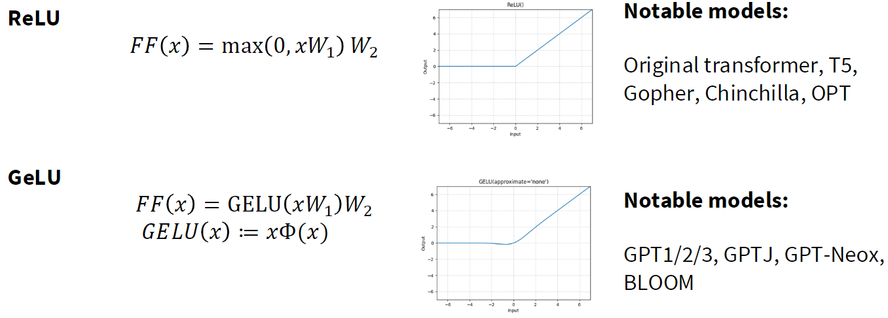
## 4.2 GLU 的机制

普通 FFN 只有“一条特征通路”；GLU 则增加另一条“门控通路”，让模型根据输入动态放大、缩小，甚至反转每个中间特征。

普通 FFN 是：

$\mathrm{FF}(x)=\mathrm{ReLU}(xW_1)W_2$ 

可以分三步理解：

 $x \xrightarrow{W_1} h \xrightarrow{\mathrm{ReLU}} a \xrightarrow{W_2} \text{output}$ 

其中 $x$ 是当前 token 的 hidden state，$W_1$ 把它投影到更宽的 FFN 中间空间，ReLU 决定哪些中间特征被保留，$W_2$ 再投影回模型维度。

---

GLU 改的是中间那一步。它额外计算一条分支：

$g=xV$

于是：

$\mathrm{ReLU}(xW_1) \quad\rightarrow\quad \mathrm{ReLU}(xW_1)\odot(xV)$ 

这里的 $\odot$ 表示逐元素相乘，不是矩阵乘法。

完整的 ReGLU 为：

$\mathrm{FF}_{\mathrm{ReGLU}}(x) = \left[ \mathrm{ReLU}(xW_1) \odot (xV) \right]W_2$ 

也就是说，$xW_1$ 是“候选特征”，而 $xV$ 是由同一个输入 $x$ 算出来的、针对每个特征维度的动态调节系数。

一个数值例子：

 $\mathrm{ReLU}(xW_1)=[2,\,3,\,0],\qquad xV=[0.5,\,2,\,-1]$ 

逐元素相乘：

 $[2,3,0]\odot[0.5,2,-1]=[1,6,0]$ 

含义是：
- 第一维特征被缩小为原来的 $0.5$ 倍；
- 第二维被放大为原来的 $2$ 倍；
- 第三维本来就被 ReLU 关闭，因此仍为 0。

所以，GLU 中的 “gate” 不一定严格介于 0 和 1；在这页的 ReGLU 里，$xV$ 可以大于 1，也可以为负。它更准确地说是一个输入相关的“逐维调制器”。

常见变体只是把左边的 ReLU 换掉：

$\mathrm{GeGLU}(x)= \bigl[\mathrm{GELU}(xW_1)\odot(xV)\bigr]W_2$ 
$\mathrm{SwiGLU}(x)= \bigl[\mathrm{Swish}(xW_1)\odot(xV)\bigr]W_2$ 

其中 SwiGLU 是 LLaMA、Mistral、PaLM 等现代 LLM 很常用的 FFN 形式。

最后，为什么它通常更有效？普通 FFN 只能通过单个激活函数决定某个特征是否通过；GLU 让模型额外学习“在当前上下文下，这个特征该被放大多少”。这提高了 FFN 的表达能力，但代价是多了一套参数 $V$。因此实践中会把 FFN 的中间维度缩小到约原来的 $2/3$，以让总参数量和计算量大致保持不变。

## 4.3 为什么现代模型偏好 SwiGLU / GeGLU

- 门控通常带来较稳定的性能提升
- 为保持参数量接近，GLU 的中间维度通常缩小为原先的约 2/3
- 记录典型经验：非门控 FFN 常取 `d_ff = 4 d_model`；GLU 常取 `d_ff ≈ 8/3 d_model`

## 4.4 串行与并行 Transformer Block

- 串行：Attention → FFN
- 并行：Attention 和 FFN 从同一输入并行计算
- 并行结构可共享归一化并有潜在 kernel fusion 优势
- 当前主流仍以串行结构为主
## 4.5 小结

- 默认做法：使用 SwiGLU 或 GeGLU；GLU 的中间维度一般设为约 `8/3 × d_model`。
- 例外模型：原始 Transformer、T5、OPT 等使用 ReLU；GPT 系列常使用 GELU；也有少数模型采用 Squared ReLU。
- 证据强度：GLU 尤其 SwiGLU/GeGLU 的收益被多项工作重复观察到，属于较可靠的现代默认选择。
- 工程影响：GLU 多一个投影分支，若不缩小中间维度会增加参数与计算；通常通过 `2/3` 缩放保持预算接近。

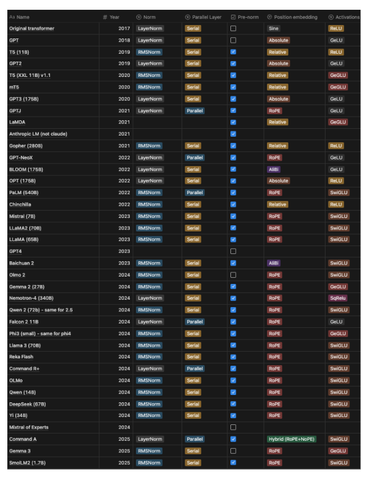
# 5. 位置编码
## 5.1 四类位置编码
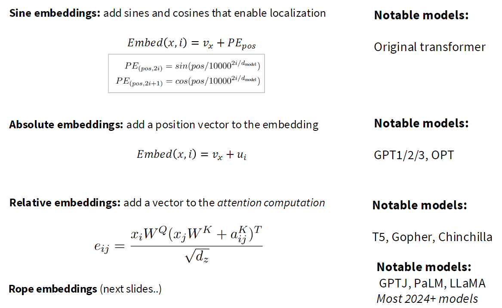
## 5.3 RoPE

> 希望 attention 判断两个词是否相关时，主要看它们相隔多远，而不是它们分别处在句子的第几个位置。

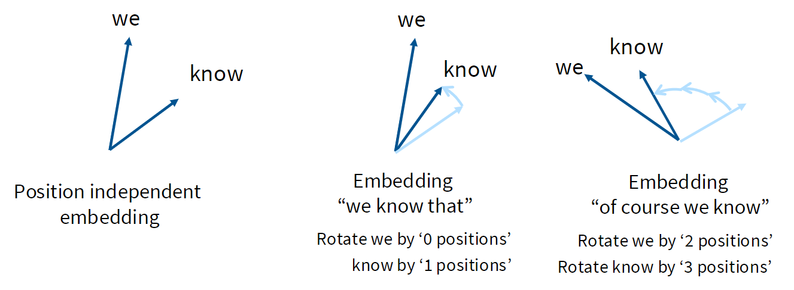
例如，“we”和“know”：
- 在 “we know that” 中，位置是 $0,1$，距离是 1；
- 在 “of course we know” 中，位置是 $2,3$，距离还是 1。
直觉上，这两种情况下 “we → know” 的相对位置关系应该相同。
绝对位置编码和正弦位置编码：模型直接看到的是绝对位置 $i$，而非单纯的距离 $i-j$。

RoPE 希望构造带位置的表示 $f(x,i)$，使得：
$\langle f(x,i),f(y,j)\rangle=g(x,y,i-j)$ 

即：
- 保留 token 内容 $x,y$；
- attention 的匹配分数只通过 $i-j$ 感知位置关系；
- 不直接依赖“第几个位置”。

RoPE 是位置编码方法，但它注入位置的地点是 attention 的 Q 和 K。
计算流程：

 $\text{hidden state} \rightarrow W_Q,W_K \rightarrow \text{RoPE} \rightarrow QK^\top \rightarrow \text{softmax} \rightarrow AV$ 

标准 attention 为：

 $\mathrm{Attention}(Q,K,V) = \mathrm{softmax} \left( \frac{QK^\top}{\sqrt{d}} \right)V$ 

RoPE 只改变 $Q,K$：

 $Q\leftarrow\mathrm{RoPE}(Q),\qquad K\leftarrow\mathrm{RoPE}(K)$ 
通常不改变 $V$。

原因：
- Q-K 内积决定“该关注谁”，需要位置与距离信息；
- V 是最终被汇总的内容，不负责计算匹配分数。

## 5.4 小结

- 默认做法：现代 decoder-only LLM 普遍使用 RoPE。
- 例外模型：原始 Transformer 使用正弦编码；GPT-1/2/3、OPT 使用绝对位置嵌入；T5、Chinchilla 等使用相对位置 bias。
- 证据强度：RoPE 已成为广泛验证的工程选择，但不同长上下文外推策略之间没有唯一最优解。
- 工程影响：RoPE 只作用于 Q、K，计算开销小；它对长上下文扩展、滑动窗口注意力和不同频率缩放策略都有直接影响。

# 6. 超参数的经验规律
## 6.1 FFN 宽度

- 默认规则：
    - 普通 FFN：`d_ff = 4 d_model`
    - GLU FFN：`d_ff ≈ 8/3 d_model`
- 这并不是硬约束：T5-11B 曾采用极大的 FFN 比例

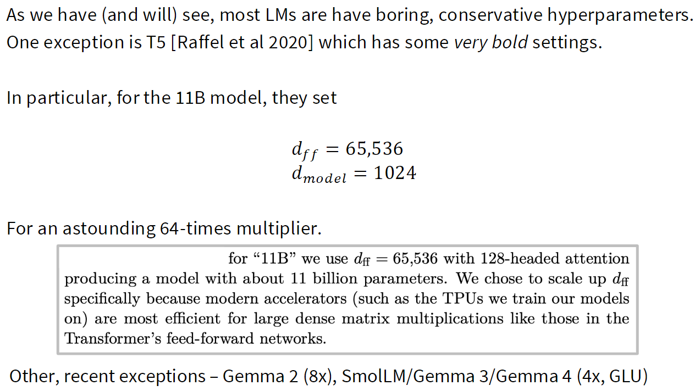

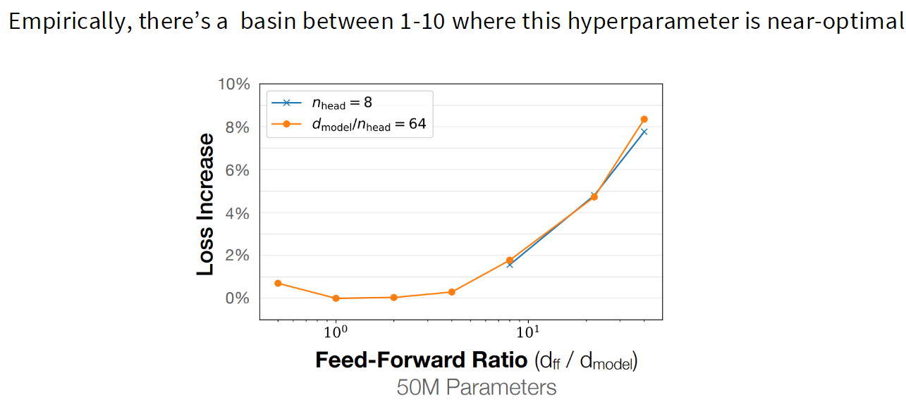
## 6.2 Attention Head 配置

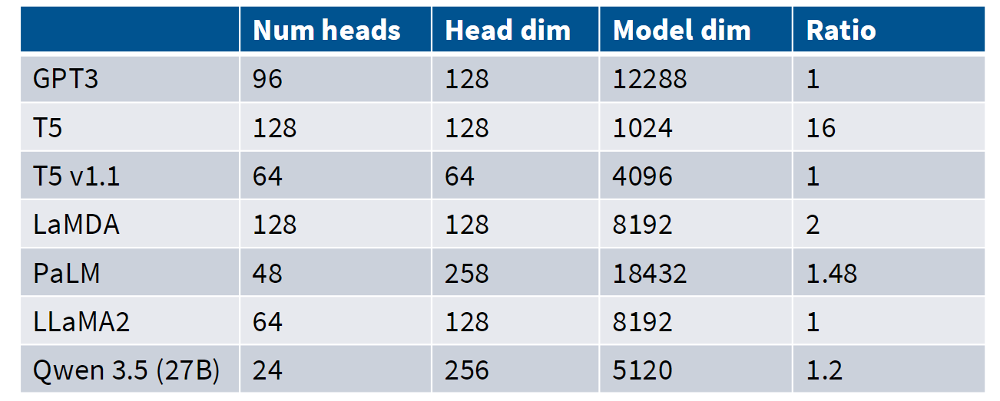
- 常见设置：`num_heads × head_dim ≈ d_model`
- 并非数学上必须成立
- 记录典型模型的例外，如 T5、PaLM
- 结论：这是强经验惯例，但讲义指出其验证证据相对有限

## 6.3 深度与宽度的比例

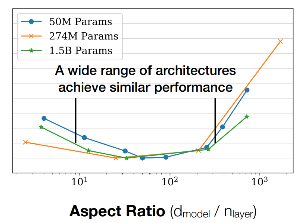
- 关注 `d_model / num_layers`
- 常见有效区间约为 100–200，但不同模型差异明显
- 系统权衡：
    - 过深：难并行、延迟高
    - 过宽：单层计算与显存压力大

## 6.4 词表大小

- 单语模型：通常 30k–50k
- 多语或生产系统：通常 100k–250k
- 词表大小应服务于语言覆盖范围、压缩率与部署需求

## 6.5 Dropout 与 Weight Decay

- 大规模预训练是否需要正则化？
- 趋势：
    - 早期模型常用 dropout
    - 新模型多减少或取消 dropout，但通常仍使用 weight decay
- Weight decay 的关键作用不只是防过拟合，也会与学习率调度及优化动态交互
# 7. 训练稳定性技巧
## 7.1 Softmax 的数值风险
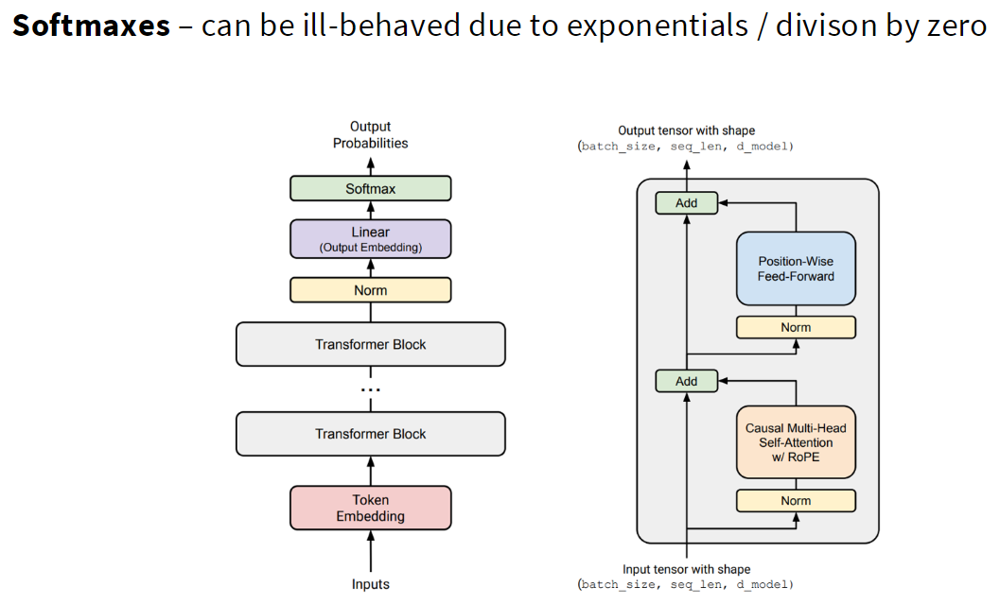
- 指数运算导致 logits 过大
- 除法与归一化可能放大数值问题
- 区分输出 softmax 与 attention softmax 的稳定性问题
## 7.2 稳定输出softmax: Z-loss

- 对输出 logits 加入额外约束
- 目标：抑制输出 logits 爆炸，提升训练稳定性
- 代表使用：PaLM、OLMo 系列等

## 7.3 稳定attention softmax: QK-Norm

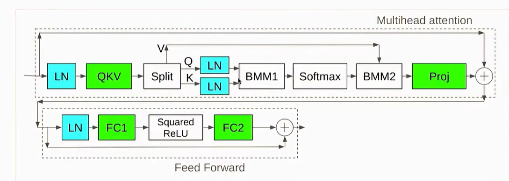
- 在进入 attention softmax 前，对 Query 和 Key 做 LayerNorm / RMSNorm
- 目的：控制 attention logits 的尺度
- 代表使用：Gemma、Qwen、OLMo 等模型
## 7.4 Logit Soft-capping

- 通过 `tanh` 等方式限制 logits 的有效范围
- 优点：防止数值爆炸
- 代价：可能影响模型表达能力或性能，需要实证评估

## 7.5 小结

- 默认做法：稳定训练依赖合理初始化、学习率调度、数值稳定 softmax；新模型越来越常加入 QK-Norm 等显式技巧。
- 例外模型：不同模型会选择 Z-loss、QK-Norm、logit soft-capping 中的一种或多种，未形成唯一配方。
- 证据强度：这些技巧主要来自大规模训练中的经验与具体模型报告，适用性应通过自己的训练曲线验证。
- 工程影响：稳定性问题一旦出现，训练损失、梯度范数或 logits 会突然异常；越晚发现，浪费的算力越多。
# 8. 注意力机制的效率变体

> 模型生成得越长，attention 需要“回看”的历史越多，推理会越来越慢、越来越占显存。
## 8.1 推理阶段的 KV Cache

假设模型已经看到：

> “今天天气很”

现在要预测下一个词。生成时模型一次只能生成一个 token：

 $x_1 \rightarrow x_2 \rightarrow x_3 \rightarrow \cdots$ 

因为第 $t+1$ 个词依赖前面已经生成的全部内容，所以不能像训练那样把未来所有 token 同时算出来。

对于每个 token，attention 会计算：

 $Q=xW_Q,\qquad K=xW_K,\qquad V=xW_V$ 

在生成第 100 个 token 时，新 token 的 Query 要与前 99 个 token 的 Key 匹配，并对它们的 Value 加权求和。

**不使用 KV Cache**
每生成一个新 token，都重新把前面所有 token 输入模型，重新计算它们的 K、V。

- 生成第 10 个词：重算前 9 个词的 K、V；
- 生成第 100 个词：重算前 99 个词的 K、V；
- 生成第 1000 个词：重算前 999 个词的 K、V。

这会产生大量完全重复的计算。

**使用 KV Cache**
历史 token 的 K、V 一旦算出，就存起来：

 $\text{KV Cache}= \{(K_1,V_1),(K_2,V_2),\ldots,(K_{t-1},V_{t-1})\}$ 

生成第 $t$个 token 时，只需要：

1. 计算新 token 的 $Q_t,K_t,V_t$；
2. 把 $K_t,V_t$ 追加到 cache；
3. 用 $Q_t$ 与缓存中所有 $K$ 计算注意力；
4. 用注意力权重汇总缓存中所有 $V$。

即：

$\mathrm{softmax} \left( \frac{Q_tK_{1:t}^{\top}}{\sqrt{d}} \right)V_{1:t}$ 

**为什么推理常受内存带宽限制？**
生成一个 token 时，模型要从显存中读取很长的一串历史 K、V cache。
此时：
- 新做的矩阵计算相对不多；
- 但需要搬运很多历史数据；
- GPU 可能在等待显存把数据读过来。

这就是 memory-bound（受内存带宽限制）：瓶颈不是 GPU 算得不够快，而是数据搬得不够快。

## 8.2 MQA 与 GQA

- MQA：多个 Q head 共享一组 K/V
- GQA：多个 Q head 分组共享较少的 K/V head
- 核心收益：显著减少 KV Cache 的内存占用和读取成本
- 权衡：MQA 可能损失性能；GQA 往往更平衡

## 8.3 稀疏与滑动窗口注意力

- 全注意力复杂度为二次方
- Sliding Window Attention：仅关注局部上下文
- 常见混合策略：大多数层局部注意力，少数层全局注意力
- 目标：在长上下文能力与计算成本之间折中
## 8.4 走向混合架构

- 将 Attention 与 SSM 等机制组合
- 本讲只作引入，后续课程继续讨论

## 8.5 小结

- 默认做法：训练时大多仍使用全注意力；部署推理时，GQA 已成为降低 KV Cache 成本的常见方案。
- 例外模型：MQA 更激进；滑动窗口、稀疏注意力、全局—局部注意力交错，以及 Attention-SSM 混合模型都在快速发展。
- 证据强度：GQA 通常能以较小质量损失换取明显推理收益；MQA 的性能损失在某些设置下更明显。
- 工程影响：自回归推理往往受 KV Cache 读取的内存带宽限制。减少 KV head 数、缩短注意力范围，往往比减少少量算术计算更有效。
# 9. 总结与复习问题

- 为什么 Pre-Norm 比 Post-Norm 更适合深层 LLM？
- RMSNorm 的优势为什么不能只用 FLOPs 解释？
- 为什么 GLU 的 FFN 中间维度通常要缩小？
- RoPE 如何将相对位置信息编码进 Q-K 内积？
- `d_ff / d_model`、`head_dim × num_heads / d_model` 分别有哪些经验规则？
- 为什么生成阶段会变成 memory-bound？
- GQA 如何降低 KV Cache 成本？
- Z-loss、QK-Norm、logit soft-capping 分别控制哪类不稳定性？