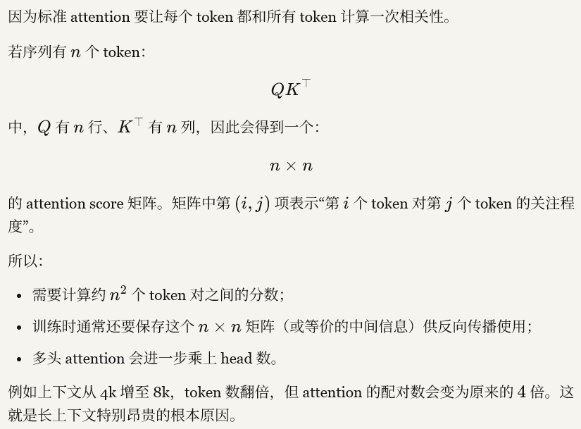
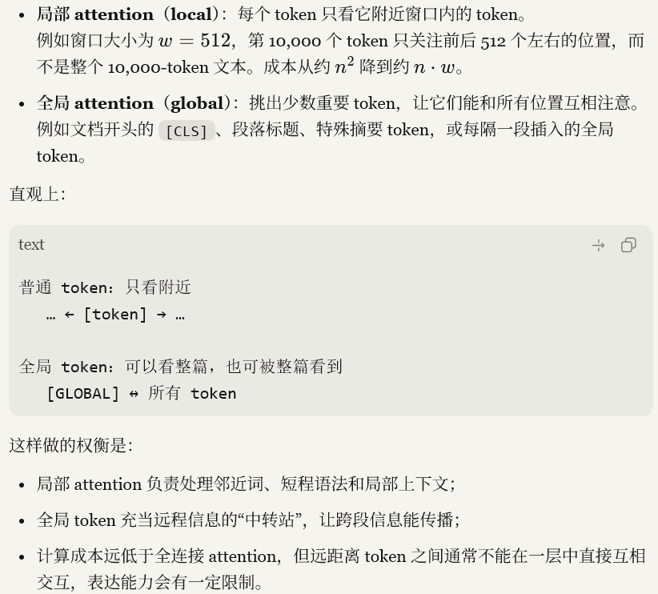
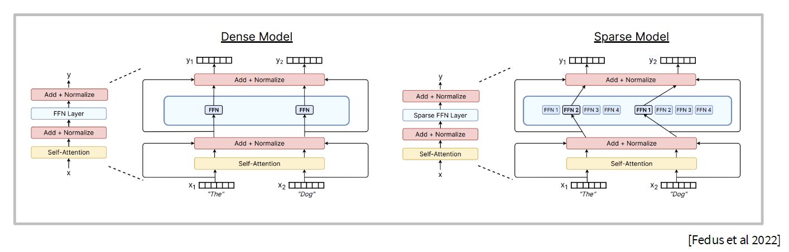
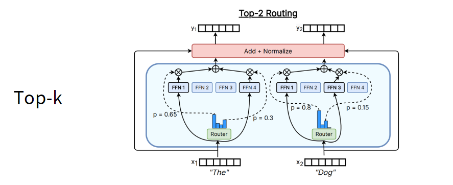
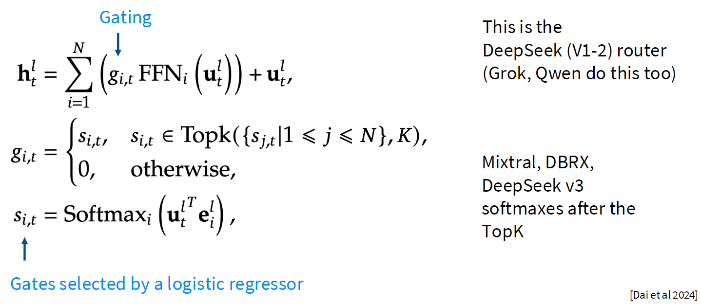
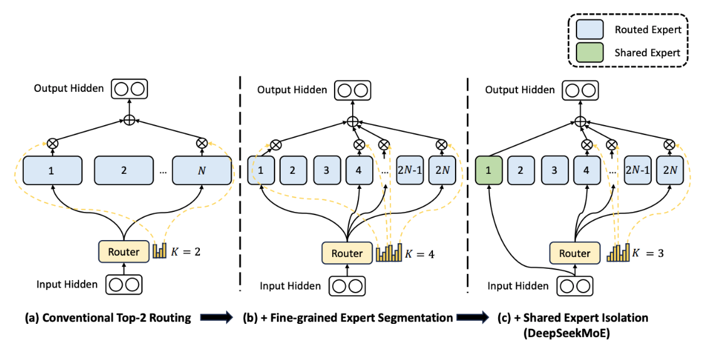
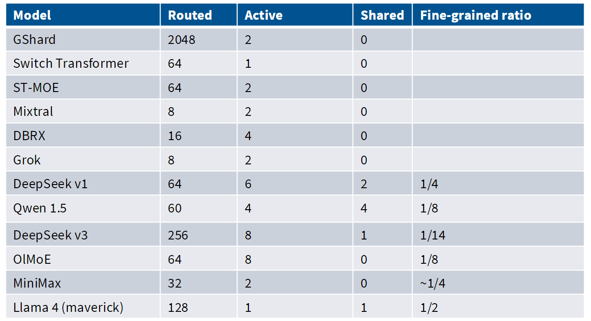
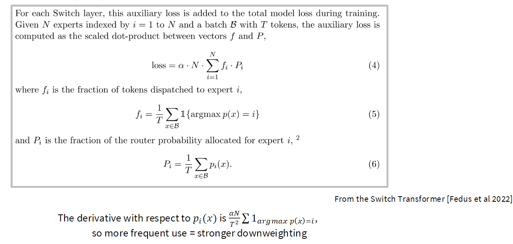
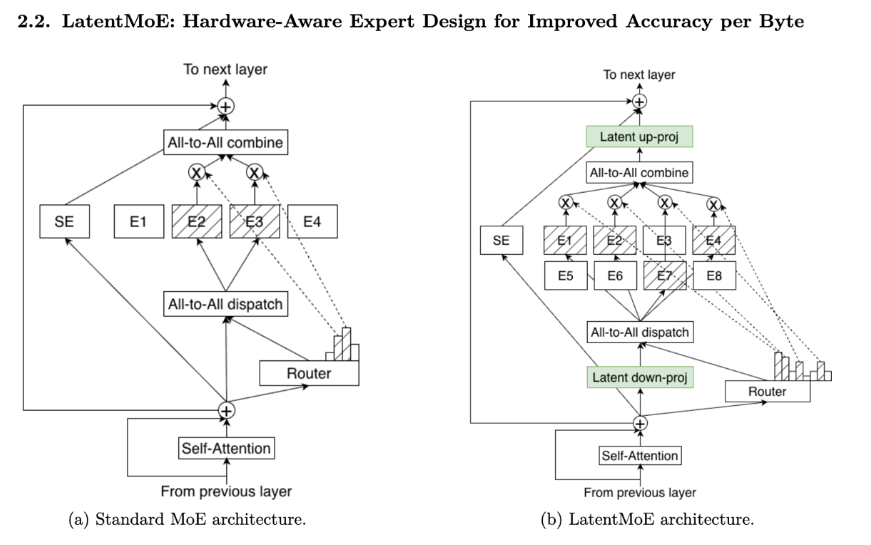
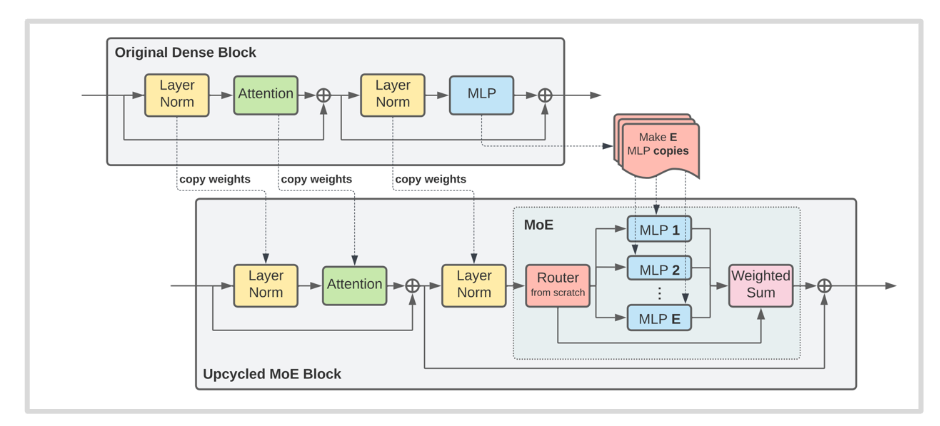

本讲围绕两条降低 Transformer 成本的路线：**替代/稀疏化注意力**与**稀疏专家模型（MoE）**。

# 1. Attention alternatives
## 1.1 问题背景

- 标准 attention 的上下文长度为 $n$时，计算与显存成本随 $n^2$增长。

- 基础优化：
    - 局部 attention + 少量全局 attention；
     
    - 系统层面优化。
- 更激进的路线：
    - Linear Attention / 状态空间模型；
    - 稀疏 attention；
    - 二者与全 attention 的混合架构。

## 1.2 Linear Attention

标准形式：

 $\mathrm{Attn}(Q,K,V)=\rho(QK^\top)V$ 

若暂时令 $\rho$ 为恒等映射，可利用结合律：

 $QK^\top V = Q(K^\top V)$ 

1. 先算 $K^\top V$：把所有 token 的 key 和 value 汇总成一个较小的矩阵，相当于“压缩记忆”；
2. 每个 query 再去读取这份记忆：$Q(K^\top V)$。

$K^\top V$ 的尺寸不再包含序列长度 $n$。

设：

$K\in \mathbb{R}^{n\times d_k},\qquad V\in\mathbb{R}^{n\times d_v}$ 

那么：

 $K^\top V\in\mathbb{R}^{d_k\times d_v}$ 

它的大小是 $d_k\times d_v$，而不是 $n\times n$。

例如：
- 序列长度 $n=10{,}000$
- key 维度 $d_k=64$
- value 维度 $d_v=64$

普通 attention 要形成

 $QK^\top\in\mathbb{R}^{10000\times10000}$ 

即 1 亿个注意力分数。

而 linear attention 先形成：

 $K^\top V\in\mathbb{R}^{64\times64}$ 

只有 4096 个数，大小与文本有多长无关。

直觉上，$K^\top V$ 把所有 token 的信息累加成一个固定大小的“统计记忆”：

$K^\top V=\sum_{t=1}^{n} k_t v_t^\top$ 

每个 token 都贡献一个 $d_k\times d_v$ 小矩阵，最后全部加到同一个矩阵里。文本再长，记忆矩阵的形状也始终不变；新增 token 只是在这个固定大小的矩阵上继续累加。

代价也正来自这里：它把历史压缩了，不能像普通 attention 一样为当前 token 保留“第 372 个历史 token 的精确内容和独立权重”。

## 1.3 递归形式与 RNN 对偶性

定义状态：

 $S_t=S_{t-1}+k_tv_t^\top,\qquad y_t=q_t^\top S_t$ 

可以把它理解成：**把过去所有 token 的信息压缩进一个不断更新的“记忆表” $S_t$**。

其中：
- $k_t$：第 $t$个 token 的“索引/键”
- $v_t$：它携带的“内容/值”
- $q_t$：当前 token 想查询什么
- $S_t$：截至当前时刻的累计记忆
- $y_t$：查询得到的输出

关键是第一式：

$S_t=S_{t-1}+k_tv_t^\top$ 

每读到一个 token，就把它的「键 × 内容」写进记忆；不必保存全部历史 token，也不用和所有过去 token 两两比较。

第二式：

 $y_t=q_t^\top S_t$ 

当前 token 用自己的 query 去读取这个记忆，得到与查询相关的信息。

举个极简的标量例子。假设过去有两条信息：

- token 1：$k_1=2, v_1=3$
- token 2：$k_2=1, v_2=4$

那么：

 $S_1=2\times3=6$             
 $S_2=S_1+1\times4=10$ 

若当前 query $q_2=0.5$，输出就是：

 $y_2=0.5\times10=5$ 

真实模型中 $k,v,q$ 都是向量，所以 $S_t$是矩阵；直觉仍一样：**持续写入一个固定大小的状态，再用 query 读取它。**

它为什么像 RNN？

- RNN：$h_t=f(h_{t-1}, x_t)$，当前隐藏状态依赖上一步状态。
- Linear attention：$S_t=S_{t-1}+k_tv_t^\top$，当前记忆也依赖上一步记忆。

因此推理时只要带着 $S_{t-1}$往前走，每一步更新一次，成本随 token 数量线性增长；无需重算对全部历史 token 的 attention。

## 1.4 从 Linear Attention 到 Mamba-2 / Gated Delta Net

**Mamba-2** 式更新：

 $S_t=\gamma S_{t-1}+k_tv_t^\top$ 

- $\gamma<1$：旧信息逐渐淡忘；
- $\gamma\approx1$：旧信息保留得更久。

这就是 RetNet/Mamba 一类模型常用的“可控记忆”思想。

**Gated Delta Net** 进一步加入输入门控和选择性遗忘：

1. 要不要写入新信息（$\beta_t$）
2. 旧记忆保留多少（$\gamma_t$）
3. 是否先擦掉与当前内容冲突的旧记忆

公式：

 $S_t=\gamma_t(I-\beta_tk_tk_t^\top)S_{t-1}+\beta_tk_tv_t^\top$ 

逐项看：

- $S_{t-1}$：此前累积的记忆。
- $\gamma_t$：整体遗忘门。小则更快忘记旧内容，大则保留更多。
- $\beta_t$：写入门。
    - $\beta_t=0$：完全不更新记忆；
    - $\beta_t$ 大：强烈写入当前 token 的信息。
- $k_t$：当前信息的“索引/主题方向”。
- $v_t$：当前信息的具体内容。
- $\beta_t k_tv_t^\top$：把“在 $k_t$ 这个主题下，内容是 $v_t$”写进记忆。

关键是这部分：

$(I-\beta_tk_tk_t^\top)S_{t-1}$ 

它表示：**先从旧记忆中擦掉与当前 key $k_t$ 相关的部分，再写入新的 value $v_t$。**

一个直觉例子：

- 旧记忆：`“小明的住址 = 北京”`
- 新 token：`“小明搬到了上海”`

普通 linear attention 更像是直接再记一条：

> 小明住北京；小明住上海。

Gated Delta Net 则更像：

> 找到“小明住址”这个记忆槽，先擦掉“北京”，再写入“上海”。

所以它特别适合处理“新信息覆盖旧信息”、变量更新、状态变化等场景。

至于 `test-time training / fast-weight programming`：它们都把模型运行中不断更新的内部状态，当作一种临时可写的记忆；这里的 $S_t$ 就是这块可写、可擦除的临时记忆。

## 1.5 Hybrid 与 Sparse Attention

- 实践中常将 linear/SSM 与 full attention 混合：
    - MiniMax M1：约 7:1 的 linear : full attention；
    - Nemotron 3、Qwen Next 等也采用类似混合路线。
- 目标：在长上下文推理中获得接近线性扩展的成本，同时保留部分全注意力能力。
- 另一条路线是稀疏 attention：
    - 不让每个 token 都访问所有 token；
    - 通过轻量 indexer 选择少量候选；
    - 代表：DeepSeek Sparse Attention（DSA）。
- 稀疏注意力有时可以在已有短上下文 dense 模型上后续适配。

# 2. Mixture of Experts（MoE）
## 2.1 基本概念

- 将 Transformer 中的大型 FFN/MLP 替换为多个 expert FFN。
- Router（selector/gating network）为每个 token 选择少数几个 expert。
- 只有被选中的专家参与计算，因此：
    - 总参数量可大幅增加；
    - 每 token 的 active FLOPs 不必同比增加。

通常只替换 MLP；将 attention head 也做成 MoE 相对少见。

## 2.2 为什么 MoE 流行

- 相同 FLOPs 下，更多参数通常带来更好的效果。
- 相比同规模 dense 模型，训练可能更快、性能更有竞争力。
- Experts 可以分布到不同设备上，天然适合大规模并行。
- 大量领先开源模型采用 MoE；Qwen、DeepSeek 等也做了大量实证与消融研究。

## 2.3 MoE 的关键设计维度

- 路由函数：token 如何选择 expert。
- 专家大小与数量。
- 训练目标：尤其是如何保证负载均衡、训练稳定。

## 2.4 稠密模型和稀疏模型

**Dense model（稠密模型）**：每个 token 都会经过模型的几乎所有参数/模块。
以普通 Transformer 为例：

- 每层所有 token 都经过同一个 Attention 和同一个 FFN；
- 模型有多少参数，推理每个 token 基本都会动用这些参数；
- 例如一个 70B dense LLM，每步推理大致都会使用全部 70B 参数。

**Sparse model（稀疏模型）**：每个 token 只激活模型的一部分参数或连接。
- 总参数可以很大；
- 但一次计算只使用其中一小部分；
- “稀疏”可指不同层面：稀疏 attention、稀疏权重、条件计算等。
MoE 正是最常见的**条件稀疏（conditional sparsity）模型：

Dense FFN:
token → 同一个 FFN → 输出

MoE FFN:
token → router 选 top-k experts → 仅运行这 k 个 FFN → 加权合并输出

比如一个 MoE 有 64 个 experts，但每个 token 只选 2 个：

- 总参数量：包含全部 64 个 expert，可能很大；
- active parameters：该 token 实际使用的只有 2 个 expert 加上共享模块；
- 计算量更接近“小模型”，容量则接近“大模型”。
# 3. Routing（路由）
## 3.1 路由类型

- **Token-choice**：每个 token 选 top-\(k\) 个 expert；最常见。
- **Expert-choice**：每个 expert 选自己要处理的 token。
- **全局优化式路由**：通过匹配/线性分配来决定 token-expert 对应。
- 其他历史路线：
    - 哈希路由；
    - 用 RL 学路由策略。

## 3.2 Top-k routing

- Router 通常由线性/逻辑回归式 gating 网络产生每个 expert 的分数。
- 每个 token 只激活分数最高的 k 个 expert。
- 常见配置：
    - Switch Transformer: k=1
    - GShard、Mixtral、Grok：常见 k=2
    - Qwen / DBRX：常见 k=4
    - DeepSeek：更高的 top-k配置
- 实现差异之一：
    - 有些模型先归一化再取 top-k；
    - 有些模型先选 top-k，再在选中的 expert 内 softmax。

## 3.3 Fine-grained experts 与 shared experts

- 近期趋势：使用**更多但更小的 routed experts**。
- 可额外设置始终激活的 shared experts，负责 token 间的共通知识。
- DeepSeek/Qwen 等采用过 shared experts；但 OlMoE 的消融显示 shared expert 并非始终带来增益。
- 结论：更细粒度专家整体有效，但共享专家的收益依具体模型而定。

# 4. MoE 的训练挑战

## 4.1 离散路由不可微
稀疏 top-k 选择本身不可微，常见解决思路：

1. RL / REINFORCE：原则上直接优化路由，但方差大、复杂，实践中不普遍。
2. 随机扰动：如给路由分数加入 Gaussian noise 或 multiplicative jitter。
3. 启发式负载均衡损失：工业实践中最常见。

## 4.2 Load balancing
目标：让专家被较均匀地使用，否则会出现：

- 热门 expert 成为瓶颈；
- 其他 expert 得不到训练；
- 容量溢出导致 token 被丢弃；
- 设备间负载与通信失衡。

常见做法：

- Switch Transformer 风格的 per-expert auxiliary loss；
- DeepSeek v1/v2：同时做 per-expert 与 per-device 平衡；
- DeepSeek v3：用每个 expert 的动态 bias 与在线更新实现所谓 “auxiliary-loss-free balancing”。
    - 但讲义指出它并非完全没有辅助目标。

# 5. 系统、稳定性与微调
## 5.1 系统问题
- Experts 可分布在不同设备，但路由会引入 all-to-all 通信。
- 高效实现需要稀疏矩阵乘法与专门系统库，例如 MegaBlocks。
- Nemotron 3 等工作还会压缩/down-project activation，减少通信量。

## 5.2 额外随机性
- 路由容量通常在 batch 级别约束。
- 某个 token 是否被丢弃，可能受到同一 batch 其他样本的影响。
- 因此 MoE 的输出可能比 dense 模型多出一种批次相关的随机性。

## 5.3 稳定性与微调
- Router 数值不稳定：
    - 常用 FP32 专门计算 router；
    - 可配合 z-loss 稳定路由 logits。
- 微调：
    - 稀疏 MoE 在小规模微调数据上更易过拟合；
    - 一种方案是微调非-MoE MLP 部分；
    - 另一种方案是使用足量 SFT 数据。

# 6. Upcycling

- **Upcycling**：从已训练好的 dense LM 初始化/扩展成 MoE，而不是从零训练。
- 优点：复用 dense 模型已经学到的表示能力，降低训练成本。
- 例子：
    - MiniCPM：基于已有模型构造 top-2、8 experts 的 MoE；
    - Qwen MoE：由 Qwen 1.8B 初始化，top-4、60 routed experts、4 shared experts。
- 课程重点：upcycling 已有成功案例，是训练 MoE 的重要工程路线。

# 7. DeepSeek MoE 演进
## 7.1 DeepSeek MoE v1
- 约 16B 总参数、2.8B active parameters。
- 2 个 shared experts。
- 细粒度 routed experts。
- 标准 top-\(k\) routing。
- 使用 expert 与 device 两级辅助负载均衡。

## 7.2 DeepSeek MoE v2
- 约 236B 总参数、21B active parameters。
- 引入 top-\(M\) device routing。
- 更重视通信均衡：同时平衡通信流入与流出。

## 7.3 DeepSeek MoE v3
- 约 671B 总参数、37B active parameters。
- 1 个 shared expert、约 258 个 routed experts、每 token 激活 8 个。
- 使用 sigmoid + softmax 的 top-\(k\) 路由。
- 使用动态 expert bias 的负载均衡，并加 sequence-level auxiliary loss。

# 8. DeepSeek v3 的配套组件
## 8.1 MLA（Multi-head Latent Attention）
- 将 Q、K、V 表示为低维 latent activation 的函数。
- 推理 KV cache 只需存储低维 latent，从而显著降低缓存占用。
- 部分投影可与 Q projection 合并。
- 技术难点：RoPE 的位置旋转会与 latent KV cache 压缩冲突。
- 解决思路：保留少量不经 latent 压缩、可施加 RoPE 的 key 维度。

## 8.2 MTP（Multi-Token Prediction）
- 用轻量模块预测多个未来 token，服务于训练或推理加速思路。
- 讲义提及 DeepSeek v3 最终实际使用的是一步 ahead 的 MTP 配置。

# 9.核心结论
- 长上下文的主要瓶颈是 attention 的二次成本。
- Linear attention / SSM 通过状态递推降低推理成本，但通常需要与 full attention 混合。
- MoE 通过“参数稀疏激活”实现更大的总参数量与近似受控的计算量。
- MoE 的真正难点不只是模型结构，而是路由、负载均衡、通信、稳定性与微调。
- 目前大量经验结果表明：在合适的系统支持下，MoE 是高性能 LLM 的有效且具成本优势的路线。