# 1. 为什么需要 GPU
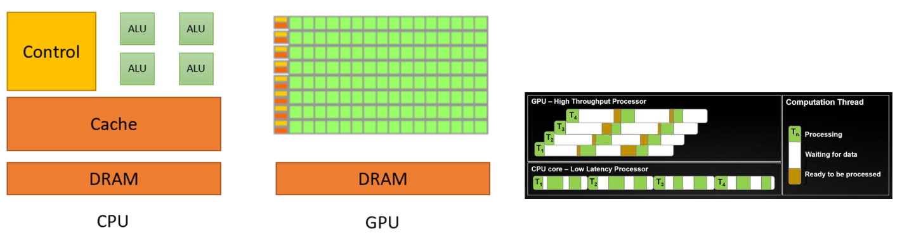
- CPU 优化的是少量线程的**低延迟**：控制逻辑、分支预测和较大的缓存较强。
- GPU 优化的是海量轻量线程的**高吞吐量**：许多简单计算单元并行执行相同指令。
- LLM 的规模化依赖于硬件、利用率和并行化；传统 Dennard scaling 已减缓，但 GPU 的并行规模仍持续增长。

# 2. GPU 的硬件与编程模型

## 2.1 执行层级

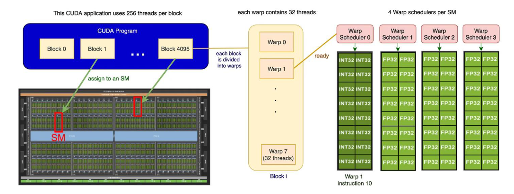


假设你要把 **256 个数字都乘以 2**：
```
输入：x[0], x[1], x[2], ..., x[255]
目标：y[i] = x[i] × 2
```

GPU 不会让一个人从 `x[0]` 算到 `x[255]`，而是把工作拆开。
```
Thread 0   算 y[0]   = x[0] × 2
Thread 1   算 y[1]   = x[1] × 2
...
Thread 255 算 y[255] = x[255] × 2
```

这里每一个“负责算一个数字的人”，就是 **Thread（线程）**。
但 GPU 不会真的一次分别指挥 256 个人。它规定：

> 每 32 个线程必须成一组、一起听同一个指令。

这 32 个线程的一组就是 **Warp**。
```
Warp 0：Thread 0  到 Thread 31
Warp 1：Thread 32 到 Thread 63
...
Warp 7：Thread 224 到 Thread 255
```

所以，图中央的意思只是：
```
256 个线程
= 8 组 warp
= 每组 32 个线程
```

可以把 warp 想成“32 人齐步走的小队”。
而这 256 个线程作为一个整体，叫作 **Block**。
```
一个 Block
├─ Warp 0：32 个线程
├─ Warp 1：32 个线程
├─ ...
└─ Warp 7：32 个线程

总计：8 × 32 = 256 个线程
```

为什么还需要 Block 这个层级？因为同一个 block 内的线程可以：
- 共用一块小黑板（shared memory）
- 在某个阶段互相等待、同步

也就是说：**Block 是一支可以协作完成同一小任务的大队。**
最后是 **SM**。SM 可以直接理解为 GPU 里面的一个“小车间”。
GPU 有很多小车间：
```
GPU
├─ SM 0
├─ SM 1
├─ SM 2
└─ ...
```

GPU 把一个 block 分派到一个 SM：
```
Block 0 ──> SM 0
Block 1 ──> SM 1
Block 2 ──> SM 2
...
```

于是很多 SM 同时做不同 block 的工作，速度就很快。
**SM 里有 4 位调度员，和很多实际做浮点计算的小计算器。**
```
Warp scheduler（调度员）决定：
“下一拍，让哪个 32 人小队执行哪条指令？”

FP32 方格（计算器）负责：
“真的把这 32 次 float32 计算算出来。”
```

以图中的 `Warp Scheduler 1` 为例：
```
Warp Scheduler 1
      │
      │ 选中一个准备好的 warp，例如 Warp 1
      │ 并发出指令：“所有人执行 float32 乘法”
      ▼
一组 FP32 方格
```

这个 warp 有 32 个线程：
```
Warp 1 = Thread 32, Thread 33, ..., Thread 63
```

若它们要算：
```
y[i] = x[i] * 2;
```

调度器只发**一条**“float32 乘法”指令；FP32 方格并行完成这 32 个线程各自的乘法：
```
同一条指令：× 2

Thread 32：x[32] × 2
Thread 33：x[33] × 2
...
Thread 63：x[63] × 2
```

这就是 “Single Instruction, Multiple Threads”：**指令只有一份，数据有 32 份。**
为什么需要 **Warp Scheduler**？因为不是每个 warp 都随时能算。
例如：
```
Warp 0：正在等显存读取数据，暂时不能算
Warp 1：数据已到，ready
Warp 2：正在等待前一条乘法结果
Warp 3：数据已到，ready
```

调度器不会傻等 Warp 0，而会立即选择 `Warp 1` 或 `Warp 3` 来填满 FP32 单元：
```
这一拍：执行 Warp 1
下一拍：执行 Warp 3
再下一拍：Warp 0 的数据到了，执行 Warp 0
```
因此 GPU 隐藏内存延迟的主要方式不是让一个线程跑得特别快，而是：**一个 warp 在等，就换另一个 ready warp 上场。**

## 2.2 内存层级

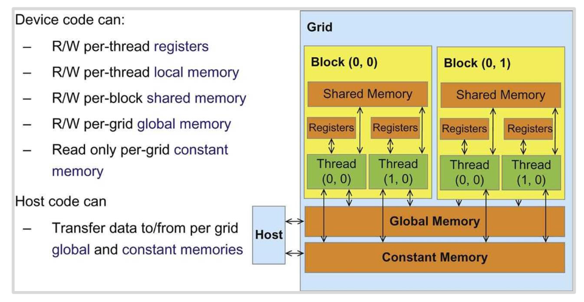

- register 仅供本线程使用；shared memory 仅能被同一 block 内的线程共享。
- 跨 block 通信必须经由 global memory，因此成本高。
- SRAM（shared/L1 等）昂贵但比 DRAM/global memory 快得多；因此，应把会重复使用的数据搬进 shared memory。

## 2.3 Tensor Core 与 TPU

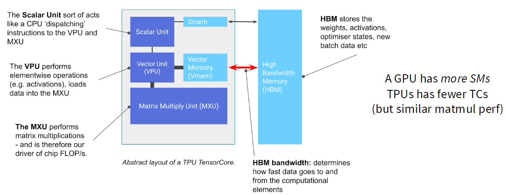

- Tensor Core 是专用矩阵乘法单元，矩阵乘法吞吐可远高于通用浮点运算。
- TPU 与 GPU 的共同点：轻量控制、快速大矩阵乘法单元、快速本地存储。
- TPU 相对更偏向矩阵乘法执行；GPU 有 warp 等机制，非矩阵计算的灵活性不同。

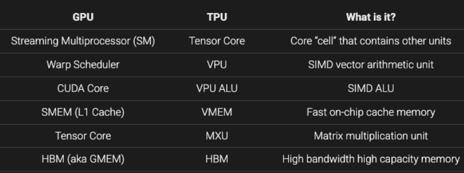
# 3. 用 Roofline 思维理解性能

- **compute-bound**：- 每次搬来的数据能做很多计算，数据供应跟得上；GPU 的计算单元先满负荷。
- **memory-bound**：每次搬数据只做很少计算，GPU 算得太快、常在等数据。
- GPU 中 FLOPs 的扩张快于带宽，许多 ML 工作负载天然容易 memory-bound。

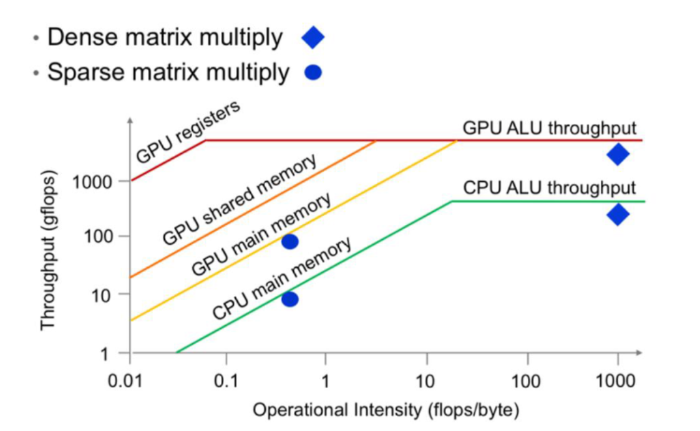
roofline模型表示：在某个关键点之前，我们的瓶颈都是memory-bound；在某个阶段。每移动一单元的工作量已经足够，能让计算单元完全饱和，超过这个临界点，再增加工作量也没有用了。
也就是说，如果你想让代码在GPU上高效运行，你要做的就是保证运行在平稳区，一旦运行在平稳区，就不需要做其他操作了，这时我们到达了最大吞吐量；所以就是要避免落入斜坡区，即提高Operational Intensity(Arithmetic Intensity)，每从内存读取一次，我们做的计算量都得足够大。

 优化总原则

1. 降低 global-memory 的读写量。
2. 复用已经读入的数据。
3. 让 warp 的内存访问连续、对齐。
4. 用足够多且合适大小的工作块填满 SM。

# 4. 常用 GPU 优化技巧

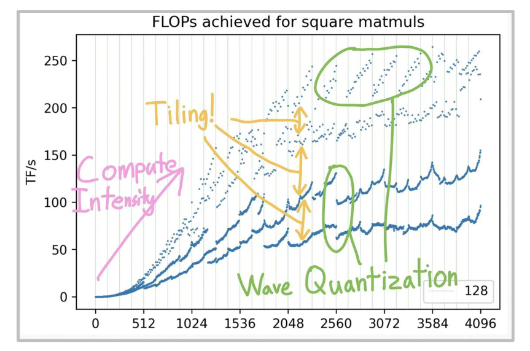

## 4.1 控制分歧（control divergence）

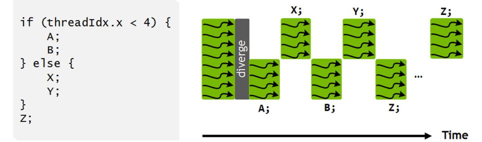

warp 中线程要执行同一条指令。若条件分支让一部分线程走 `if`、另一部分走 `else`，硬件通常需要分路径串行执行并掩蔽不相关线程，造成浪费。

- 条件分支不是不能用；关键是避免同一 warp 内频繁分叉。
- 这主要是执行效率问题，而非内存带宽问题。

## 4.2 低精度 / 混合精度

位宽更低意味着：同样的数据量占更少字节、内存传输更少，且可调用更高吞吐的 Tensor Core 路径。

例：对长度为 `n` 的 ReLU，FP32 的一次读写约为 8 bytes / FLOP，FP16 约为 4 bytes / FLOP。因此 FP16 将算术强度翻倍。
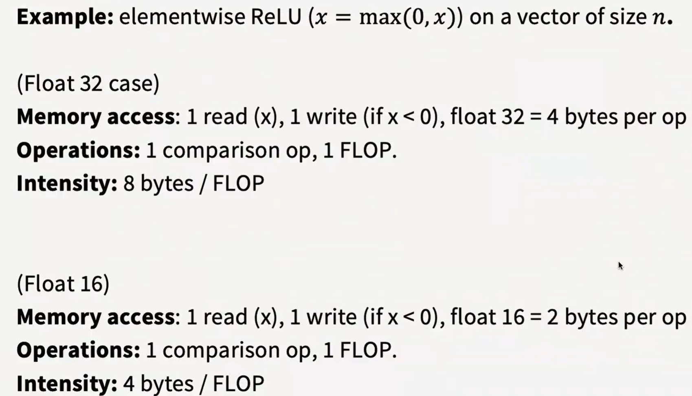

- 常见格式：FP16、BF16、FP8；训练往往保留部分高精度状态以稳定数值。
- MXFP8 使用分组 scale（例如每 32 个值一个缩放因子），可扩展范围但让转置和数据布局更复杂。

## 4.3 算子融合（operator fusion）

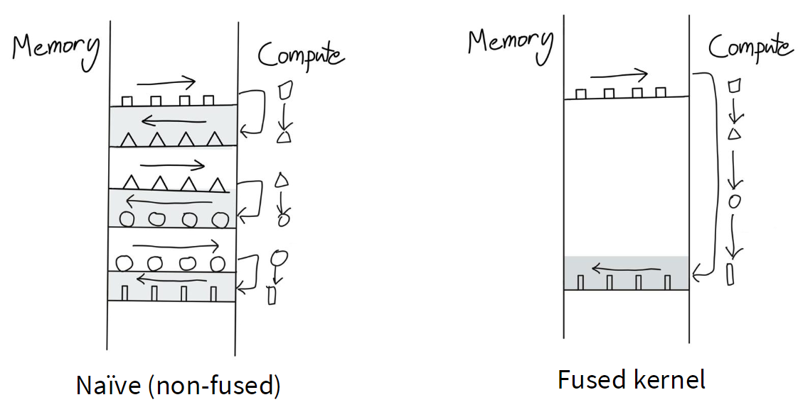
非融合实现会把每个中间结果写回 global memory，再由下一个 kernel 读回；而逐元素算子的 FLOPs 很少，往返显存尤其浪费。

例如 `sin(x)^2 + cos(x)^2` 的朴素实现可能启动多个 kernel；把所有逐元素步骤放进一个 fused kernel 后：

- 中间张量不再落到 global memory；
- 减少 kernel launch 开销；
- 提高算术强度。

PyTorch 的 `torch.compile` 可自动完成一些简单 fusion。

## 4.4 重计算（recomputation / activation checkpoin
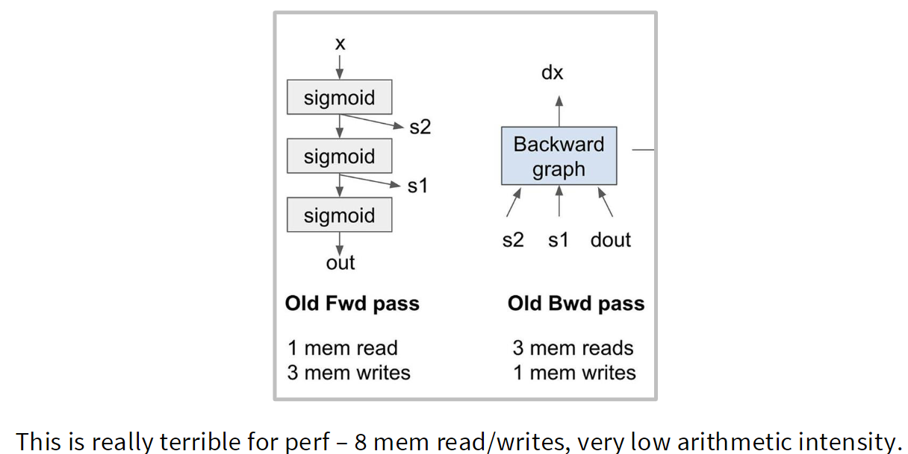ting）
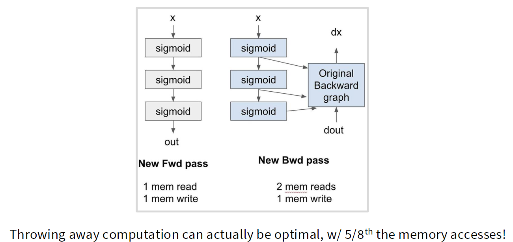
反向传播常需读取前向 activation。对一串计算很便宜、但 activation 很大的算子，保存并读回 activation 的成本可能大于重新计算。

- **做法**：不保存部分 activation，反向阶段重新计算。
- **权衡**：更多 FLOPs，换取更少内存访问/显存占用。

- 这说明“减少计算”不等于“更快”；在 memory-bound 情况下，适度重计算反而更优。

## 4.5 Memory coalescing

DRAM 按 burst 成批读取。一个 warp 的 32 个线程若访问连续且对齐的地址，硬件可用少量事务服务它们，这称为 **coalesced access**。

- 对 row-major 矩阵，线程沿行访问通常连续；沿列访问常是跨步访问，效率低。
- 数据布局、线程索引方式和 padding 都会影响 coalescing。
- 访问不对齐时，即使数据总量相同，也可能需要更多 burst。

## 4.6 Tiling（最关键）

以 `P = MN` 为例。朴素矩阵乘法会反复从 global memory 读取相同的 `M`、`N` 元素。

**Tile 化做法**：

1. 将 `M` 和 `N` 切为小块（tiles）。
2. 一个 block 协作将本 phase 所需的两个 tile coalesced 地读进 shared memory。
3. 线程从 shared memory 多次复用这些数据，累加输出 tile 的部分和。
4. 继续下一对 tile，直至完成输出 tile。

若每个 tile 的边长为 `T`，相较于朴素算法，每个输入从 global memory 的读取次数可约减少 `T` 倍；代价是 shared-memory 容量、寄存器和线程组织都必须适配。

**tile 尺寸的约束：**

- shared memory / register 容量；
- 线程数、warp 组织和 SM occupancy；
- 内存 coalescing 与 burst 对齐；
- 矩阵维度是否能被 tile 整除；必要时 padding；
- 硬件及 Tensor Core 偏好的形状。

## 4.7 Wave quantization

tile 总数不一定恰好能均匀分给所有 SM。最后一波 tiles 若很少，许多 SM 会闲置。

课中示例：使用 `256 x 128` tile，在 A100（108 个 SM）上，矩阵维度从 1792 增至 1793 时，tile 数会由 `7 x 14 = 98` 跳至 `8 x 15 = 120`。这可能多出一整波不满的调度，导致性能出现周期性突变。

**结论**：矩阵“稍微变大”不一定稍微变慢；对齐、tile 数和 SM 波次会造成非线性性能曲线。

# 5. FlashAttention：这些原则如何组合
## 5.1 普通 attention

给定 `Q, K, V`：

`S = QK^T / sqrt(d)`

`P = softmax(S)`

`O = PV`

朴素实现通常将巨大的 `S` 和/或 `P` 物化到 HBM。序列长度为 `N` 时，它们是 `N x N`，内存访问量很大。

## 5.2 核心障碍：softmax 看似需要完整一行

稳定 softmax 使用行最大值：

`softmax(x)_i = exp(x_i - m) / sum_j exp(x_j - m)`，其中 `m = max_j x_j`。

表面上，`m` 和分母都要求先看完整行，似乎无法像矩阵乘法一样分 tile 处理。

## 5.3 Online / incremental softmax

对已处理块维护每行状态：

- `m`：目前为止的最大值；
- `l`：以该最大值为基准的指数和。

处理下一块、其块内最大值为 `m_b`、局部指数和为 `l_b` 时：

`m_new = max(m_old, m_b)`
`l_new = exp(m_old - m_new) * l_old + exp(m_b - m_new) * l_b`

旧块贡献会按新的最大值重新缩放，因而可逐 tile 累积且数值稳定。输出累计值也做相同的重缩放和更新。

## 5.4 FlashAttention 的前向逻辑

对每个 `Q` tile，依次遍历 `K, V` tiles：

1. 在片上存储/共享内存中计算当前块的 `S_tile = Q_tile K_tile^T`。
2. 融合 exp、缩放、online softmax 更新及与 `V_tile` 的乘法。
3. 仅保留每行必要的统计量和输出累计值；不把完整 `S`、`P` 写回 HBM。

这同时运用了：

- **tiling**：让 `Q/K/V` 局部复用；
- **fusion**：中间结果停留在片上；
- **online softmax**：使分块 softmax 成为可能；

- **重计算**：反向传播可按块重算部分中间量，避免保存巨大 attention matrix。

> FlashAttention 的关键不是改变 attention 的数学结果，而是改变 I/O 计划：把昂贵的 HBM 往返降到最低。

# 6. 考试/面试式复习题

1. 为什么 GPU 对分支分歧敏感？
- 因为 warp 以 SIMT 执行；分支不同会使路径串行化并导致部分 lane 空转。

2. 为什么低精度可能更快？
- 减少搬运字节数、提高算术强度，并能利用低精度 Tensor Core。

3. fusion 的核心收益是什么？
- 避免中间张量写回及再读取 global memory，而不是仅仅少启动几个 kernel。

4. 为什么重计算有时更快？
- 当算子计算便宜但 activation 搬运昂贵时，以 FLOPs 换带宽更划算。

5. tiling 为什么提高矩阵乘法性能？
- 将重复读取的输入移到 shared memory 复用，并促成 coalesced global-memory load。

6. FlashAttention 为什么不必存完整 attention matrix？
- online softmax 允许逐 tile 更新最大值、归一化常数和输出累计值。