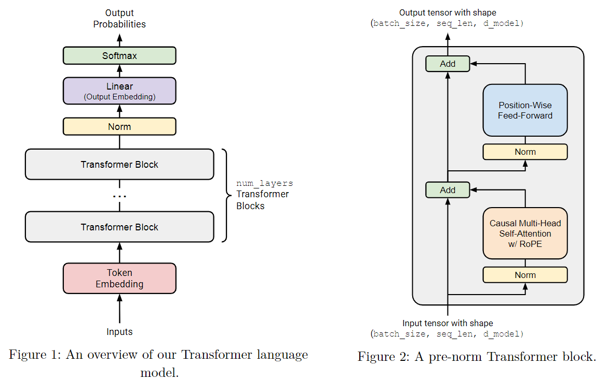
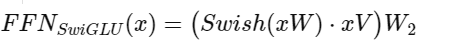
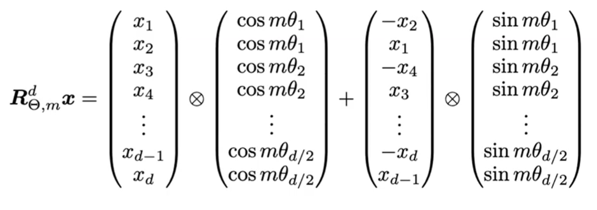
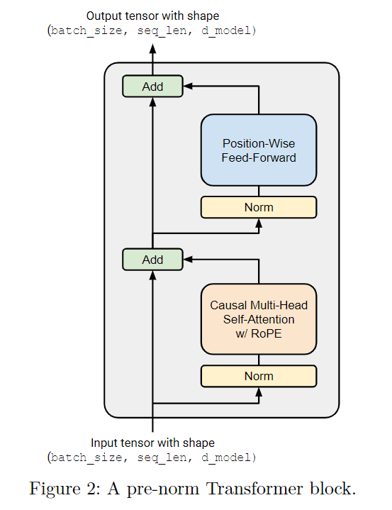
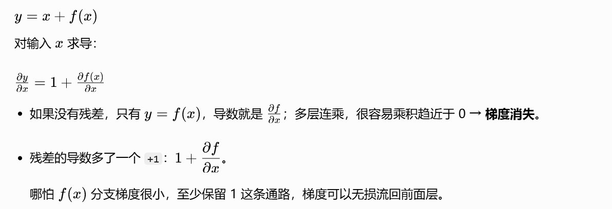
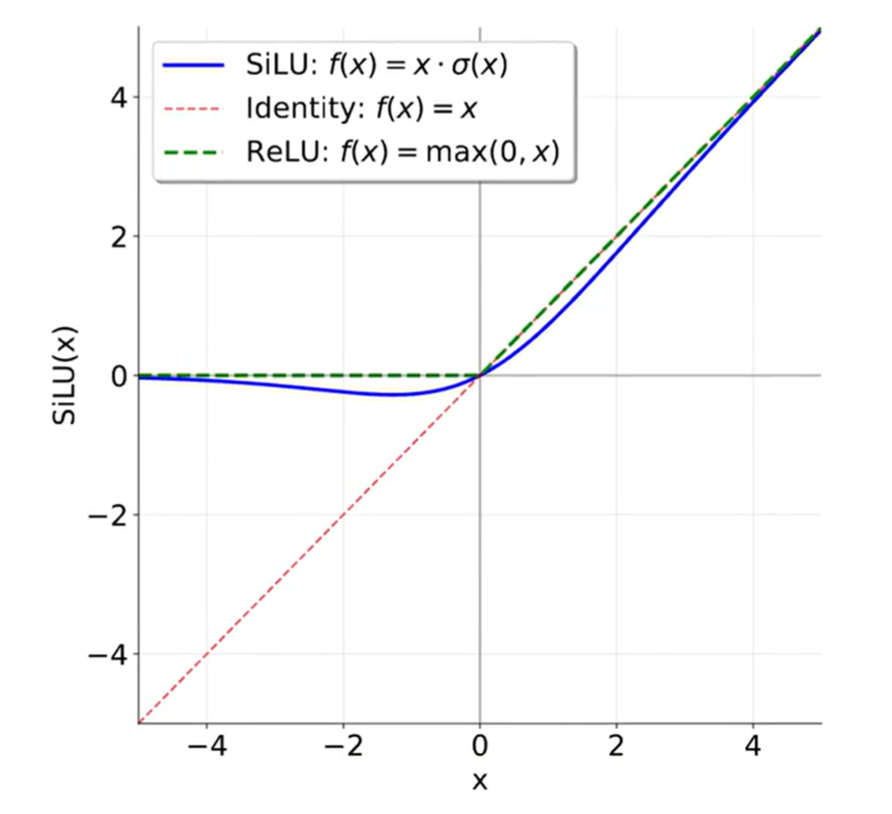
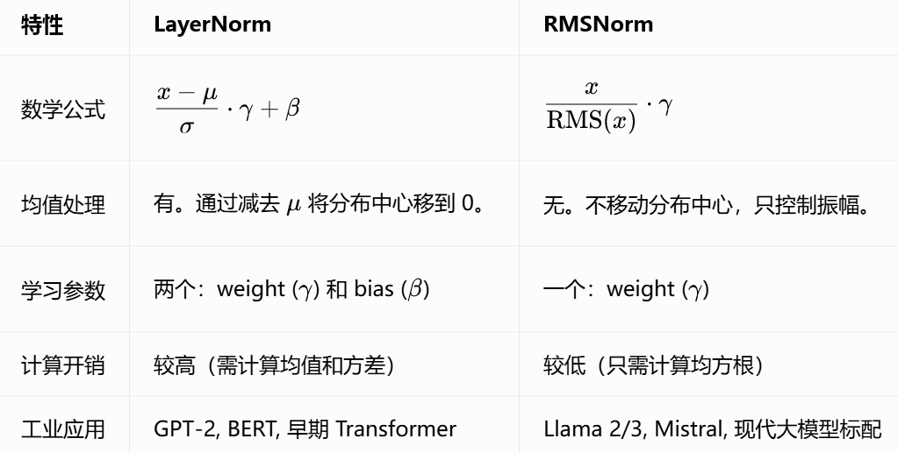
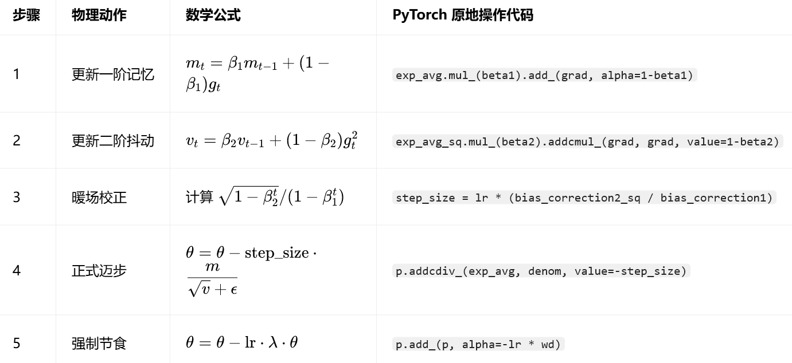

# CS336 Assignment 1 学习笔记

> 从字节级 BPE 到 Transformer 训练的逐章推导与实现记录。
> [返回项目主页](../../README.md) · [实验报告](../../experiments/README.md)

## 快速导航

- [1. 文本编码与 Tokenizer](#1-文本编码与tokenizer)
  - [1.1 ASCII、Unicode 与 UTF-8](#11-ascllunicode与utf-8编码)
  - [1.2 BPE 算法原理与训练实现](#12-bpe算法原理与训练实现)
  - [1.3 完整 Tokenizer 类的封装](#13-完整tokenizer-类的封装)
- [2. 核心基础组件](#2-核心基础组件)
  - [2.1 语言模型全流程](#21-lm全流程)
  - [2.2 Embedding](#22-embedding模块)
  - [2.3 Linear](#23-linear模块)
  - [2.4 Transformer 与注意力](#24-transformer模块)
  - [2.5 前馈网络 FFN](#25-前馈网络-ffn)
  - [2.6 RMSNorm](#26-归一化层-rmsnorm)
- [3. 训练](#3-训练)
  - [3.1 交叉熵](#31-损失函数交叉熵--cross---entropy-loss)
  - [3.2 优化器与 AdamW](#32-优化器)
  - [3.3 Cosine 学习率调度](#33-学习率调整cosine-schedule)
  - [3.4 梯度裁剪](#34-梯度裁剪gradient-clipping)
  - [3.5 数据加载与批处理](#35-数据加载与批处理data-loader)
  - [3.6 Checkpoint](#36-模型保存与恢复checkpoint)
  - [3.7 端到端训练流程](#37-端到端训练流程实现)
- [4. 推理](#4-推理)
  - [4.1 自回归生成机制](#41-自回归生成机制)
  - [4.2 采样策略](#42-采样策略-sampling-strategies)
  - [4.3 生成循环的实现](#43-生成循环的实现)

---

# 1. 文本编码与Tokenizer
## 1.1 ASCll、Unicode与UTF-8编码
### **1.1.1 ASCII 与 Unicode 的映射表**

计算机底层只有 0 和 1。为了显示字符，必须先定义“哪个数字代表哪个字符”。

- **ASCII：**
  - 逻辑：用 1 个字节存储 127 个字符。
  - 例子：字符 `A` 对应数字 `65`。
  - 问题：无法覆盖中文。如果你给一个只有 ASCII 表的系统输入“牛”，它会因为找不到对应的 ID 而产生乱码。

- **Unicode：**
  - 逻辑：为全球 15 万字符分配唯一 ID，称为码点（Code Point）。
  - 例子：`A` 依然是 `65`；汉字“牛”的码点是 `29275`（十六进制 `0x725B`）。
  - 现状：解决了“身份编号”问题，但没规定在内存里怎么存。
---
### **1.1.2 UTF-8、UTF-16、UTF-32 区别与优缺点**

UTF，是 Unicode Transformation Format 的缩写，意为 Unicode 转换格式。它负责把抽象的数字编号（码点），转换成计算机硬盘存储、网络能传输的二进制数据（字节流）。（有了码点，我们需要决定用几个字节来存它。）

| 编码方式   | 存储规则         | 优点                  | 缺点                 | “A”（65）占用 | “牛”（29275）占用 |
| ------ | ------------ | ------------------- | ------------------ | --------- | ------------ |
| UTF-32 | 无论啥字，固定 4 字节 | 读取速度快，无需计算长度        | 极度浪费空间（存英文多 3 倍体积） | 4 bytes   | 4 bytes      |
| UTF-16 | 2 或 4 字节     | 历史遗留产物（Java/Win 核心） | 不上不下，变长处理也麻烦       | 2 bytes   | 2 bytes      |
| UTF-8  | 变长（1–4 字节）   | 空间效率极高，兼容 ASCII     | 读取第 N 个字符需要遍历，稍慢   | 1 byte    | 3 bytes      |

### **1.1.3 UTF‑8 编码原理：它是如何拆分字节的？**

UTF‑8 采用**前缀识别法**，通过字节的开头几位来判断该字符占几个字节。
#### **1. 编码模板**

| 码点范围 (十六进制)   | 字节数 | 字节 1 模板    | 字节 2       | 字节 3       | 字节 4       |
| ------------- | --- | ---------- | ---------- | ---------- | ---------- |
| 0000‑007F     | 1   | `0xxxxxxx` | -          | -          | -          |
| 0080‑07FF     | 2   | `110xxxxx` | `10xxxxxx` | -          | -          |
| 0800‑FFFF     | 3   | `1110xxxx` | `10xxxxxx` | `10xxxxxx` | -          |
| 010000‑10FFFF | 4   | `11110xxx` | `10xxxxxx` | `10xxxxxx` | `10xxxxxx` |

- 控制位：`1110` 开头表示后面还有 2 个字节。
- 延续位：`10` 开头表示这是一个 “从属字节”，不是新字符的开头。

#### **2. 拆解示例：以 “牛” 字为例**
取码点：`ord('牛')`

```
print(ord('牛'))        # 29275
print(hex(29275))       # 0x725B
print(bin(29275))       # '0b111001001011011'
print('牛'.encode('utf‑8')) # b'\xe7\x89\x9b'
```

1. `29275`，十六进制为 `0x725B`。
2. 转二进制：`0111 0010 0101 1011`（16 位）。
3. 填模板：`0x725B` 在 `0800‑FFFF` 范围内，对应 3 字节模板。
    - 模板：`1110 xxxx | 10 xxxxxx | 10 xxxxxx`
    - 填充：`1110 0111 | 10 001001 | 10 011011`
    
4. 算结果：
    - 字节 1：`11100111` = 231 (`0xE7`)
    - 字节 2：`10001001` = 137 (`0x89`)
    - 字节 3：`10011011` = 155 (`0x9B`)
    
- 验证：Python 运行 `'牛'.encode('utf‑8')` 结果正是 `b'\xe7\x89\x9b'`。

---
## 1.2 BPE算法原理与训练实现

> 分词结果可视化网站：[https://tiktokenizer.vercel.app/](https://link.wtturl.cn/?target=https%3A%2F%2Ftiktokenizer.vercel.app%2F&scene=im&aid=582478&lang=zh "autolink")\
### **1.2.1 为什么需要 Tokenizer？**

为什么不能直接把 UTF‑8 字节（0‑255）丢给模型？

如果模型直接读取原始字节：

- **计算成本爆炸**：Transformer 的注意力机制（Self‑Attention）计算复杂度是序列长度 N 的平方，即 $O(N^2)$
- 例子：单词 `"Transformer"` 占用 11 个字节。如果以字节为单位，序列长度就是 11；如果将其作为一个整体 Token，长度就是 1。
- 结果：直接用字节会导致输入序列极其漫长，模型不仅跑得极慢，而且显著增加显存占用。

**Tokenizer 的本质作用**：在 “词表大小” 和 “序列长度” 之间寻找平衡点。通过将常见的字节组合打包成一个数字（Token），实现对文本的压缩。

**BPE（Byte‑Pair Encoding）** 只是 Tokenizer 的一种主流实现方案，它是通过统计学手段自动寻找最值得合并的字节组合。

- 有一个训练集，用来 train tokenizer
- 训练集 $\xrightarrow{UTF‑8}$ 字节序列 (0-255)
- 迭代：
    ① pair: $\langle B_1,B_2\rangle$ , num
    ② 找到最大 num 的 pair → best_pair
    ③ 认为 best_pair 是 dict 中的一个。
---
### **1.2.2 预分词（Pre‑tokenization）**

 >相比于 tokenizers 来说，pre_tokenizers 是相对而言更加简单更加容易理解的，预分词的作用，就是根据一组规则对输入的文本进行分割，这种预处理是为了确保模型不会在多个 “分割” 之间构建 tokens。
   比如如果不进行预分词，而是直接进行分词，那么可能出现这种情况："您好 人没了" -> "您" "好人" "没了"。
   也就是说分词有可能会产生这种与我们日常经验相悖的分词效果，而预分词就可以有效地避免这一点，比如在分词前，先在使用预分词在空格上进行分割："您好 人没了" -> "您好" "人没了"，再进行分词："您好" "人没了" -> "您好" "人" "没了"。


在统计字节对频率前，我们必须执行 “预分词”。

- **为什么要预分词？**：为了防止 BPE 学习到跨越语义边界的无意义组合。保证 token 的完整性，让模型更容易学习语义。
- **结构破坏的案例**：
    假设语料库中有个句子：`"It is good"`。
    
	错误的 token：`t i`
	正确的 token：`It`

- **解决方案**：通过正则表达式，将文本切分为 `["It", "is", "good", ".", "!"]`。这样，t 永远只能在单词内部寻找合并对象。这保证了 token 的完整性，让模型更容易学习语义。
---
### **1.2.3 BPE 训练的步骤**

BPE 训练并不直接在原始长文本上扫描，而是通过一个词频字典进行高效迭代。

**Step 1：字节化与初始化**
将语料库通过 UTF‑8 编码转为字节。初始词表（Vocab）为 0‑255，每个字节都是一个独立的 Token。

**Step 2：构建统计字典**
统计预分词后，每个独立单位（Pre‑token）出现的次数。

- 例子：
    
    `{ (b'l', b'o', b'w'): 5, (b'l', b'o', b'w', b'e', b'r'): 2, (b'n', b'e', b'w', b'e', b's', b't'): 6 }`

(注意：这里的每一项都是字节 Token 的元组)

**Step 3：寻找最频繁的 “字节对”（Byte Pair）**
扫描字典，计算所有相邻两个 Token 组合出现的总频次：

- `(b'e', b'w')` 出现了 6 次（在 `newest` 中）。
- `(b'l', b'o')` 出现了 5+2=7 次（在 `low` 和 `lower` 中）。
- 胜出者：`(b'l', b'o')` 是当前最频繁的字节对。

**Step 4：合并与记录（Merge）**
1. 产生新规则：`(b'l', b'o') -> b'lo'`。
2. 更新词表：将新产生的 `b'lo'` 加入词表（分配新 ID，如 256）。
3. 更新字典：将字典中所有 `(b'l', b'o')` 替换为 `b'lo'`。

新字典：`{ (b'lo', b'w'): 5, (b'lo', b'w', b'e', b'r'): 2, ... }`

**Step 5：迭代**
重复 Step 3 和 4，直到词表大小达到预设值（如 10,000）。

---
### **1.2.4 性能优化：倒排索引 (Inverted Index)**

- 普通法：每合并一个对，就遍历整个字典（包含几万个唯一词）去替换。
- 优化设计：
    a. 建立索引：`indices[ (b'l', b'o') ] = {词1, 词2}`。
    b. 当确定合并 `(b'l', b'o')` 时，只去修改词 1 和词 2。
    c. 同时更新受影响的邻居（如 词 1 中原有的邻居关系会变，需要增量加减 `stats` 计数）。
---
### **1.2.5 Special Tokens (特殊 Token)**

#### **1.2.5.1 定义与核心作用**

Special Tokens 是分词器中具有特定功能、不可拆分的原子单位。与通过统计学学习到的普通 Token 不同，它们通常由开发者手动预设，用于定义序列结构或触发特定行为。

1. **结构化标记：界定序列边界**

- `<|endoftext|>` (EOS)：告诉模型该篇文档已结束。
- 目的：预训练时通常会将多篇短文拼接在一起。若无 EOS 隔离，模型会误认为前一篇的末尾与后一篇的开头存在因果逻辑。
- `[PAD]` (Padding)：用于批处理（Batch）时对齐不等长的序列，配合 Attention Mask 告知模型忽略此类占位符。

2. **对话模板：角色分界**

- 在 Chat 模型中，特殊 Token 用于标识 `system`、`user`、`assistant` 的对话起止，防止模型混淆对话内容与控制指令。

#### **1.2.5.2 垂类应用：提速与压缩**

在医学、法律等专业领域，可以将高频长术语手动设为 Special Tokens（或 Added Tokens）。

- **案例：医学术语优化**
    - 原始分词：`"系统性红斑狼疮"` 会被拆分为 `[系统，性，红，斑，狼，疮]`（约 6 个 Token）。
    - 特殊 Token 化：将其设为单一 ID，消耗 Token 数降为 1 个。
    
- **目的：**
    - 提升推理速度：模型前向传播次数直接与生成的 Token 数挂钩，压缩 Token 数可显著降低推理延迟。
    - 节省上下文窗口：在有限的上下文长度内，能容纳更多的专业信息。

---
## 1.3 完整Tokenizer 类的封装

### **1.3.1 编码 (Encode)：**

BPE 的编码过程必须严格重现训练时的 “演化历史”。

1. **核心原则：按照训练时的合并顺序**

在训练阶段，每一对合并规则产生的顺序被记录了下来。这个顺序就是 **Rank**。

- Rank 0：最早被合并的（通常是最高频的）。
- Rank N：最后被合并的。

 2. **编码流程**

场景设定：

- 输入单词：`target`
- 初始字节序列：`['t', 'a', 'r', 'g', 'e', 't']`

假设我们训练好的 Merges 规则如下（按 Rank 排序）：

> Rank 越小，优先级越高，越应该先合并。

1. `e + t → et`（Rank 0 ‑ 最高优）
2. `a + r → ar`（Rank 1）
3. `g + et → get`（Rank 2）
4. `t + ar → tar`（Rank 3）
---

 **推演过程**

 **ROUND 1：全局扫描**

- 当前序列：`['t', 'a', 'r', 'g', 'e', 't']`
- 存在的相邻对：
    - `t, a`（无规则）
    - `a, r`（命中 Rank 1）
    - `r, g`（无规则）
    - `g, e`（无规则）
    - `e, t`（命中 Rank 0）
- 决策：
    - 虽然 `a,r` 在 `e,t` 前面出现，但 `Rank 0 < Rank 1`。
    - BPE 的铁律：优先合并 Rank 最小的。
- 执行合并：`e + t → et`。

 **ROUND 2：新序列扫描**

- 当前序列：`['t', 'a', 'r', 'g', 'et']`（注意：et 已成为一个整体 Token）
- 存在的相邻对：
    - `t, a`（无规则）
    - `a, r`（命中 Rank 1‑上一轮输了，这轮还在）
    - `r, g`（无规则）
    - `g, et`（命中 Rank 2‑这是新产生的组合）
- 决策：
    - 比较候选者：`a,r`（Rank 1）vs `g,et`（Rank 2）。
    - Rank 1 < Rank 2。
- 执行合并：`a + r → ar`。

 **ROUND 3：继续迭代**

- 当前序列：`['t', 'ar', 'g', 'et']`
- 存在的相邻对：
    - `t, ar`（命中 Rank 3）
    - `ar, g`（无规则）
    - `g, et`（命中 Rank 2）
- 决策：
    - 比较候选者：`t,ar`（Rank 3）vs `g,et`（Rank 2）。
    - Rank 2 < Rank 3。
- 执行合并：`g + et → get`。

 **ROUND 4：收尾**

- 当前序列：`['t', 'ar', 'get']`
- 存在的相邻对：
    - `t, ar`（命中 Rank 3）
    - `ar, get`（无规则）
- 决策：
    - 只剩一个候选者，直接合并。
- 执行合并：`t + ar → tar`。

 **FINAL RESULT：**
- 最终序列：`['tar', 'get']`

**代码实现的逻辑**
```
while True: 
	# 1. 找出当前序列中所有相邻的 pair 
	# 2. 检查这些 pair 是否在 merges 规则中 
	# 3. 如果都不在，停止循环 
	# 4. 如果有多个在，找出 rank 最小的那个 best_pair 
	# 5. 执行合并：将序列中所有的 best_pair 替换为新 Token
```

---
### **1.3.2 解码 (Decode)：**

 **1. 流程**

1. 查表：遍历 ID 列表，从 `vocab` 中找到对应的 `bytes`。
2. 拼接：将所有 `bytes` 拼成一个长字节串。
3. 解码：调用 `.decode('utf-8')`。

 **2. 致命问题：不合法的字节流**

由于 BPE 是基于统计的，模型有时可能会生成（或者被截断）“半个汉字”。

- 汉字 “牛”：`b'\xe7\x89\x9b'`（3 字节）。
- 场景：模型只生成了前两个 Token 对应的字节 `b'\xe7\x89'`，然后就被截断了（比如达到 `max_len`）。
- 后果：直接 `decode('utf‑8')` 会抛出 `UnicodeDecodeError`，导致整个服务崩溃。

 **3. 解决方法：`errors='replace'`**

```
text = byte_stream.decode('utf-8', errors='replace')
```

检测到非法字节（不符合 UTF‑8 编码规则）。用 �（`\ufffd`，Unicode 替换字符）替换该字节，而不是中断解码。继续解码后续字节。

---
# 2. 核心基础组件

语言模型接收一批整数词元ID构成的序列作为输入，该输入为形状`(batch_size, sequence_length)`的PyTorch张量；模型输出词汇表维度上的批归一化概率分布，对应张量形状为`(batch_size, sequence_length, vocab_size)`，该输出为每个输入词元位置预测其后继词元的概率。 

**训练阶段**，语言模型利用上述后继词元预测结果，计算真实后继词元和模型预测结果之间的交叉熵损失，完成模型优化。

**推理阶段**做文本生成时，只取序列最后一个时间步对应的下一词概率分布，通过贪心取最大概率、概率采样等方式得到新生成的词元；再将该词元追加到原有输入序列末尾，循环执行上述流程，持续生成后续文本。
## 2.1 LM全流程


### **2.1.1 输入阶段：从 ID 到张量**

1. 原始输入：一批文本，经过 Tokenizer 转换后变成一个二维整数张量（Tensor）。

- 形状：`[Batch_Size, Seq_Len]`
- 例子：`[[332, 545, 612], [866, 959, 1402]]`（2 条句子，每条 3 个 Token）。

2. 面临问题：整数 ID 之间没有数学上的相关性（ID 10 和 ID 11 并不代表语义接近）。我们需要将它们映射到一个高维的连续空间。
---
### **2.1.2 映射阶段：Embedding 模块**

- 作用：将每个整数 ID 转换为一个长度为 `d_model` 的浮点数向量。
- 数学本质：一个巨大的查找表，shape：`[vocab_size, d_model]`。
- 形状变化：`[B, S] → [B, S, d_model]`。
- 意义：现在每个 Token 都有了自己的特征向量。在这个空间里，语义相近的 Token，其向量距离也会更近。
---
### **2.1.3 核心变换：Transformer Block**

数据进入堆叠的 Block，这是模型进行 “思考” 和 “特征提炼” 的核心单元。一个 Block 包含两个子层：负责 “**信息交换**” 的**注意力层**和负责 “**特征加工**” 的**前馈网络层**。

 1. **因果多头自注意力 (Causal Multi‑Head Self‑Attention)**
 - 自注意力的本质 (Q, K, V)：

$SelfAttention(X) = softmax\left(\frac{Q \cdot K}{\sqrt{d}}\right) \cdot V$

   每一个 Token 向量通过线性投影生成三个身份：
- **Query (Q)**：我想找什么？（当前位置的搜索词）
- **Key (K)**：我能提供什么？（所有位置的索引标签）
- **Value (V)**：我具体的内容是什么？（所有位置的信息内容）
- 逻辑：通过计算 Q 与 K 的点积相似度，决定当前 Token 应该分多少注意力给上下文中的其他 Token，最后对 V 进行加权求和。

2. **多头机制 (Multi‑Head)**：
- 逻辑：不直接在 $d_{model}$ 全维度上计算一次注意力，而是将其拆分成 $h$ 个低维的“头”。
- 目的：允许模型在不同的子空间中并行学习。例如：头1关注指代关系，头2关注时态信息，头3关注句式结构。 
- 维度演变： 
    i. 输入：$[B, S, d_{model}]$
    ii. 投影：分别乘以 $W_Q, W_K, W_V$，得到三个 $[B, S, d_{model}]$ 张量。 
    iii. 拆分：重塑（Reshape）为 $[B, S, h, d_{head}]$，并转置为 $[B, h, S, d_{head}]$（其中 $d_{head}=d_{model}/h$） 
    iv. 合并：计算完注意力后，将所有头拼接，再通过一个输出线性层 $W_O$ 还原回 $[B, S, d_{model}]$。

3. **因果掩码 (Causal Mask)**：
- 实现：在计算 \(Attention(Q,K)\) 的矩阵（形状为 $[S,\ S]$）时，将右上角（未来信息）填充为 $-\infty$。
- 作用：确保第 t 个位置在做 Softmax 时，未来的权重降为 0，严格遵守单向因果律（只能看过去）。

4. **位置编码 (RoPE)**：
- 逻辑：在投影得到 \(Q,K\) 后，对其应用复数域或旋转矩阵变换。
- 意义：给 Q 和 K 注入旋转相位，使它们的点积结果直接受到 “相对距离” 的影响。

5. **前馈网络 (FFN / SwiGLU)**
- 逻辑：在注意力层完成**空间维度**（Token 与 Token 之间）的信息交换后，FFN 在**通道维度**（Token 自身的特征）进行深度加工。
- **SwiGLU 结构（Llama 3 标配）**：
    - 传统的 FFN 是两层线性层中间加一个 ReLU；SwiGLU 引入了门控机制。
    - 计算过程：

      
- **维度操作与升维**：
    - 升维：通常将维度从 $d_{model}$ 提升至 $d_{ff}$。
    - 形状变化：$[B, S, d_{model}] \rightarrow [B, S, d_{ff}] \rightarrow [B, S, d_{model}]$。
- **作用**：如果说注意力机制是 “把相关的词聚在一起”，那么 FFN 就是 “**对聚合后的信息进行逻辑推理和存储**”。大模型中绝大部分的知识和逻辑推理能力都被认为存储在 FFN 的参数中。
---
### **2.1.4 输出层：从隐藏特征到词概率**

经过 N 层 Block 后，输出张量的形状依然是 $\boldsymbol{[B,\ S,\ d\_model]}$。

1. **最终归一化 (RMSNorm)**：在输出前进行最后一次标准化，稳定梯度。

2. **LM Head（线性输出层）**
- 动作：使用一个巨大的 Linear 层，将向量维度从 $d\_model$ 映射回 $vocab\_size$。
- 形状变化：$[B,\ S,\ d\_model] \rightarrow [B,\ S,\ vocab\_size]$。

3. **Softmax 概率化**
- 对 $vocab\_size$ 维度做 Softmax 运算，得到每个词出现的概率。
- 训练目标：训练时，位置 t 的真实标签是 t+1。模型分配给真实标签的概率越大，**交叉熵损失 (Loss)就越小。
---

## 2.2 Embedding模块

### **2.2.1 PyTorch核心基础组件**

在手写 Embedding 层之前，必须理解 PyTorch 提供的 “基础设施”：

1. **`nn.Module`：模型基类**

- 它是所有神经网络模块的**母体**。继承它后，PyTorch 会自动追踪你定义的所有子模块和参数。
- 提供核心能力：
    - `.to(device)`：一键搬运模型到 GPU
    - `.train()` / `.eval()`：切换训练 / 推理模式

2. **`nn.Parameter`：被标记的张量**

> - 如果你希望这个张量**通过优化器更新**，且**随模型保存**，请用`nn.Parameter`
> - 如果你希望这个张量**随模型移动设备**并**随模型保存**，但不更新梯度，请用`register_buffer`
> - 如果是临时中间变量，请用普通`Tensor`

- **本质**：它是一种特殊的`Tensor`
- **区别**：当你把一个`Tensor`定义为`nn.Parameter`后，它会被自动添加到模型的`parameter()` 迭代器中
- **意义**：只有被标记为 Parameter 的张量，优化器才能看到它并更新梯度

3. **`torch.empty`：内存分配**
 
- 与`torch.zeors`和`torch.ones` 不同，`empty` 只申请内存空间，而不进行数据填充。此时矩阵中的值是内存中的随即残留（Garbage Values）。
- 工程意义：在立即进行手动初始化的情况下，`empty`比`zeros`更高效。

###  **2.2.2 实现**

1. **定义权重矩阵**：使用`nn.Parameter`进行初始化，形状`[vocab_size,d_model]`
2. **参数初始化**（Truncated Normal）
- 均值 $\mu$：0
- 标准差 $\sigma$：1.0
- 截断范围：$[-3,\ 3]$（即正负 3 倍标准差）。
- 目的：防止初始值过大导致模型训练初期失去稳定性。
3. **前向传播（Forward）**
- 直接利用PyTorch的索引语法 `self.weight[token_ids]` 。
---
## 2.3 Linear模块

### **2.3.1 数学定义 vs. 工程现实**

1. 数学视角：$\boldsymbol{y = Wx}$

在数学教科书中，我们习惯将输入 x 看作列向量。

- W 的维度是 $[out,in]$
- x 的维度是 $[in,1]$
- 结果 y 是$[out,1]$

2. PyTorch 视角：$\boldsymbol{y = xW^\top}$

在计算机内存中，数据是行主序（Row‑major）存储的。为了高效处理 Batch 数据，我们将输入 x 组织为行向量。

- 输入 x 形状：$[Batch, in_features]$
- 权重 W 形状：$[out_features, in_features]$
- 计算逻辑：为了让维度匹配，我们需要对 W 进行转置，执行 $x @ W.T$。
---
### **2.3.2 权重初始化：Xavier 的思想**

Linear 层对初始值极其敏感。如果初始值太大，输出会瞬间爆炸；如果太小，信号会迅速衰减。

我们将实现**截断正态分布初始化（Truncated Normal Initialization）**：

- 标准差 ( $\sigma$ )：$\displaystyle \sqrt{\frac{2}{d_{in}+d_{out}}}$
- 原理：这是为了保持层与层之间输出方差的一致性，确保信号能传到深层。
- 截断范围：$[-3\sigma,3\sigma]$

> 为什么要截断？剔除正态分布 “长尾” 处的极端异常值，防止模型在第一步训练时就因为某个随机数太大而崩溃（NaN）。

---
## 2.4 Transformer模块

### **2.4.1 缩放因子 $\sqrt{d_k}$ 的意义**

**公式中除以 $\sqrt{d_k}$ 是为了解决梯度消失问题。

- **现象**：随着维度 $d_k$ 增大，点积的方差会变得很大，导致 Scores 中出现极大的数值（如 100）。
- **后果**：Softmax 函数在输入值很大时，其导数（梯度）趋近于 0（饱和区）。
- **解决方案**：通过除以 $\sqrt{d_k}$，将分数的分布拉回到 0 附近。确保信号在传输过程中既不过载也不消失，让模型能够通过梯度下降进行学习。
---

### **2.4.2 RoPE旋转位置编码**

#### **2.4.2.1. 核心思想：从“相加”到“旋转”**

传统方案（BERT/GPT‑2）：绝对位置编码是将位置向量直接**加**在 Embedding 上。
RoPE 创新点：通过**旋转矩阵**改变 Query (q) 和 Key (k) 的方向，将位置信息编码进点积运算中。

1. **成对旋转 (Pairwise Rotation)**

RoPE 将 $d_k$维向量看作 $d_k/2$个 2D 平面上的点。对于位置 i 的向量，对其每一对元素进行旋转。

**2D 旋转矩阵公式：**

$R_k^i = \begin{bmatrix} \cos(\theta_{i,k}) & -\sin(\theta_{i,k}) \\ \sin(\theta_{i,k}) & \cos(\theta_{i,k}) \end{bmatrix}$

- 效果：该矩阵将 2D 向量旋转 $\theta$角度。
- 全局结构：最终的全局旋转矩阵 $R^i$ 是由这些 $2\times2$ 小矩阵构成的分块对角矩阵。

2. **角度$\boldsymbol{\theta_{i,k}}$ 的计算**

$\theta_{i,k} = \frac{i}{\Theta^{(2k-2)/d}}$

- i (Position)：Token 在序列中的索引。
- $\Theta$ (Theta)：常数基数（通常为 10000）。
- k：不同的维度对应不同的旋转频率。范围 $[1,\ d/2]$。

 3. **深度拆解：i 与 k 的坐标系**

我们可以把 RoPE 想象成一个**二维坐标系**：i 代表纵向（哪一个词），k 代表横向（哪一个特征维度）。

**i：Token 在序列中的位置**

- 含义：代表当前处理的是第几个词。
- 作用：决定了旋转的基本倍数。位置越靠后，i 越大，旋转角度成倍增加。
- 举例：句子 “我 爱 吃 苹果”
    
    - “我”：$i=0$
    - “爱”：$i=1$
    - “吃”：$i=2$
    - “苹果”：$i=3$

 **k：维度对的索引**

- 含义：代表当前处理的是向量中的哪一对维度。
- 背景：RoPE 把 d 维向量拆成了 $d/2$个两两一对的平面。k 的取值范围是 1 到 $d/2$。
- 作用：决定了旋转的频率（速度）。**k 越小，旋转越快；k 越大，旋转越慢。**
- 举例：假设词向量为 128 维（$d=128$）
    
    - 第 0,1 维：组成第 1 对平面（$k=1$）
    - 第 2,3 维：组成第 2 对平面（$k=2$）
    - ……

---

#### **2.4.2.2 工程实现：高效向量化计算技巧**、

在数学上，RoPE描述为一个巨大的分块对角矩阵。但在工程实践中，为了压榨CPU的性能，我们绝对不会构建这个稀疏矩阵，而是利用 **张量广播** 和 **成对变换** 来实现。



为了实现上面的公式，我们在代码中对向量进行“**偶数位**”和“**奇数位**”的切片：

- $x_{\rm even} = [x_0, x_2]$ 偶数索引：0,2,4…
- $x_{\rm odd} = [x_1, x_3]$ 奇数索引：1,3,5…

 旋转计算（二维旋转矩阵展开）

$\begin{cases} x'_{\rm even}= x_{\rm even}\cdot\cos\theta - x_{\rm odd}\cdot\sin\theta \\ x'_{\rm odd}= x_{\rm odd}\cdot\cos\theta + x_{\rm even}\cdot\sin\theta \end{cases}$

$\theta = m\cdot w_k$，m 是 token 绝对位置，$w_k$ 是第k组维度的旋转角速度。

--- 
#### **2.4.2.3 PyTorch广播机制**

**什么是广播？**

简单来说，当你对两个形状（Shape）不一样的张量进行算术运算（如加、减、乘、除）时，PyTorch 会在后台自动、循环地拉伸较小的张量，使其形状与较大的张量对齐。

**1.广播的两大核心法则（右对齐原则）**

要判断两个张量能否广播，请将它们的 Shape**右对齐**，然后从右往左看，每一位必须满足以下两个条件之一：

1. 相等：该维度的数值完全一样。
2. 其中一个是 1：数值为 1 的那个维度会被自动 “影分身” 复制，直到和对方一样大。
3. 其中一个缺失：如果左边没位了，自动补 1，然后继续应用规则 2。


**2.RoPE 实现中的经典场景**

在我们的代码中，经常遇到这种情况：

- x (Query/Key)：形状 $[\mathbf{B},\ \mathbf{H},\ \mathbf{S},\ \mathbf{D}]$（Batch, Head, Seq, Dim）
- cos / sin 缓存：形状 $[\mathbf{S},\ \mathbf{D}]$

> 将`[S,D]`在左边补两个维度，变为`[1,1,S,D]`，和`[B,H,S,D]`广播，`B`、`H`维度自动复制，无需显式 expand。

---
### **2.4.3 残差连接**



数学表达式：$\boldsymbol{y = x + f(x)}$

---

1. **解决的问题**

 ==**梯度消失**==
   


==**网络退化**==

 **a. 现象描述**

模型深度增加，训练集准确率先饱和，之后**训练集性能也下降**。

> 和过拟合区分：
> 
> - 过拟合：训练集效果好，测试集差
> - 网络退化：**连训练集都练不好**

 **b. 本质原因**

i. **信息磨损**
信号每经过一层线性变换 + 非线性激活，会丢失部分原始信息；层数堆叠，原始特征被破坏。

ii. **恒等映射陷阱**
深层网络直接学习恒等映射 $H(x)=x$ 非常难。权重初始接近 0，网络容易把输入抹平，做不到 “原样传递”。

 **c. 残差连接怎么解决：把 $y=H(x)$改成 $\boldsymbol{y=F(x)+x}$**

i. **赋予网络 “不做功” 的能力**
当该层不需要做变换，优化器只需要把残差分支 $F(x)$的权重趋近 0：
\(y = 0 + x = x\)，直接实现恒等映射。
配合 Weight Decay，倾向把多余权重压到 0，保留原始输入成为默认选择。

ii. **信息逐层递增（大底座 + 小补丁）**
输入 x 直接作为保底底座；分支 $F(x)$ 只学习微小增量（残差），不需要每层重新构造全部特征。信息沿着 shortcut 通路保留，深层不会把原始信息磨没，特征持续精炼。

---

2. **PreNorm VS PostNorm**
Transformer 归一化层两种摆放方式

 **1.Post‑norm（原始 Transformer 论文）**

公式：$\boldsymbol{\text{Norm}(x + \text{Sublayer}(x))}$

- 流程：先残差相加 \(x+\text{Sublayer}(x)\)，**相加完再做归一化**
- 缺点：Norm 落在残差主路径上；层数加深输出方差剧烈波动，训练不稳定。
- 解决手段：**必须学习率 Warmup 预热**，不然很容易崩。

**2.Pre‑norm（Llama 系列、现代大模型主流）**

公式：$\boldsymbol{x + \text{Sublayer}(\text{Norm}(x))}$

- 流程：先对输入x做 Norm，再送入 Attention/FFN 子层，**最后做残差相加**
- 优点：

1. 残差直通路不经过 Norm；反向传播梯度直接沿 shortcut 回底层，不用穿过归一化层。
2. 对权重初始化鲁棒性更强，可以训练超深超大模型（70B、405B）。
3. 不需要严苛的 warmup 策略。

---

## 2.5 前馈网络 FFN
### **2.5.1 为什么需要 FFN？**

我们可以把一个 Transformer Block 的工作模式总结为：**先交流，再计算**。

- **交流阶段 (Attention)**：Token 之间互相 “对眼神”。通过 MHA，每个词把全句和自己最相关的特征都抓取过来，存在自己的向量里。但这步只是搬运，并没有产生质变。
    
- **计算阶段 (FFN)**：每个词回到自己的位置上，利用 FFN 这一层对刚抓到的素材进行深度消化。它通过高维投影和非线性变换，把零散的上下文信号合并成更高阶的语义概念。

### **2.5.2 SwiGLU 的数学逻辑**

传统的 FFN（GPT‑2 时代）使用的是 `Linear -> ReLU -> Linear`。现代模型则使用 SwiGLU，它通过 “门控机制” 提供了更强的表达能力。

**1.核心公式**

$\text{FFN}_{SwiGLU}(x) = \big(\text{SiLU}(xW_1) \otimes xW_3\big)W_2$

我们将计算过程拆解为三条路径：

1. **门控分支 (Gate Path)**：输入 x 经过 $W_1$ 升维，随后应用 SiLU 激活函数。它决定了哪些信息是重要的。
2. **信号分支 (Signal Path)**：输入 x 经过 $W_3$ 升维。它提供了实际要处理的内容。
3. **融合与降维**：将两条路径的结果逐元素相乘 ($\otimes$)，最后经过 $W_2$ 映射回原始维度 $d_{model}$

**2.激活函数：SiLU (Swish)**



$\text{SiLU}(x) = x\cdot\sigma(x) = \frac{x}{1+e^{-x}}$

相比 ReLU，SiLU 在 0 点附近更加平滑，且允许微弱的负值通过，这有助于深层网络中的梯度流动。

### **2.5.3 参数规模与 8/3 维度准则**

- 传统 FFN：使用 2 个矩阵（$d_{model} \to 4d_{model}$ 和 $4d_{model} \to d_{model}$）。总参数量 $\approx 8d_{model}^2$。

- SwiGLU FFN：使用了 3 个矩阵（$W_1,W_3$ 升维，$W_2$ 降维）。

- 如何保持参数量对齐？为了让 SwiGLU 的总参数量与传统 FFN 持平，我们不再使用 4 倍升维，而是将中间维度 $d_{ff}$ 设为 $d_{model}$ 的 $\boldsymbol{8/3}$倍。

- 硬件对齐要求：为了优化 GPU 计算效率，$d_{ff}$ 通常需要向上取整为 **64 的倍数**。
---
## 2.6 归一化层: RMSNorm

### **2.6.1 LayerNorm**

 1. **核心定义：针对 Token 的 “精准调控”**

LayerNorm 的目标是将神经网络每一层输出的数值强行 “拉回” 到标准范围。

- 作用对象：将每一个 Token 看作独立个体。在 $[B,S,D]$ 张量中，它针对的是 D（特征维度）。
- 计算频率：在一个 Batch 中，独立执行 $B \times S$ 次归一化计算。


 2. **深度价值：为什么大模型离不开它？**

**维度一：训练的更稳定**

- 现状：LLM 包含上百层 Block。如果没有归一化，信号就像 “传声筒” 游戏。
- 蝴蝶效应：初始音量为 1，若每层增加 0.1，100 层后 $1.1^{100} \approx 13780$。信号会迅速爆炸（NaN）或消失（0），导致梯度崩溃。
- LayerNorm 方案：在每一层出口安装 “自动调音器”，强行将输出拉回均值 0、方差 1。确保无论模型多深，能量始终恒定。

 **维度二：训练的更快**

- 现状（崎岖地形）：若特征维度尺度不一（如维度 A 范围 0~1000，维度 B 范围 0~1），Loss 空间会形成极度扁平的 “深谷”。梯度下降时极易震荡，迫使我们使用极小的学习率。
- LayerNorm 方案（平缓盆地）：通过对齐所有维度的尺度，将地形重塑为圆形的“大盆地”**。
- 直觉：在盆地中，坡度均匀，我们可以放心使用更大的学习率，训练效率显著提升。


 3. **数学逻辑：中心化 + 缩放**

LayerNorm 对向量 $\boldsymbol{x}$ 的处理分为两个标准步骤：

1. **中心化 (Centering)**
    
    - 算出均值 $\mu$，让向量所有元素减去它。
    - 结果：向量的中轴线对齐到了 0。
    
2. **缩放 (Scaling)**
    
    - 算出标准差 $\sigma$，让向量除以它。
    - 结果：向量的分布宽度（方差）变成了 1。
    

最终公式：

$\text{LayerNorm}(x) = \frac{x - \mathrm{E}[x]}{\sqrt{\mathrm{Var}[x]+\epsilon}} \cdot \gamma + \beta$
$\text{Std}[x]=\sqrt{\mathrm{Var}[x]+\epsilon}= \sqrt{\frac{1}{d}\sum_{i=1}^{d}(x_i-\mu)^2+\epsilon}$

- $\epsilon$：一个极小的常数（防止除以 0）。
- $\gamma$ 与 $\beta$：可学习参数。允许模型在必要时打破 “均值 0 / 方差 1” 的束缚，自主调节信号的幅度和偏移。

---

### **2.6.2 RMSNorm**

1. **公式**

对于一个 d 维的激活向量 $\boldsymbol{a}$，归一化过程如下：

$\text{RMSNorm}(a_i) = \frac{a_i}{\text{RMS}(a)} \cdot g_i$

其中，均方根 (RMS) 的计算公式为：

$\text{RMS}(a) = \sqrt{\frac{1}{d}\sum_{j=1}^{d} a_j^2 + \epsilon}$

- $\epsilon$：一个微小的常数（如 1e‑5），防止除以 0。
- g：一个可学习的增益参数 (Gain)，维度与隐藏层 $d_{model}$ 一致。


 2. **具象化数值案例**

假设 d=2（特征维为 2），输入向量为 [3, 4]，增益参数 g 初始为 [1, 1]：

1. 平方均值 (Mean Square)：$(3^2 + 4^2) / 2 = 12.5$。
2. 开方 (Root)：$\sqrt{12.5} \approx 3.53$
3. 归一化：
    
    - $3 / 3.53 = 0.85$
    - $4 / 3.53 = 1.13$
    
4. 输出：结果为 [0.85, 1.13]。

---
### **2.6.3 为什么从 LayerNorm 转向 RMSNorm**

传统的 LayerNorm 包含两个步骤：

1. 平移（Centering）：减去均值 $\mu$，使数据中心对齐到 0。
2. 缩放（Scaling）：除以标准差 $\sigma$，使数据的方差对齐到 1。

**RMSNorm 的核心观察：**

研究表明，LayerNorm 的 “减去均值” 的操作对模型性能的贡献微乎其微，反而增加了额外的计算开销。

**RMSNorm 的优势：**

- 计算更少：不计算均值，只计算均方根。
- 更稳定：在保持相同性能的前提下，计算效率提升约 10%~40%，且在深层网络中表现优异。

**对比：LayerNorm vs RMSNorm**



---

# 3. 训练

## 3.1 损失函数：交叉熵 ( Cross - Entropy Loss)

### **3.1.1 谁与谁的差距？（输入对齐）**

在语言模型任务中，损失函数衡量的是模型对 “下一个词” 预测的准确度。

- 模型输出 (Logits) o：形状为 `[Batch, SeqLen, VocabSize]`。它代表了模型认为词表中每一个词作为下一个词的 “能量分值”。注意，此时它还没经过 Softmax，数值范围可能很大。
- 真实标签 (Target) y：形状为 `[Batch, SeqLen]`。它存储的是标准答案在词表中的索引 ID。

核心逻辑：交叉熵的目标是让正确 ID 对应的 Logits 分值尽可能高，而让其他无关词的分值尽可能低。

### **3.1.2 从概率定义到工程公式**

 1. **原始定义（Softmax + Negative Log Likelihood）**

对于某个位置的输出 o 和正确索引 y，损失 $\ell$的标准定义为：

$\ell = -\log(\text{Softmax}(o)_y) = -\log\left(\frac{\exp(o_y)}{\sum_j \exp(o_j)}\right)$

 2. **工程化拆解（对数运算律）**

利用 $\log(a/b)=\log a-\log b$，我们可以将公式展开：

$\ell = -\left(\log(\exp(o_y))-\log\sum_j\exp(o_j)\right)$ 
$\ell = \underbrace{\log\left(\sum_j\exp(o_j)\right)}_{\text{LogSumExp项}} - o_y$

这个公式在工程上更受欢迎，因为它减少了除法操作，并将复杂的比值转化为了减法。

### **3.1.3 数值稳定性：为什么要用 Log‑Sum‑Exp 技巧？**

在训练几百亿参数的大模型时，Logits 的数值往往会失控。直接计算 $\exp(o$会面临两大杀手：

- **上溢 (Overflow)**：单精度浮点数（FP32）能表示的最大值约为 $3.4\times10^{38}$。如果 Logits 中出现一个 89，$\exp(89)$ 就会超过这个上限，结果直接变成 `Inf`，随后导致整个 Loss 变成 `NaN`。

对策：减去最大值 M

利用恒等式：

$\log\sum_j\exp(o_j) = M+\log\sum_j\exp(o_j-M)$

其中 $M=\max(o)$。

### **3.1.4 示例**

假设我们有一个极小的场景：

- Batch Size (B) = 1（一个句子）
- Sequence Length (S) = 2（两个单词）
- Vocab Size (V) = 3（词表只有 A, B, C 三个词）

 1. 输入数据

模型输出的原始分值 Logits（shape: (1,2,3)）：

- 位置 1: `[2.0, 1.0, 0.1]`（模型最看好 A）
- 位置 2: `[0.5, 3.0, 1.2]`（模型最看好 B）

真实标签 Targets (shape: (1,2))：

- `[0, 1]`（正确答案：位置 1 是 A，位置 2 是 B）

2. 步骤拆解

**第一步：计算最大值 M（数值稳定）**

- 位置 1 最大值 $m_1=2.0$
- 位置 2 最大值 $m_2=3.0$
- m=[2.0],[3.0]，形状为 $(1,\ 2,\ 1)$。

**第二步：提取目标位置分值 $o_y$（使用 gather）**

- 我们在位置 1 提取索引 0 的值 → 2.0
- 我们在位置 2 提取索引 1 的值 → 3.0
- `target_logits = [2.0, 3.0]`。

**第三步：计算 Log‑Sum‑Exp (LSE)** 以位置 1 为例：

1. 减去最大值：$[2.0-2.0,\ 1.0-2.0,\ 0.1-2.0] = [0,\ -1.0,\ -1.9]$
2. 取指数并求和：$e^{0}+e^{-1.0}+e^{-1.9} \approx 1+0.36+0.15 = 1.51$
3. 取对数并加回 M：$\log(1.51)+2.0 \approx 0.41+2.0 = 2.41$

同理可得位置 2 的 $LSE_2 \approx 3.22$。

**第四步：计算 Token Loss ($LSE-o_y$)**

- 位置 1 损失：$2.41-2.0 = 0.41$
- 位置 2 损失：$3.22-3.0 = 0.22$

**第五步：求全批次平均 (Mean)**

- 最终 $\text{Loss} = (0.41+0.22)/2 = 0.315$
---
## 3.2 优化器

### **3.2.1 优化器的本质**

在训练大模型时，我们的目标是寻找一组参数 $\theta$，使得损失函数 $L(\theta)$最小。 优化器就是更新参数的策略。

- 输入：当前的梯度 $g_t = \nabla L(\theta_t)$（告诉我们要往哪走）。
- 状态：历史的信息。
- 输出：下一步的参数 $\theta_{t+1}$。
---
### **3.2.2 优化器的历史演变**

1. **SGD (随机梯度下降)：只看当下的 “鲁莽汉”**

最基础的更新策略，没有任何记忆，完全依赖当前的梯度。

- 公式：

$\theta_{t+1} = \theta_t - \eta \cdot g_t$

- $\eta$：学习率（步长）。
- $g_t$：当前时刻的梯度。
- 痛点：
    - 遇到峡谷（震荡）：如果梯度方向变化剧烈（比如在一个狭长的山谷里），SGD 会在两壁之间反复横跳，收敛极慢。
    - 遇到平原（停滞）：如果梯度很小（鞍点），更新量 $\eta \cdot g_t$ 会趋近于 0，模型走不动了。

---
2. **Momentum (动量法)：引入惯性的 “铁球”**

为了解决震荡，我们模拟物理世界中的动量。让参数更新不仅仅依赖当前梯度，还保留一部分之前的速度。

- 公式：

$m_t = \beta_1 m_{t-1} + (1-\beta_1) g_t$ 
$\theta_{t+1} = \theta_t - \eta \cdot m_t$

- $m_t$：一阶动量（梯度的指数移动平均）。
- $\beta_1$：摩擦系数（通常 0.9）。意味着我们保留 90% 的历史速度，只听 10% 的当前指挥。
- 进化点：
    - 冲过平原 (局部最优解)：即使当前梯度 $g_t$为 0，靠着历史惯性 $m_{t-1}$，球还能继续滚。
    - 抑制震荡：震荡方向的梯度正负相消，而主路方向的梯度不断累积，速度越来越快。

---
3. **RMSProp (均方根传播)：自带路况适应的 “越野车”**

Momentum 解决了方向问题，但没解决步长问题。我们希望：在陡峭的地方步子小点（防炸），在平坦的地方步子大点（提速）。

- 公式：

$v_t = \beta_2 v_{t-1} + (1-\beta_2) g_t^2$
$\theta_{t+1} = \theta_t - \frac{\eta}{\sqrt{v_t+\epsilon}} \cdot g_t$

- $v_t$：二阶动量（梯度平方的移动平均，反映了梯度的 “能量” 或 “波动程度”）。
- $\displaystyle \frac{1}{\sqrt{v_t}}$：自适应缩放系数。梯度越大，分母越大，步长越小（自动刹车）；梯度越小，步长越大（自动加油）。
- 进化点：实现了参数级的自适应学习率。不同的参数可以有不同的更新速度。

---
4. **Adam (Adaptive Moment Estimation)：集大成者**

Adam 是 Momentum 和 RMSProp 的结合体，它既有惯性（一阶矩），又有自适应步长（二阶矩），并加入了偏差修正。

- 完整流程公式： 

a. 算一阶矩（方向）：

$m_t = \beta_1 m_{t-1} + (1-\beta_1) g_t$

b. 算二阶矩（力度）：

$v_t = \beta_2 v_{t-1} + (1-\beta_2) g_t^2$

c. 偏差修正（解决冷启动）：

$\hat{m}_t = \frac{m_t}{1-\beta_1^t},\quad \hat{v}_t = \frac{v_t}{1-\beta_2^t}$

d. 更新参数：

 $\theta_{t+1} = \theta_t - \eta \cdot \frac{\hat{m}_t}{\sqrt{\hat{v}_t}+\epsilon}$
 
---
### **3.2.3 AdamW**

Adam 看起来已经完美了，但在很长一段时间里，它在 CV 和 NLP 的最终泛化能力上都不如 SGD + Momentum。直到 2017 年，人们发现 Adam 在处理权重衰减 (Weight Decay) 时存在严重的逻辑错误。

1. **L2 正则化 vs. 权重衰减**

在 SGD 中，这两者是等价的。

- L2 正则：在 Loss 后加一项 $\displaystyle \frac12 \lambda \|\theta\|^2$。
- 求导后：梯度变成了 $g_t + \lambda \theta$。
- SGD 更新：

$\theta_{t+1} = \theta_t - \eta(g_t+\lambda\theta_t) = \theta_t - \eta g_t - \underbrace{\eta \lambda \theta_t}_{权重衰减}$

可以看到，L2 正则化最终导出了权重衰减项。

2. **Adam 的 “耦合” 灾难**

如果我们把 L2 正则化（$g_t+\lambda\theta$）直接塞进 Adam 的更新公式里，会发生什么？

$\theta_{t+1} = \theta_t - \eta \frac{M_t(g_t+\lambda\theta)}{\sqrt{V_t(g_t+\lambda\theta)}+\epsilon}$

注意分母上的 $\sqrt{V_t}$。

- 实际的衰减力度变成了 $\displaystyle \frac{\eta\lambda}{\sqrt{v_t}}$。
- 后果：
    - 当 $v_t$ 很大时（梯度变化剧烈，比如陡峭区域）：分母大，衰减力度变小了。这很不合理！梯度大的参数往往数值也大，恰恰需要更强的正则化来抑制过拟合，Adam 却反而保护了它。
    - 当 $v_t$ 很小时（平坦区域）：分母小，衰减力度变大了。可能会误杀重要的细微特征。
---
### **3.2.4 权重衰减**

在大模型（LLM）预训练中，权重衰减是必须开启的，原因有三点：

1. **防止 “记忆过载”(Overfitting)**
如果权重非常大，模型就会变得非常 “敏感”。输入里的一丁点噪声，经过大权重的放大，都会导致输出剧变。这说明模型在 “死记硬背” 训练数据。 权重衰减强迫模型用更小的权重去解决问题，从而逼模型去学习普适的规律，而不是记住噪音。

2. **提高数值稳定性 (Numerical Stability)**
大模型有上百层。如果每一层的权重都很大，信号在传递过程中会指数级膨胀，最终导致 NaN（数值溢出）。 权重衰减就像是一个 “限压阀”，把参数控制在温和的范围内，保住模型的命。

3. **增加泛化能力 (Occam's Razor)**
根据奥卡姆剃刀原理：如果两个模型都能解释数据，我们倾向于选择更简单的那个。 权重更小的模型，在数学上等价于更简单的函数。这让模型在面对从未见过的测试数据时，表现更稳。

---
### **3.2.5 算法全流程**

 1. **为什么要有偏置校正？**

Adam 的 $m_t$（一阶动量）、$v_t$（二阶动量）是指数移动平均：

$\begin{aligned} m_t &= \beta_1 m_{t-1} + (1-\beta_1)g_t \\ v_t &= \beta_2 v_{t-1} + (1-\beta_2)g_t^2 \end{aligned}$

初始化：$m_0=0,\ v_0=0$

**迭代早期 t 很小的时候，$m_t,v_t$会偏向 0，估计有偏差。** 

举个例子：t=1

$m_1 = (1-\beta_1)g_1,\quad v_1=(1-\beta_2)g_1^2$

期望：真实梯度均值≈$g_1$，但 $m_1$ 被乘了 $(1-\beta_1)$，数值偏小。

偏置校正就是**把这个初始被压低的动量估计还原回去**：

$\hat m_t = \frac{m_t}{1-\beta_1^t}$,$\quad \hat v_t = \frac{v_t}{1-\beta_2^t}$

$\hat m_t,\hat v_t$是校正之后无偏的动量估计。

 2. **把标准 Adam 更新式变形，得到你看到的 step_size**

标准参数更新：

$\theta_t = \theta_{t-1} - \eta \cdot \frac{\hat m_t}{\sqrt{\hat v_t}+\epsilon}$

代入校正定义：

$\hat m_t=\frac{m_t}{1-\beta_1^t}$

$\quad \sqrt{\hat v_t}= \frac{\sqrt{v_t}}{\sqrt{1-\beta_2^t}}\frac{\hat m_t}{\sqrt{\hat v_t}} =\frac{m_t/(1-\beta_1^t)}{\sqrt{v_t}/\sqrt{1-\beta_2^t}} =\frac{m_t}{\sqrt{v_t}} \cdot \boldsymbol{\frac{\sqrt{1-\beta_2^t}}{1-\beta_1^t}}$

于是原式改写：

$\theta_t = \theta_{t-1} - \underbrace{\eta \cdot \frac{\sqrt{1-\beta_2^t}}{1-\beta_1^t}}_{step\_size} \cdot \frac{m_t}{\sqrt{v_t}+\epsilon}$

在你的 `step()` 函数里，每一个变量都对应算法的一步：



---
## 3.3 学习率调整：Cosine Schedule

### **3.3.1 为什么学习率需要 “调度”？**

如果我们在整个训练过程中使用固定的学习率，模型会面临两个困境：

1. **起步难**：训练初期，模型参数是随机初始化的。如果学习率过大，不稳定的梯度会瞬间破坏模型，导致 Loss 爆炸。
2. **收敛难**：训练后期，模型已经接近最优解。如果学习率依然很大，优化器会在 “山谷” 底部反复横跳，无法进入最精确的低点。

**解决方案：**

- Warmup（预热）：起步时，学习率从 0 线性增加到最大值。
- Cosine Decay（余弦衰减）：到达顶点后，学习率按照余弦曲线平滑下降。
---
### **3.3.2 算法阶段拆解**

我们将学习率的演变分为三个阶段：

 1. **预热阶段 (Warm‑up)**

- 逻辑：像飞机起飞，在跑道上逐渐加速。
- 公式：$\alpha_t = \alpha_{max} \cdot \frac{t}{T_{warmup}}$
- 物理意义：让模型在不稳定的训练初期，以极小的步长 “试探” 方向，逐渐过渡到高速训练。

 2. **余弦退火阶段 (Cosine Annealing)**

- 逻辑：像平滑降落，优雅地进入最优区域。
- 公式核心：利用 cos 函数在 $[0,\pi]$ 区间从 1 降到 −1 的特性。
    - 通过 $\frac12(1+\cos(\dots))$，我们将波动范围映射到 $[1,0]$。
- 优势：相比于阶梯式下降，余弦退火没有突然的数值跳变，梯度更加平滑。

 3. **退火后阶段 (Post‑annealing)**

- 逻辑：保持最低速滑行。
- 公式：$\alpha_t = \alpha_{min}$
- 物理意义：当预定的训练周期结束，如果还需要继续训练，则维持一个极小的学习率进行微调。

---
### **3.3.3 其他学习率调度策略**

  https://zhuanlan.zhihu.com/p/14402471296
  
---
## 3.4 梯度裁剪：Gradient Clipping

在训练深层 Transformer 模型时，由于网络层数多且包含复杂的非线性变换，模型经常会遇到梯度爆炸的问题。本节我们将实现梯度裁剪，确保模型在不稳定的训练初期或遇到极端数据时不会崩溃。

### **3.4.1 梯度裁剪作用**

在每次反向传播之后、优化器步进（Step）之前，检查所有参数梯度的总长度（Global Norm）。如果总长度超过了安全阈值 M，它就把你的步子按比例收回来，确保你的步长在安全范围内，但保持前进的方向不变。

### **3.4.2 数学逻辑：全局 L2 范数**

梯度裁剪的核心是计算全局 L2 范数。我们将模型中所有层的梯度拼接成一个巨大的向量 g，然后计算它的欧几里得长度：

$\|g\|_2=\sqrt{\sum_{p\in\theta}\|g_p\|_2^2}$

如果 $\|g\|_2 > M$，则对所有梯度进行等比例缩放：

$g_{new}=g_{old}\times \frac{M}{\|g\|_2+\epsilon}$

---
## 3.5 数据加载与批处理：Data Loader

### **3.5.1 训练任务的本质：下一个 Token 预测**

语言模型的训练目标是：给定前 m 个词，预测第 \(m+1\) 个词。

为了高效训练，在一个长度为 L 的窗口内，我们不仅预测最后一个词，而是让模型在每一个位置都预测它的下一个词。

- 输入 (x)：从索引 i 开始，长度为 L 的序列：$[x_i, x_{i+1},\dots,x_{i+L-1}]$。
- 目标 (y)：输入序列向后平移一位，长度同样为 L：$[x_{i+1},x_{i+2},\dots,x_{i+L}]$。

物理意义： 当模型看到输入中的第一个词 $x_i$ 时，它应该输出 $x_{i+1}$；看到$[x_i,x_{i+1}]$时，应输出 $x_{i+2}$。这种偏移设计允许我们在一个计算步内完成 L 次学习。

---
### **3.5.2 代码实现逻辑拆解**

由于数据集通常极大（几百 GB），我们不能使用传统的 `list`。代码基于 Numpy 数组（通常配合内存映射 `mmap` 使用）进行操作。

1. **确定合法边界**

```
max_idx = n - max_seq_length - 1
```

- 为什么要减 1？因为目标序列 y 需要取到 $i+L+1$ 的位置。如果不减 1，当随机抽到序列末尾时，取 y 会发生越界错误。

 2. **随机采样起始点**

```
ix = torch.randint(0, max_idx + 1, (batch_size,))
```

- 逻辑：一次性生成 `batch_size` 个随机数，作为本批次中每个句子的 “起点”。这种随机性保证了模型每一轮看到的组合都不一样，有利于泛化。

 3. **内存切片与堆叠**

```
x_stack = [dataset[i : i + max_seq_length] for i in ix]
y_stack = [dataset[i + 1 : i + max_seq_length + 1] for i in ix]
```

- 逻辑：利用 Python 列表推导式从 Numpy 数组中提取片段。此时数据仍在 CPU 内存中。

 4. **张量化与类型转换**

```
x = torch.from_numpy(np.array(x_stack)).to(device).long()
```

- 类型转换：原始数据通常是 `uint16` 或 `int32`，但 PyTorch 的 Embedding 层要求输入必须是 `int64`(Long)。因此显式调用 `.long()` 是防止报错的关键。
---
### **3.5.3 优化：内存映射 (np.memmap)**

这是大模型训练的标配技术。

在 `main_train.py` 中，你不会直接 `f.read()` 整个文件，而是使用：

```
# 训练脚本中的典型用法
data = np.memmap('train.bin', dtype=np.uint16, mode='r')
```

- 原理：`memmap` 并不真正把数据读入 RAM，而是在磁盘和逻辑内存间建立映射。
- 配合 `get_batch`：当 `get_batch` 执行切片操作时，操作系统才会去磁盘上精确地把那几 KB 的数据拉进缓存。
- 价值：这让你能在只有 16GB 内存的个人电脑上，轻松训练存储在 500GB 硬盘里的数据集。

---
## 3.6 模型保存与恢复：Checkpoint

### **3.6.1 为什么要保存 Checkpoint?**

1. **容错性**：当训练意外中断时，可以从最近的存档点恢复，而不是从第 0 步重头开始。
2. **恢复优化器状态**：最容易忽略的一点。像 AdamW 这样有状态的优化器，内部记录了每个参数的动量（m）和平方梯度（v）。如果只恢复模型权重而不恢复优化器状态，训练会产生巨大的数值冲击，导致 Loss 剧烈震荡甚至爆炸。
3. **断点续训**：通过记录 `iteration`（迭代步数），可以确保学习率调度器（Scheduler）从正确的时间点继续执行余弦退火。
---
### **3.6.2 state_dict**

在 PyTorch 中，无论是模型（`nn.Module`）还是优化器（`Optimizer`），其核心状态都存储在 `state_dict` 中。

- 它是一个标准的 Python 字典。
- 模型字典：将每一层的名称（如 `layers.0.attn.q_proj.weight`）映射到对应的参数张量。
- 优化器字典：记录了当前所有参数的动量信息和步数。
---
## 3.7 端到端训练流程实现

1. **同步进度**：根据当前步数计算对应的学习率（Cosine Schedule）。
2. **准备数据**：从内存映射文件（memmap）中随机采样一个批次（Batch）。
3. **前向传播**：计算 Logits，并通过交叉熵函数算出损失（Loss）。
4. **清理现场**：清空优化器中上一轮残余的梯度。
5. **反向传播**：计算当前参数的梯度。
6. **安全控制**：执行梯度裁剪（Gradient Clipping），防止权重更新过猛。
7. **参数更新**：优化器根据梯度修改模型权重。
8. **状态监控**：定期在验证集上跑分，并将结果记录到云端（WandB）。

---
# 4. 推理

训练完成后，模型进入推理（Inference）阶段。这里有一个和训练本质不同的约束：训练时，一个长度为 $L$ 的序列可以一次前向并行算出所有 $L$ 个位置的预测（teacher forcing）；而推理时，第 $t+1$ 步的输入依赖第 $t$ 步的输出，**无法并行**。生成 $N$ 个 Token 就必须老老实实做 $N$ 次前向传播。

---

## 4.1 自回归生成机制

语言模型的生成过程本质上是一个离散时间序列的预测问题：模型不是一次性写出整段文本，而是每次只预测一个 Token，然后把自己刚写下的内容当作新的输入，再预测下一个。

### **4.1.1 核心逻辑**

模型根据已有的 Token 序列 $x_{1:t}$，输出下一个 Token $x_{t+1}$ 在整个词表上的概率分布：

$x_{t+1} \sim P(x \mid x_{1:t})$

整个流程是一个循环：

1. **前向传播**：把当前序列喂给模型，取最后一个时间步的 Logits。
2. **采样**：按某种策略从 Logits 中选出一个 Token $x_{t+1}$。
3. **拼接**：把 $x_{t+1}$ 接到序列末尾，得到 $x_{1:t+1}$。
4. **回到第 1 步**，直到生成够 $N$ 个 Token 或遇到结束符。

关键点在于：整个序列是靠**一次又一次的自我拼接**长出来的。模型没有全局规划，它在第 $t$ 步做出的选择会永久地约束第 $t+1$ 步能看到的上下文——这正是自回归模型错误会累积的原因。

### **4.1.2 上下文窗口限制**

Transformer 模型具有固定的上下文窗口长度（`context_length`，本项目取 256）。推理时生成的序列很容易超过这个上限，因为生成上限 `max_new_tokens` 和窗口长度是两个独立的量。

处理方式是**滑动窗口裁剪**：每次前向之前，只保留序列末尾的 `context_length` 个 Token。

```
idx_cond = generated[:, -context_length:]
```

这里有两个容易混淆的点：

- **裁剪只影响模型能看到什么，不影响序列本身**。`generated` 仍在持续增长，被裁掉的 Token 依然在最终输出里，只是不再参与注意力计算。换句话说，模型会「忘记」自己开头写了什么——这解释了长文本生成中常见的后文与前文设定矛盾。
- **为什么必须裁**：一是注意力的计算量与显存占用随序列长度呈 $O(T^2)$ 增长；二是位置编码（RoPE）在训练时只在 $[0, \text{context\_length})$ 范围内见过样本，外推到更长的位置属于训练分布之外的行为，结果不可靠。

工业级实现（如 KV Cache + RoPE 外推 / 位置插值）能把「记住开头」的成本降下来，但作业范围内只要求滑动窗口这一种处理。

---

## 4.2 采样策略 (Sampling Strategies)

模型直接输出的是 **Logits**——未经归一化的预测分值。最朴素的做法是每次取分值最大的 Token（Greedy Search），但这样生成的文本往往重复且枯燥。原因在于：Greedy 等价于在每一步都选择概率最高的分支，而语言模型的概率分布是「长尾」的，高频的通用词（如 "the"、"and"）会反复胜出，模型一旦进入某个循环就再也出不来。

为了生成多样化的文本，我们需要在采样前对 Logits 进行干预。

### **4.2.1 Temperature（温度缩放）**

温度参数 $\tau$ 用于调整概率分布的熵（Entropy）。做法是把 Logits 先除以 $\tau$ 再过 Softmax：

$P_i = \frac{\exp(z_i / \tau)}{\sum_j \exp(z_j / \tau)}$

- $\tau > 1$：缩小 Logits 之间的差异，概率分布趋向均匀（High Entropy）。生成的文本随机性增加，也更容易出现语法错误。
- $\tau < 1$：放大 Logits 之间的差异，高分值 Token 的概率显著增加（Low Entropy）。生成的文本更加确定和保守。
- $\tau = 1$：不改变原始分布。

理解这个公式的关键是：Softmax 是**指数**函数，$\exp(z_i)/\exp(z_j) = \exp(z_i - z_j)$，所以 Logits 的差值被 $\tau$ 直接缩放了 $\frac{1}{\tau}$ 倍。$\tau < 1$ 时差值被放大，指数效应随之加剧，分布更尖锐。

值得注意的两点：

- **Temperature 不改变 Logits 的排序**，只改变分布的平坦程度。所以它无法「换一个候选」，只能改变各候选之间的相对权重。
- $\tau \to 0$ 的极限就是 Greedy：概率最高的 Token 独占全部质量。因此 Greedy 可以看作 $\tau = 0$ 的特例，实现上直接走 `argmax` 分支即可（既避免除零，也省一次 Softmax）。

### **4.2.2 Top-p (Nucleus) Sampling**

Temperature 的局限在于它是**全局**的：整个词表共享同一个 $\tau$。但模型在不同位置的确定性差别很大——有时它非常确定下一个词是什么，有时它只是在几个合理选项之间犹豫。固定的 $\tau$ 无法同时适配这两种情况：调大 $\tau$ 会让确定的位置变得胡言乱语，调小 $\tau$ 又救不了犹豫的位置。

Top-p 采样（又称 Nucleus Sampling）的思路是**动态截断概率分布的尾部**：只在累积概率达到 $p$ 的最小 Token 集合中采样。这个集合的大小随分布形状自适应——分布尖锐时集合很小，分布平坦时集合自动变大。

相比 Top-k 采样（固定保留概率最高的 $k$ 个），Top-p 的优势正在于这种自适应性：Top-k 用一个固定大小的候选集去应对形状千变万化的分布，$k$ 太小会切断合理选项，$k$ 太大会放进垃圾 Token。

**算法步骤：**

1. **排序**：将词表 Logits 按降序排列。
2. **累积**：计算 Softmax 后的累积概率分布（CDF）。
3. **截断**：找到累积概率超过阈值 $p$ 的位置，将该位置之后的 Token 概率置为 0（Logit 置为 $-\infty$）。
4. **重归一化**：对剩余的 Logits 重新计算 Softmax，然后采样。

第 3 步有一个**极易写错的实现细节**：被丢弃的不应该是「第一个使累积概率超过 $p$ 的 Token」，而是它**之后**的所有 Token。因为那个 Token 本身的累积概率还没超过 $p$，它理应留在核内。如果直接照搬「累积概率 $> p$ 就丢弃」，会平白无故地切掉边界上的一个合法候选，在候选集本来就很小时（分布尖锐的情况）影响尤其明显。

实现上通过把掩码整体右移一位来修正：

```python
sorted_mask = cumulative_probs > top_p
# 保留第一个使累积概率超过 top_p 的 token，避免把边界 token 一起删掉
sorted_mask[..., 1:] = sorted_mask[..., :-1].clone()
sorted_mask[..., 0] = False
```

最后再用 `scatter_` 把排序后的 Logits 恢复到原始词表顺序，把被过滤的位置填成 $-\infty$，交回调用方做 Softmax。

---

## 4.3 生成循环的实现

把上述组件组装成 `TransformerLM.generate()`，单步逻辑如下：

```python
# 1. 滑动窗口裁剪
idx_cond = generated[:, -self.context_length:]

# 2. 前向传播，只取最后一个时间步
logits = self.forward(idx_cond)[:, -1, :]

# 3. 分支：Greedy 或 温度缩放 + Top-p
if temperature == 0:
    next_token = torch.argmax(logits, dim=-1, keepdim=True)
else:
    logits = logits / temperature
    if top_p < 1.0:
        logits = self._top_p_filter(logits, top_p)
    probs = softmax(logits, dim=-1)
    next_token = torch.multinomial(probs, num_samples=1)

# 4. 拼接并检查是否结束
generated = torch.cat((generated, next_token), dim=1)
if eos_token_id is not None and (next_token == eos_token_id).all():
    break
```

几个实现要点：

- **`logits[:, -1, :]` 的取法**：前向传播返回的是 `(Batch, T, vocab)` 的完整张量，但自回归生成只关心最后一个位置。中间位置的 Logits 在这一步是无用计算——这正是 KV Cache 要解决的问题。
- **EOS 提前终止**：遇到 `<|endoftext|>` 就跳出循环，避免无意义地生成到 `max_new_tokens`。
- **复杂度**：当前实现每一步都对完整的前缀重做一次前向，且注意力本身是 $O(T^2)$，因此生成 $N$ 个 Token 的总开销约为 $O(N \cdot T^2)$。KV Cache 把历史各层的 Key/Value 缓存下来、每步只计算新 Token，可以把每步的注意力开销降到 $O(T)$，是推理优化的第一优先级。
- **`temperature == 0` 必须单独走 `argmax`**：不能靠「设一个极小的 $\tau$」来近似，因为除法会放大数值误差，甚至产生 Inf/NaN；而且 Softmax 后仍需采样，结果并不确定。

---
