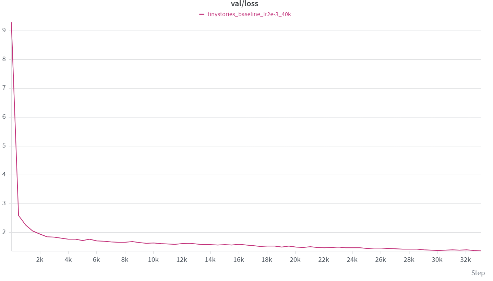
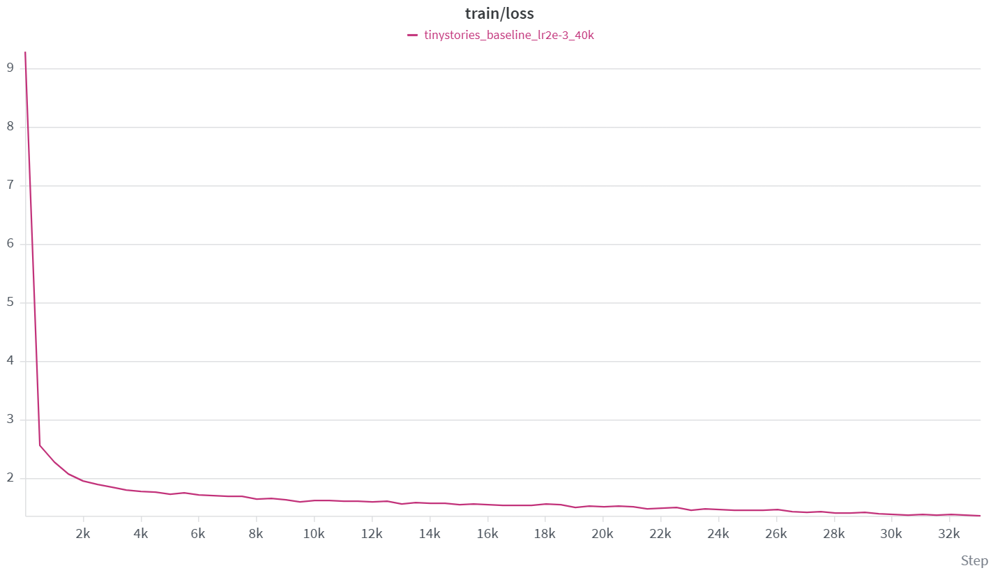
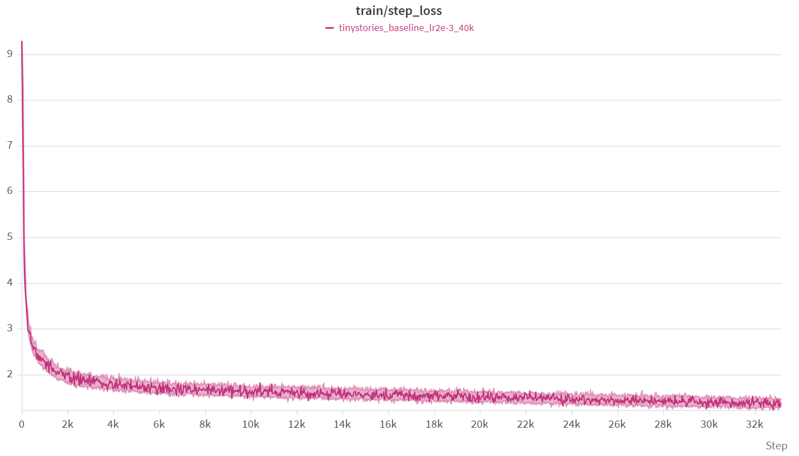

# Baseline run: the 22.7M-parameter model at the swept learning rate

> **Result.** Trained the full model at peak `lr=2e-3`, the rate selected by the
> [learning-rate sweep](../lr_sweep/README.md), for **33,078 of a planned 40,000
> steps** before stopping. Final **train loss 1.3559**, **validation loss 1.3597**,
> measured at step 33,001. The run cost **45.8 minutes** on one RTX 4090 D and saw
> **271M tokens**. All 33,078 steps were finite (`diverged=0`) and the
> train/validation gap never exceeded evaluation noise.

## Quick links

- [Experimental question](#experimental-question)
- [Controlled setup](#controlled-setup)
- [Training curves](#training-curves)
- [Convergence and diminishing returns](#convergence-and-diminishing-returns)
- [Generalization](#generalization)
- [Why training stopped at 33,078](#why-training-stopped-at-33078)
- [Limitations and next experiments](#limitations-and-next-experiments)
- [Exported figures](../wandb/)

## Experimental question

The [learning-rate sweep](../lr_sweep/README.md) ranked twelve candidate peak
rates on a 500-update budget and selected `2e-3`. That selection was made on short
runs, where the loss is still dominated by early optimization speed. This run asks
whether that choice still holds once the same model is trained far past the sweep
horizon: does `2e-3` decay into a usable model, or was it merely the fastest rate
over 500 steps?

It also produces the checkpoint that the
[inference notes](../../docs/notes/assignment1.md) describe sampling from.

## Controlled setup

| Item | Value |
|---|---:|
| Run name | `tinystories_baseline_lr2e-3_40k` |
| Model | decoder-only Transformer, pre-norm, RoPE, SwiGLU |
| Layers / heads | 4 / 16 |
| Model / FFN width | 512 / 1344 |
| Parameters | 22,696,448 (token and output embeddings untied) |
| Vocabulary / context | 10,000 / 256 |
| Batch size | 32 |
| Peak / final LR | `2e-3` → cosine decay to `2e-4` |
| Warm-up | 1,000 updates |
| Planned budget | 40,000 updates |
| Completed | 33,078 updates |
| Gradient clipping | global norm 1.0 |
| Evaluation | every 500 updates, 20 batches per split |
| Seed | 42 |
| Hardware | 1× NVIDIA GeForce RTX 4090 D, 64 CPU cores, 540 GB RAM |
| Wall clock | 2,747.6 s (45.8 min) |
| Throughput | 83.1 ms/update, 98.6k tokens/s |
| Total tokens seen | 270,974,976 |

Optimizer is AdamW with weight decay 0.1. The peak rate, warm-up length, clipping
threshold, and evaluation cadence are identical to the sweep's, so the two reports
describe the same optimization setup at different horizons.

## Training curves

*Figure 1. Validation loss: nearly all of the total improvement is spent in the
first few thousand updates, after which the curve is almost flat.*

*Figure 2. Training loss on the same cadence, tracking the validation curve with no
visible separation.*

*Figure 3. Per-step training loss: the band narrows and stabilizes with no excursion
above its starting value at any point, which is the visual form of `diverged=0`.*

Milestone values, sampled every 2,500 updates:

| Step | Train | Val | Val − train |
|---:|---:|---:|---:|
| 1 | 9.2913 | 9.2901 | −0.0012 |
| 2,501 | 1.8889 | 1.8535 | −0.0354 |
| 5,001 | 1.7312 | 1.7185 | −0.0126 |
| 7,501 | 1.6945 | 1.6567 | −0.0377 |
| 10,001 | 1.6187 | 1.6367 | +0.0180 |
| 12,501 | 1.6062 | 1.6196 | +0.0134 |
| 15,001 | 1.5437 | 1.5730 | +0.0293 |
| 17,501 | 1.5330 | 1.5139 | −0.0192 |
| 20,001 | 1.5083 | 1.4873 | −0.0211 |
| 22,501 | 1.4983 | 1.4806 | −0.0176 |
| 25,001 | 1.4543 | 1.4416 | −0.0127 |
| 27,501 | 1.4223 | 1.4160 | −0.0063 |
| 30,001 | 1.3807 | 1.3767 | −0.0041 |
| 32,501 | 1.3639 | 1.3754 | +0.0115 |
| **33,001** | **1.3559** | **1.3597** | **+0.0037** |

## Convergence and diminishing returns

The run reduces loss from 9.2901 to 1.3597, a total improvement of 7.9304. The
first 500 updates alone account for 6.7010 of that, or **84.5% of all the
improvement this run ever achieved, in 1.5% of its updates**. What the remaining
32,578 updates bought is small and shrinking:

| Interval | Val change | Per 1,000 updates |
|---|---:|---:|
| 1 → 501 | −6.7010 | −13.402 |
| 501 → 1,001 | −0.3361 | −0.672 |
| 1,001 → 5,001 | −0.5345 | −0.134 |
| 5,001 → 10,001 | −0.0819 | −0.016 |
| 10,001 → 15,001 | −0.0637 | −0.013 |
| 15,001 → 20,001 | −0.0857 | −0.017 |
| 20,001 → 25,001 | −0.0457 | −0.009 |
| 25,001 → 30,001 | −0.0649 | −0.013 |
| 30,001 → 33,001 | −0.0170 | −0.006 |

Two things are worth separating here. The rate of improvement from 5,000 updates
onward is roughly constant per step — about 0.01–0.02 loss units per thousand
updates — rather than collapsing to zero. So the run was not finished learning; it
was in a regime where each additional thousand updates costs the same and returns
progressively less in relative terms. Whether that is worth paying for depends on
the budget, which is the subject of the next section.

Total run cost was under an hour, so the interesting question is not compute but
whether the remaining schedule — the cosine decay still had 6,922 updates to run,
from `lr=3.36e-4` down to `2e-4` — would have converted into a materially better
model.

## Generalization

Across all 67 evaluations the gap between validation and training loss averages
**+0.0013** with a standard deviation of **0.0188**, and validation loss is the
lower of the two in 35 of them. The gap is therefore smaller than its own
evaluation noise and flips sign with no trend over the run.

This is the expected picture for a model of this size on this corpus: 22.7M
parameters trained on 271M tokens is a compute-limited regime, not a
data-limited one, so there is nothing to overfit yet. It also means the final
validation loss is not a generalization measurement in any meaningful sense — the
run is nowhere near the point where capacity starts to hurt.

## Why training stopped at 33,078

The run was terminated deliberately, 6,922 updates short of the planned 40,000.
The name `tinystories_baseline_lr2e-3_40k` records the intended budget, not what
was executed.

The evidence supporting the stop is the marginal return in the table above: the
last 3,000 updates (9% of the run) moved validation loss by 0.0170, or 0.2% of the
total improvement. Extrapolating the 0.01–0.02 per-thousand rate, the remaining
6,922 updates would plausibly have been worth on the order of 0.1 loss units — real
but small, and obtained at the cost of another ~10 minutes of the same wall clock.

Two consequences of stopping early should be stated plainly rather than left
implicit:

- **The cosine schedule never completed.** The run ended at `lr=3.36e-4` with
  decay still underway toward `2e-4`. A model trained to the end of the schedule
  is not directly comparable to this one; the final learning-rate annealing, which
  is usually where a schedule earns its keep, is missing.
- **The stopping rule was informal.** It was a judgement call made while watching
  the curve, not a pre-registered criterion. A criterion fixed in advance — for
  example "stop when validation loss has not improved by more than ε over the last
  N evaluations" — would make the decision reproducible and would let the same
  rule be applied across runs.

## Limitations and next experiments

1. **The sweep and this run used different model widths.** The sweep selected
   `2e-3` on a model with `d_ff=2048`; this run used `d_ff=1344`. The optimal peak
   rate shifts with model size and width, so `2e-3` is a rate that was *validated
   elsewhere* and then transferred, not a rate validated on this exact
   architecture. Re-running a short confirmation sweep at `d_ff=1344` would settle
   whether the transfer cost anything. This is the weakest link between the two
   reports.
2. **Single seed.** All results come from seed 42, so the trajectory is one sample
   and the curves carry no error bars.
3. **No terminal checkpoint guarantee.** The run's W&B state is `killed` rather
   than `finished`, and the training script writes its final checkpoint only on
   normal loop exit. Periodic saves were configured every 5,000 updates, so the
   newest checkpoint that certainly exists is at step 30,000. Any inference
   results should record which of the two checkpoints they used.
4. **Under one epoch.** 271M tokens is a fraction of the TinyStories training
   split, so the model is far from having seen the data once.
5. **No sampling evaluation.** The inference notes describe temperature and top-p,
   but no generation-quality comparison has been run against this checkpoint, so
   nothing here speaks to whether the lower loss produced better text.
6. **Under-training cannot be ruled out.** The flat curve is equally consistent
   with "this is close to what this model can do" and "the schedule stopped too
   early". The missing 6,922 updates and the uncompleted decay are exactly the
   experiment that would distinguish them.

## Provenance

- W&B project `cs336-assignment1`, group `train`, run `5acln0cl`
- Started 2026-09-21, ended after 2,747.6 s
- Configuration, metrics, and the 67-point evaluation history were read back from
  the W&B API, not transcribed by hand
- Figures are W&B exports; the underlying per-evaluation values are in the table
  above
