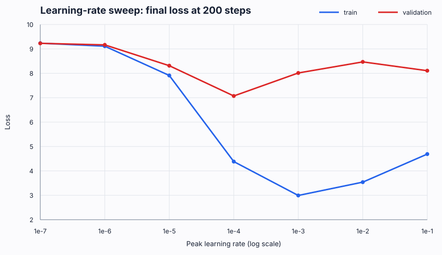

# Learning-rate sweep

## Question

For the current 4-layer Transformer on TinyStories, which peak learning-rate
region produces useful optimization progress without unstable updates or a rapidly
widening train–validation gap?

## Evidence

The table in [`results.csv`](results.csv) was reconstructed from the local W&B
run cache on 2026-09-18. The broad sweep covers peak learning rates from
`1e-7` to `1e-1` for 200 iterations; the fine sweep covers `2e-4` to `7e-4`
for 500 iterations. Runs use cosine decay and therefore report a final learning
rate below the configured peak.

The canonical run table is available in the
[W&B project dashboard](https://wandb.ai/meiyuxin7-china-university-of-petroleum/cs336-assignment1/table).
Access currently requires permission from the project owner.



## Findings

1. **Under-training below `1e-5`.** At `1e-7` and `1e-6`, both losses remain
   near the random-initialization scale. `1e-5` makes progress, but much more
   slowly than the central range.
2. **Best observed validation endpoint near `1e-4`.** In the controlled
   200-step sweep, `1e-4` reaches validation loss `7.070`, lower than both smaller
   and larger candidates. Among comparable 500-step runs, `1e-4` also has the
   lowest final validation loss (`7.560`).
3. **Optimization and generalization separate above `2e-4`.** From `2e-4` to
   `7e-4`, final training loss improves monotonically (`3.022` → `2.515`) while
   validation loss worsens (`7.825` → `8.346`). This is not numerical divergence;
   it is a widening generalization gap under the present evaluation pipeline.
4. **The `1e-2`–`1e-1` region is over-aggressive.** These runs do not produce
   NaNs in the stored endpoints, but they underperform `1e-4` and show degraded
   training endpoints. Call this *instability/poor convergence*, not proven
   mathematical divergence.
5. **Longer is not yet better.** Extending `1e-4` from 500 to 1000 iterations
   lowers training loss but raises validation loss (`7.560` → `7.825`).

## Data-pipeline diagnosis and repair

The original sweep encoded train and validation with different tokenizer artifacts.
Their vocabulary and merge-file SHA-256 hashes differed, so equal token IDs did not
have equal byte semantics across splits. This invalidates the old validation losses
for model selection.

The validation text was re-encoded with the tokenizer trained on the training split.
A controlled 200-step diagnostic at peak learning rate `1e-4` produced:

| Step | Train loss | Validation loss |
|---:|---:|---:|
| 0 | 9.2524 | 9.2509 |
| 50 | 6.3022 | 6.2953 |
| 100 | 4.8862 | 4.9101 |
| 150 | 4.4702 | 4.4379 |
| 199 | 4.3364 | 4.3118 |

The synchronized curves confirm that the previous `3` versus `7–8` gap was caused
by the tokenizer/data pipeline, not insufficient training duration. Use
[`scripts/reencode_validation.py`](../../scripts/reencode_validation.py) to rebuild
validation data reproducibly. The generated file contained 5,506,301 tokens with
IDs in `10..9999` for a 10,000-entry vocabulary and passed an encode/decode
round-trip check.

## Decision for the next run

Discard the old validation endpoints for hyperparameter selection and rerun the
broad sweep on the repaired data. Start with `{1e-5, 1e-4, 1e-3, 1e-2}` to locate
the useful and divergent regimes, then refine around the best region. Hold the token
budget and warmup fraction constant, fix random seeds, and report mean ± standard
deviation over at least three seeds for the final comparison.

Regenerate the figure with:

```bash
python experiments/lr_sweep/plot_results.py
```
