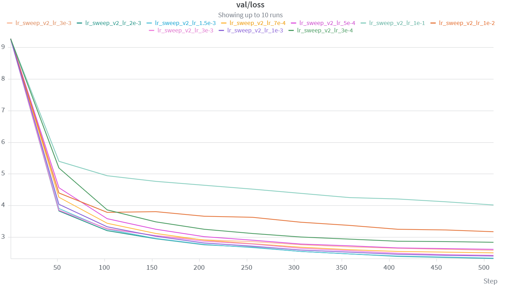
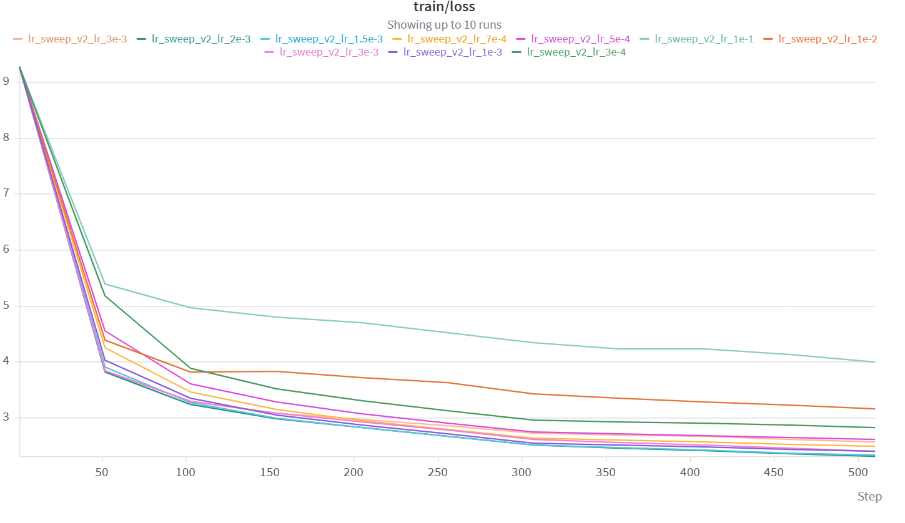
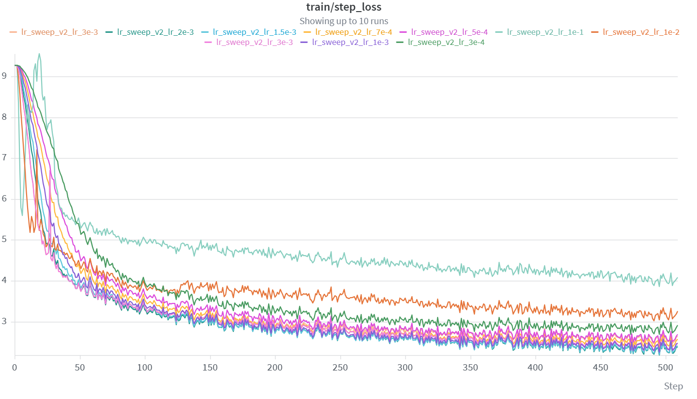

# Learning-rate sweep: coarse-to-fine selection

> **Result.** Under the fixed 500-step budget, the best tested peak learning rate is
> **`2e-3`**. Its final losses are **2.3043 (train)** and **2.3197 (validation)**.
> All 12 runs completed without NaN/Inf (`diverged=0`), so the large-learning-rate
> regime is described below as *optimization degradation*, not strict numerical divergence.

## Quick links

- [Experimental question](#experimental-question)
- [Controlled setup](#controlled-setup)
- [Sweep design](#sweep-design)
- [Results](#results)
- [Coarse-screen analysis](#coarse-screen-analysis)
- [Fine-screen analysis](#fine-screen-analysis)
- [Convergence-and-instability](#convergence-and-instability)
- [Decision](#decision)
- [Limitations and next experiments](#limitations-and-next-experiments)
- [Machine-readable results](results.csv)
- [Exported figures](../wandb/)
- [W&B project](https://wandb.ai/meiyuxin7-china-university-of-petroleum/cs336-assignment1/table)

## Experimental question

The experiment asks how the peak learning rate changes convergence speed and final
generalization for the CS336 Assignment 1 language model. Selection is based on
validation loss under an equal compute budget, rather than on training loss alone.
The search is deliberately split into a logarithmic coarse screen and a local fine
screen around the best coarse region.

## Controlled setup

The 12 runs use the same model and evaluation protocol:

| Item | Value |
|---|---:|
| Model | decoder-only Transformer, pre-norm, RoPE, SwiGLU |
| Layers / heads | 4 / 16 |
| Model / FFN width | 512 / 2048 |
| Vocabulary / context | 10,000 / 256 |
| Batch size | 32 |
| Optimizer budget | 500 updates |
| Warm-up | 50 updates |
| Evaluation | every 50 updates, 20 batches per split |
| Gradient clipping | global norm 1.0 |
| Seed | 42 |
| Hardware | NVIDIA GeForce RTX 4060 Laptop GPU |

Training and validation binaries were encoded with the same training tokenizer.
This matters because the earlier 3-vs-7/8 loss gap was caused by incompatible token
ID spaces, not by insufficient epochs. The repaired validation split makes the
train/validation comparison meaningful.

Except for the explicit schedule-control run, the peak rate is followed by cosine
decay to `0.1 × peak_lr`. Because the schedule changes the effective optimization
budget, the constant-`3e-3` run is analyzed separately rather than ranked as another
fine-screen candidate.

## Sweep design

### Stage 1 — logarithmic coarse screen

The first seven runs cover five orders of magnitude:

`1e-5 → 1e-4 → 3e-4 → 1e-3 → 3e-3 → 1e-2 → 1e-1`

This stage locates both under-training and the high-rate degradation region. The
coarse minimum is `1e-3` with final validation loss 2.3995; `3e-3` is close at
2.4147, so the useful basin lies roughly between them.

### Stage 2 — local fine screen

The second stage samples the interval around the coarse minimum:

`5e-4 → 7e-4 → 1.5e-3 → 2e-3`

The validation loss continues to improve through `2e-3`, while the coarse `3e-3`
candidate is worse. This brackets the short-budget optimum in `[1.5e-3, 3e-3)`.

### Stage 3 — schedule control at `3e-3`

One additional run keeps `lr=3e-3` constant after warm-up. Its validation loss is
2.5767, versus 2.4147 for cosine decay from the same peak. This isolates a schedule
effect: the peak itself is trainable, but sustaining it prevents the same late-stage
refinement. It is not evidence that `3e-3` numerically diverges.

## Results

Final losses are the W&B values at step 500. Lower validation loss is better.

| Stage | Peak LR | Schedule | Train loss | Val loss | Val − train | Interpretation |
|---|---:|---|---:|---:|---:|---|
| Coarse | `1e-5` | cosine | 6.7158 | 6.7139 | -0.0019 | severe under-training |
| Coarse | `1e-4` | cosine | 3.4655 | 3.4798 | 0.0142 | converges, too slowly |
| Coarse | `3e-4` | cosine | 2.8233 | 2.8348 | 0.0115 | stable but suboptimal |
| Coarse | `1e-3` | cosine | 2.3893 | 2.3995 | 0.0102 | coarse winner |
| Coarse | `3e-3` | cosine | 2.3987 | 2.4147 | 0.0160 | beyond local minimum |
| Coarse | `1e-2` | cosine | 3.1539 | 3.1661 | 0.0122 | high-rate degradation |
| Coarse | `1e-1` | cosine | 3.9888 | 4.0082 | 0.0194 | strong degradation |
| Fine | `5e-4` | cosine | 2.6018 | 2.6141 | 0.0123 | stable, slower |
| Fine | `7e-4` | cosine | 2.4842 | 2.4954 | 0.0112 | stable, slower |
| Fine | `1.5e-3` | cosine | 2.3243 | 2.3350 | 0.0107 | near-optimal |
| **Fine** | **`2e-3`** | **cosine** | **2.3043** | **2.3197** | **0.0154** | **best validation loss** |
| Control | `3e-3` | constant | 2.5612 | 2.5767 | 0.0155 | worse late refinement |

The full-precision values, run names, schedules, runtimes, and divergence flags
are stored in [`results.csv`](results.csv).

### Validation loss over the 500-update budget

*Figure 1. Validation loss over the full budget, evaluated every 50 updates. Two
caveats on this export: it contains 10 of the 12 runs, so `1e-5` and `1e-4` — the
two under-converged points discussed below — appear in the table but not here;
and the legend carries two runs named `3e-3`, the cosine coarse candidate and the
constant-schedule control of [Stage 3](#stage-3--schedule-control-at-3e-3). Every
curve is finite through step 500, which is the visual form of the `diverged=0`
result reported under [convergence and instability](#convergence-and-instability).*

## Coarse-screen analysis

At the first post-warm-up evaluation (step 51), validation loss falls from 8.9044
at `1e-5` to 4.0324 at `1e-3` and 3.8410 at `3e-3`. Higher rates therefore make
much faster initial progress. That benefit does not continue monotonically:
`1e-2` and `1e-1` have step-51 validation losses of 4.3955 and 5.3937.

By step 500 the curve is U-shaped in log-learning-rate space. Very small rates
leave most of the loss unreduced, while very large rates settle at worse solutions.
The coarse candidates `1e-3` and `3e-3` are close enough to justify a denser search
between them rather than declaring a winner from the logarithmic grid.

## Fine-screen analysis

The final validation losses in ascending fine-screen order are 2.6141 (`5e-4`),
2.4954 (`7e-4`), 2.3350 (`1.5e-3`), and 2.3197 (`2e-3`). The improvement from
`1.5e-3` to `2e-3` is only 0.0153 loss units, whereas the gap from `2e-3` to the
coarse `3e-3` run is 0.0951. The sampled optimum is therefore `2e-3`, but the
small margin over `1.5e-3` should be rechecked with multiple seeds before treating
it as a universal optimum.

*Figure 2. Training loss for the same 10 exported runs, on the same evaluation
cadence as Figure 1. The two panels track each other closely at every learning
rate, which is the visual form of the train/validation coupling quantified in the
paragraph below.*

Train and validation losses remain tightly coupled in all runs. At `2e-3`, the
final generalization gap is 0.0154. There is no evidence of overfitting within 500
steps; the comparison is dominated by optimization speed and stability.

## Convergence and instability

All 12 runs report `diverged=0` and finite losses through step 500. Thus:

- `1e-5` and `1e-4` are **under-converged**, not divergent.
- `3e-4` through `3e-3` show stable convergence, with the optimum inside this basin.
- `1e-2` shows a small reversal between steps 101 and 151 (validation 3.7844 →
  3.7963) before improving again as cosine decay lowers the rate. This is mild
  oscillatory behavior and a warning that the peak is too aggressive.
- `1e-1` remains finite but learns inefficiently; its final validation loss 4.0082
  is 1.6886 worse than `2e-3`. Gradient clipping and decay likely prevent numerical
  blow-up, but they do not recover the optimization quality.

*Figure 3. Per-step training loss, one point per optimizer update rather than one
per evaluation. This is the same training as Figures 1 and 2 at full resolution,
and it is where the instability claims above become visible: the high-rate runs
oscillate far more violently through the first ~50 updates than the rates that
converge well, and the ordering of the curves settles only after warm-up ends.
Read it against the `1e-2` reversal between steps 101 and 151 noted above — the
per-step series is noisy enough that a single evaluation interval can move in the
"wrong" direction without indicating a numerical problem.*

In this experiment, “too large” should therefore mean *degraded convergence and
poorer final validation loss*, not NaN/Inf divergence. A true divergence boundary
would require a separate stress test (for example, constant high rates and explicit
non-finite/gradient-norm tracking).

## Decision

Use **peak `lr=2e-3` with 50-step warm-up and cosine decay to `2e-4`** for the next
full training run. This decision is based on the lowest validation loss under the
same 500-step budget. Do not select the constant `3e-3` run: it changes the schedule
and produces materially worse train and validation losses.

For a long B200 run, keep the optimizer and token-based schedule comparable. If the
global batch size changes, treat `2e-3` as a starting hypothesis and run a short
local confirmation sweep rather than scaling the rate blindly.

## Limitations and next experiments

1. **Single seed.** All comparisons use seed 42. Re-run `1.5e-3`, `2e-3`, and
   `2.5e-3` with at least three seeds and report mean ± standard deviation.
2. **Short horizon.** The result is the best rate at 500 steps, not necessarily the
   best rate after full convergence. Confirm it on the intended token budget.
3. **Sparse bracket.** `2e-3` wins the tested grid, but `1.75e-3`, `2.25e-3`, and
   `2.5e-3` were not tested.
4. **Evaluation noise.** Each point averages 20 batches. More evaluation batches
   would reduce uncertainty between the two closest candidates.
5. **No numerical divergence case.** If the assignment requires an explicit
   divergence curve, add a constant-rate stress test above `3e-3` and record the
   first non-finite step; do not relabel finite but poor runs as divergent.

## Provenance

- W&B project: [`cs336-assignment1`](https://wandb.ai/meiyuxin7-china-university-of-petroleum/cs336-assignment1/table)
- Included runs: 12 names beginning with `lr_sweep_v2_`
- Excluded runs: `smoke_4090_lr2e-3_100` and `tinystories_baseline_lr2e-3_40k`
- No W&B records were modified or deleted while preparing this report.
